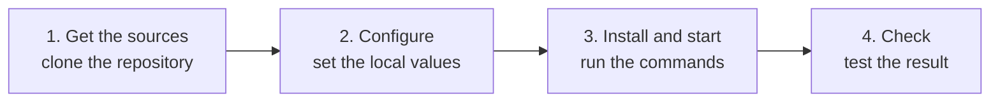

import { Steps } from '@astrojs/starlight/components';
import Capture from '@/components/Capture.astro';
import DocVersion from '@/components/DocVersion.astro';
import Stage from '@/components/Stage.astro';

{/* docgen: sources of this page, at the ref {{ref}}:
{{sources}}
*/}

<DocVersion project="{{project}}" />

{/* docgen:slot goal | 15-50 words | text | Say in one or two sentences what the reader has at the end of this page: what runs, or which files exist. */}
TODO(docgen:goal)
{/* docgen:end */}

The install has four stages. Do the stages in this order.

## The stages at a glance



## Requirements

{/* docgen:slot requirements | 10-150 words | table | Give a table with the columns Item, Required version and Notes. One row for each tool, account or access that the reader needs before Stage 1. Take each item and each version from the sources. Write "Not stated" in a cell when the sources do not give the value. */}
TODO(docgen:requirements)
{/* docgen:end */}

<Stage n={1}>

## Get the sources

This stage gives you a clone of the {{project}} repository.

<Steps>

1. Clone the repository into your home directory.

   {/* docgen:capture stage1-clone | 100 | Clone the repository | clone */}
   <Capture id="{{project}}/stage1-clone" />

   Result: Git ends with no error, and the directory `~/{{project}}` exists.

2. Go to the directory of the clone.

   ```sh
   cd "$HOME/{{project}}"
   ```

   Result: the command `pwd` prints the path of the clone.

</Steps>

`<the URL of the {{project}} repository>` is a placeholder. The owner of the project gives you the URL.

You can use another directory. Then use that directory in each later command. Run each later command from the directory of the clone.

The frame of step 1 shows the clone in a clean container.

**Result:** the directory `~/{{project}}` holds the files of the release that the top of this page shows.

</Stage>

<Stage n={2}>

## Configure

This stage sets the local values of the project before the first start.

<Steps>

{/* docgen:slot stage-2-steps | 5-250 words | steps | Give the steps that set the local values before the first start: copy an example file, set a variable, edit a configuration file. Take each command and each file name from the sources. Name a variable, but do not write a real value of it. If the sources state no such step, write: 1. The sources state no configuration step. */}
1. TODO(docgen:stage-2-steps)
{/* docgen:end */}

</Steps>

{/* docgen:slot stage-2-result | 4-40 words | text | Write one sentence that starts with `**Result:**`. Say how the reader knows that the configuration is complete: which file exists, or which value is set. If the sources state no configuration step, write: **Result:** this stage changes nothing. */}
TODO(docgen:stage-2-result)
{/* docgen:end */}

</Stage>

<Stage n={3}>

## Install and start

This stage installs what the project needs and starts it.

<Steps>

{/* docgen:slot stage-3-steps | 5-300 words | steps | Give the steps that install the project before its start, in the order of the sources: install the dependencies, build. Take each command from the sources. Do not give the command that starts the project. The next slot holds that command. If the sources state no such step, write: 1. The sources state no step before the start. */}
1. TODO(docgen:stage-3-steps)
   {/* docgen:end */}

   {/* docgen:with stage-3-command */}
1. Start the project with the command in the frame.

   {/* docgen:capture stage3-start | 300 | Install and start | slot stage-3-command */}
   <Capture id="{{project}}/stage3-start" />
   {/* docgen:end-with */}

</Steps>

{/* docgen:slot stage-3-command | 1-40 words | command | Give the one command line that starts the project. Copy it from the sources. The command must run in a new clone: use the example values of the sources, and no placeholder in angle brackets. If the sources state no such command, write: The sources state no command that starts the project. */}
{/* docgen:command
TODO(docgen:stage-3-command)
*/}
{/* docgen:end */}

{/* docgen:with stage-3-command */}
The frame of the last step shows its command in a clean container.
{/* docgen:end-with */}
{/* docgen:without stage-3-command */}
The sources state no command that starts the project.
{/* docgen:end-without */}

{/* docgen:slot stage-3-result | 5-40 words | text | Write one sentence that starts with `**Result:**`. Say what the reader sees when this stage is complete: a line of the output, a process that runs, or a file. If the sources do not state it, write: **Result:** the sources do not state the result. */}
TODO(docgen:stage-3-result)
{/* docgen:end */}

</Stage>

<Stage n={4}>

## Check

This stage tests that the install is correct.

<Steps>

{/* docgen:slot stage-4-steps | 5-250 words | steps | Give the steps that test the install before its most important test: a status command or a page to open. Take each command from the sources. Do not give the most important test. The next slot holds that command. If the sources state no such step, write: 1. The sources state no step before the test. */}
1. TODO(docgen:stage-4-steps)
   {/* docgen:end */}

   {/* docgen:with stage-4-command */}
1. Test the install with the command in the frame.

   {/* docgen:capture stage4-check | 400 | Check the install | slot stage-4-command */}
   <Capture id="{{project}}/stage4-check" />
   {/* docgen:end-with */}

</Steps>

{/* docgen:slot stage-4-command | 1-40 words | command | Give the one command line of the most important test of the install. Copy it from the sources. The command must run in a new clone: use the example values of the sources, and no placeholder in angle brackets. If the sources state no test, write: The sources state no test of the install. */}
{/* docgen:command
TODO(docgen:stage-4-command)
*/}
{/* docgen:end */}

{/* docgen:with stage-4-command */}
The frame of the last step shows its command in a clean container.
{/* docgen:end-with */}
{/* docgen:without stage-4-command */}
The sources state no test of the install.
{/* docgen:end-without */}

{/* docgen:slot stage-4-result | 5-40 words | text | Write one sentence that starts with `**Result:**`. Say what the reader sees when the install is correct: the last line of a command, an exit code or a page. If the sources state no test, write: **Result:** the sources state no test of the install. */}
TODO(docgen:stage-4-result)
{/* docgen:end */}

</Stage>

## What can go wrong

{/* docgen:slot problems | 6-250 words | table | Give a table with the columns What you see, Cause and What to do. One row for each problem that the sources name for the install. Copy each error text from the sources. If the sources name no problem, write: The sources name no known problem. */}
TODO(docgen:problems)
{/* docgen:end */}
