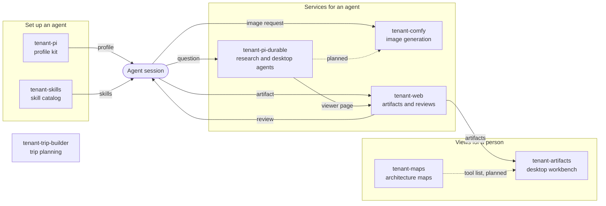

import ProjectGrid from '@/components/ProjectGrid.astro';

## What the tenant projects are

The tenant projects are eight repositories of tools for work with coding agents. A coding agent is a program that reads, writes and runs code for a person. An agent session is one run of such an agent.

Each project has its own repository. Six of the projects have a development branch and a `portable` branch. The `portable` branch holds a release with no value of one host.

## How the projects connect

The agent session is the center. Two projects set it up, three projects give it services, and two projects give views to a person.

- [tenant-pi](/tenant-pi/) generates the profile that a Pi agent session starts with.
- [tenant-skills](/tenant-skills/) holds the source of the skills that an agent session loads.
- [tenant-pi-durable](/tenant-pi-durable/) runs agents as services. A session sends a question and waits for the answer.
- [tenant-comfy](/tenant-comfy/) runs an image generation stack. A session makes an image through a skill.
- [tenant-web](/tenant-web/) stores the pages that an agent publishes. It returns the review of a person to the session.
- [tenant-artifacts](/tenant-artifacts/) shows the artifacts of tenant-web in a desktop app.
- [tenant-maps](/tenant-maps/) draws maps of an architecture. The plan of the desktop app is to link each tool of such a map.
- [tenant-trip-builder](/tenant-trip-builder/) is a separate application. It has no direct link to the other projects.

## Projects

tenant-pi has a full doc set. Each other project has one overview page.

<ProjectGrid />
