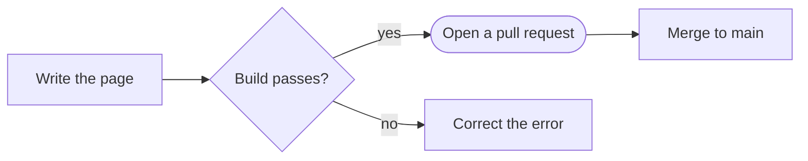
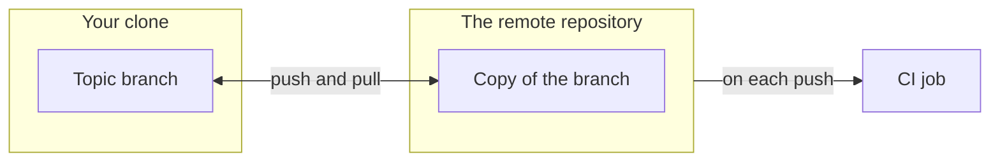
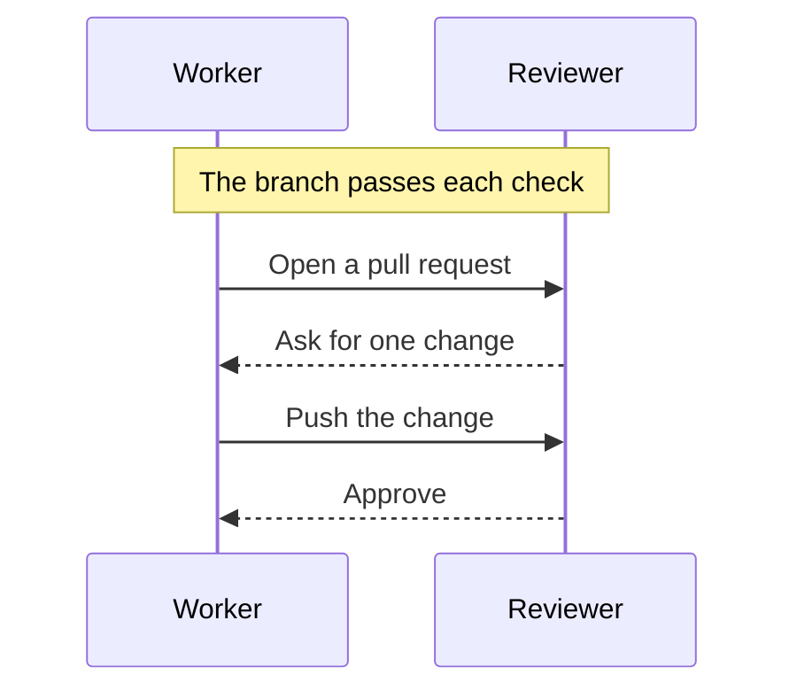
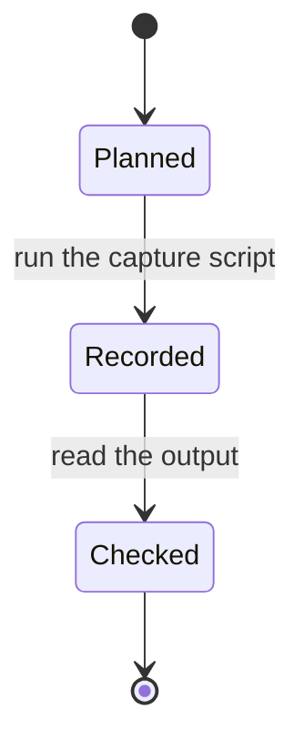
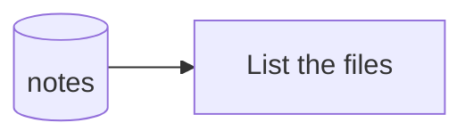
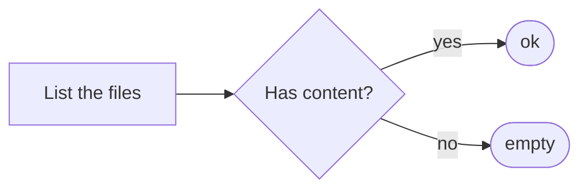

import { Steps } from '@astrojs/starlight/components';
import Capture from '@/components/Capture.astro';
import Cast from '@/components/Cast.astro';
import Shot from '@/components/Shot.astro';
import Stage from '@/components/Stage.astro';
import home from '../../../captures/demo/home.png';

This page is for page authors. Each section shows one component, its syntax and its result.

The examples use the demo captures in `captures/demo/`. They are neutral and they hold no value of a host.

## Terminal frame

`Capture` shows one command and its output in a terminal frame. The command and the output come from a capture.

```mdx
import Capture from '@/components/Capture.astro';

<Capture id="demo/list" />
```

The [first stage](#list-the-files) shows this frame.

- The **Copy** button copies the command only. It does not copy the prompt or the output.
- The frame is the one place of its command on a page. Put no code block with the same command beside the frame.
- The title comes from the field `title` of the spec file.
- A wide line does not wrap. The frame scrolls to the side.

### Colors

The frame maps the 16 ANSI colors to the Soft Night palette. Bold text and reversed text also work.

<Capture id="demo/colors" />

### Long output

An output with more than 24 lines folds. The button below the output shows all lines.

<Capture id="demo/long" />

### No output yet

A capture with a spec file and no `.txt` file shows the command and a note. The reader can copy the command. The build does not fail.

<Capture id="demo/pending" />

## Recording

`Cast` shows the frame of `Capture` and adds the asciinema recording of the capture. The player and the recording load from this site.

```mdx
import Cast from '@/components/Cast.astro';

<Cast id="demo/check" />
```

The [second stage](#check-the-files) shows this frame and its recording.

- The frame shows the command and the output as text first.
- The button **Play the recording** below the frame starts the recording in the same frame.
- The recording takes the place of the command line and of the text. A recording of the capture script shows the command.
- The button **Show the output as text** changes the frame back.
- The control bar has a play and pause button, a time display and a seek bar.
- The player takes the keyboard focus. <kbd>Space</kbd> pauses. <kbd>←</kbd> and <kbd>→</kbd> seek 5 seconds.
- The player loads only when the reader starts the recording.
- The text frame stays when JavaScript is off, and when the capture has no `.cast` file.
- Use `Cast` in the place of `Capture`, not together with it. A page shows one frame for one capture.

Record at 72 columns or less. The player makes the text smaller on a narrow screen.

## Diagram

A fenced `mermaid` block becomes an SVG diagram when the site builds. The page loads no diagram script.

````md

````


- Each diagram has a text form. The control **Diagram as text** below the diagram shows it.
- The line `accTitle:` gives the diagram a name for a screen reader. Write it for each diagram.
- The line `accDescr:` gives one sentence that replaces the default description.

The renderer supports these types: flowchart, state diagram, sequence diagram, class diagram, ER diagram and XY chart.

Warning: A block of another type, for example `gantt` or `pie`, stops the build.

### Diagram on a narrow screen

The build makes a second form of a flowchart and of a state diagram. A narrow column shows this form when the first form is too wide for it.

- The second form of a `flowchart LR` goes from the top to the bottom. Do not write "left" or "right" about a diagram.
- No label is smaller than 11 px in a narrow column. A diagram that is too wide for the column scrolls to the side.
- A diagram with one node in each row has no side scroll. Break a long label with `<br/>`.
- A sequence diagram has one form. It scrolls to the side when it has more than two participants.

### Subgraph and two-way arrow

A subgraph has an id and a title. An arrow can start or end at the id of a subgraph. The text form of the diagram shows the title of the subgraph.

The arrow `<-->` has two heads.

````md

````


Warning: An arrow with a cross or a circle at its end, for example `--x`, stops the build. The renderer does not draw such an arrow.

### Sequence diagram

A `Note` can come before the first message.

````md

````


### State diagram

A fence title adds a caption below the diagram.

````md

````


## Screenshot with callouts

`Shot` shows an image with numbered marks. Each mark has a text in the list below the image.

```mdx
import Shot from '@/components/Shot.astro';
import home from '../../../captures/demo/home.png';

<Shot
  src={home}
  alt="The home page of the site, with the top bar and the first project cards."
  callouts={[
    { n: 1, x: 22.5, y: 9.5, text: 'The project menu opens the list of all projects.' },
    { n: 2, x: 56, y: 4.6, text: 'The search field finds text in each page.' },
  ]}
/>
```

<Shot
	src={home}
	alt="The home page of the site, with the top bar and the first project cards."
	callouts={[
		{ n: 1, x: 22.5, y: 9.5, text: 'The project menu opens the list of all projects.' },
		{ n: 2, x: 56, y: 4.6, text: 'The search field finds text in each page.' },
		{ n: 3, x: 24.5, y: 58.3, text: 'The button opens the first full doc set.' },
		{ n: 4, x: 38, y: 96, text: 'Each card opens the overview page of one project.' },
	]}
/>

- `x` and `y` are the position of the mark in percent of the image, from the top left corner.
- A mark is a link to its text. The number in the list is a link back to the mark.
- The marks become smaller with the image. They do not go below a size that a finger can touch.
- Write the `alt` text for a reader who cannot see the image.

## Stage

`Stage` shows one numbered stage of a workflow. A stage has a diagram, a command and a result.

Put a Markdown heading first in the stage. Then the stage shows in the page outline.

````mdx
import Stage from '@/components/Stage.astro';

<Stage n={1}>

### List the files

The stage starts with one sentence that gives its goal.



<Capture id="demo/list" />

**Result:** The list shows each note.

</Stage>
````

<Stage n={1}>

### List the files

This stage shows which files are in the demo directory.


<Capture id="demo/list" />

**Result:** The list shows three notes, one script, one directory and one link.

</Stage>

<Stage n={2}>

### Check the files

This stage finds each note that has no content.



<Steps>

1. Go to the demo directory.
2. Run the check.

   <Cast id="demo/check" />

</Steps>

**Result:** The last line gives the number of files.

</Stage>

- `n` is the number of the stage in the workflow. A page can show one stage alone.
- `label` changes the word before the number. The default is `Stage`.
- Use the Starlight component `Steps` for the single actions inside a stage.
- Put the frame of a command into the step that runs the command.
- Each demo capture shows one time on this page.

## Code block

Use a fenced code block for a command that has no capture, and for file content.

```sh
npm run build
```

- A page shows each command one time. A command with a capture shows in the frame of the capture only.
- The copy button has its own column at the end of the block. It covers no text.
- A wide line does not wrap. The code scrolls to the side, and the button stays in its place.

```sh
scripts/capture.py --project tenant-pi --source <the path of a local clone of the project> --out <another directory for the output files>
```

A title names the file of the content.

```md title="notes/plan.md"
Plan

1. Write the page.
2. Build the site.
```

Warning: Do not type terminal output into a code block. Terminal output comes from a capture.
