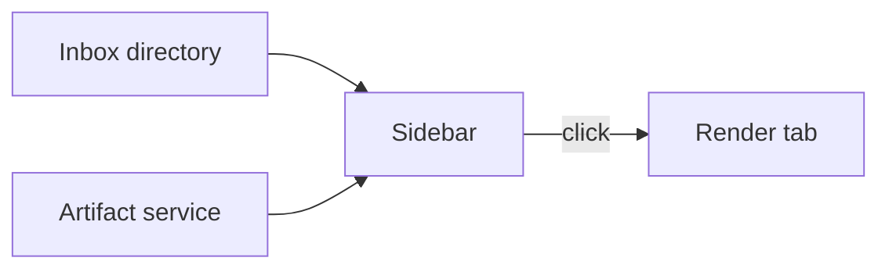

**Status:** the first prototype on 2026-10-05. The workbench runs on Linux, with Wayland and with X11.

tenant-artifacts is a desktop app in Rust, built with the GPUI framework. It is the first prototype of a hub for the tenant tools. The prototype is a workbench that shows agent artifacts. An artifact is one HTML file or one Markdown file.

## What it is for

An agent makes many artifacts, and a person must find and read them. The workbench puts the artifacts, the files, a terminal and the issues into one window. The target is larger: one app for macOS and Linux that opens remote terminals and links each tenant tool.

## Main parts

| Part | What it does |
| --- | --- |
| Sidebar | The artifacts of an inbox directory and of the artifact service. The agents of a terminal multiplexer, with their status. |
| Files | A file tree, and one code editor tab for each file. |
| Terminal | A tab with the local shell. |
| Render | A tab that shows a Markdown file. An HTML file opens in the default browser. |
| Issues | The issues of the configured repositories in one list, with filters. |

The source is a Cargo workspace with three crates: `workbench`, `workbench-core` and `workbench-link`. The window draws with Vulkan. The app reads one optional configuration file. That file names the issue repositories.

The recorded build check is for Linux only.

## Connections

- [tenant-web](/tenant-web/) is the artifact service. The workbench lists its artifacts, and a click shows one in the Render tab.
- The workbench sends the review packets of Walkr to the review store of tenant-web.
- [tenant-maps](/tenant-maps/) holds the list of the tenant tools. The hub target links each tool of that list.

This site has one overview page for this project.
