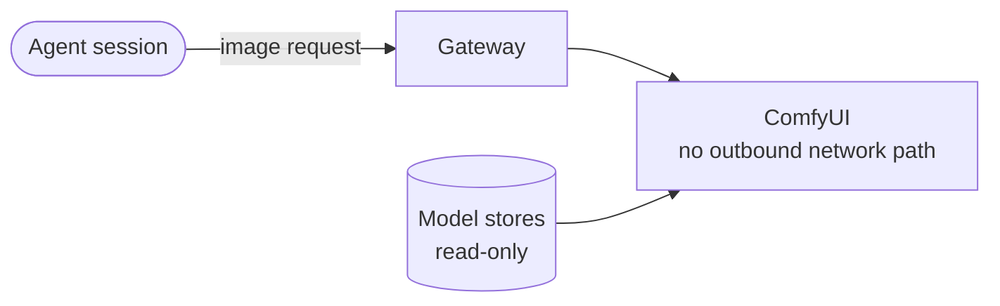

**Status:** a prototype stack on 2026-10-05. It is separate from each other ComfyUI stack.

tenant-comfy is the coordination repository of a self-maintained ComfyUI stack. ComfyUI is an application that makes images from a graph of nodes. The repository holds the source layout, the image build and an isolated prototype stack.

## What it is for

The owner of the stack controls each update. The repository pins the ComfyUI source to an exact commit of an upstream release. An update is one deliberate operation with a test. It is not a side effect of a new build.

## Main parts

| Part | What it does |
| --- | --- |
| Core source | A Git submodule with ComfyUI, pinned to a release tag of the upstream project. |
| Image build | A container image from the pinned source, with hashed lock files. |
| Custom nodes | A manifest. The build installs each node at a pinned commit. |
| Stack | Two containers: ComfyUI on an internal network, and a gateway in front of it. |
| Scripts and tests | Build, upgrade, smoke test, API contract test, secret scan and promotion. |
| Agent skill | A skill that makes an image from a text description. |
| Watch job | A daily job that opens an issue when a newer upstream release exists. |

The ComfyUI container has no outbound network path. A script proves this before a route to the gateway exists. The model stores are read-only mounts.

The watch job makes no branch and pushes nothing. The owner starts each upgrade, and one script makes the branch, the lock file, the image and the test output.

## Connections

- An agent session makes an image through the skill. [tenant-pi](/tenant-pi/) generates the profile of a Pi session.
- [tenant-pi-durable](/tenant-pi-durable/) has a plan for an image agent that uses this stack.

This site has one overview page for this project.
