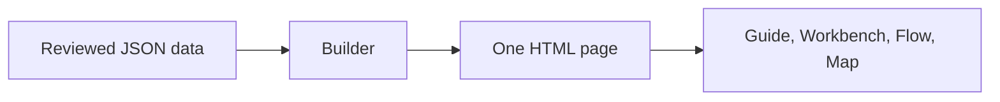

**Status:** in development on 2026-10-05. It has no accepted portable release.

tenant-maps builds architecture maps from reviewed JSON data. A map is one self-contained HTML page. An optional Workbench view shows one work item from planning to execution.

## What it is for

A system with many tools is hard to explain in text. A person reviews the facts of the system as JSON data, and the builder draws them. One renderer serves the neutral examples and the private data of one host. The private data stays in a directory that Git ignores.

## Main parts

| Part | What it does |
| --- | --- |
| Builder | A Python script with no external package. It validates the data and writes the page. |
| Guide | The screens that a person sees, in six stages from Decide to Review. |
| Workbench | One example work item in five stages: Frame, Context, Assign, Execute and Verify. |
| Flow and Map | A flow view, and the architecture map with steps. |
| Exports | The scene as JSON and as SVG. |
| Secret scanner | Git hooks that scan the files before a commit and the history before a push. |

The page embeds its data, its script and its styles. It makes no external request, and it works offline. A map only illustrates actions. It does not run a tool, and it does not call a service.

Not implemented: the automatic intake of a repository, and an automatic layout. A person sets the coordinates of each item.

## Connections

- A local map can show a set of tools, for example the tools of the tenant projects.
- [tenant-artifacts](/tenant-artifacts/) has a plan for a desktop hub. The hub links each tool that the map lists.

This site has one overview page for this project.
