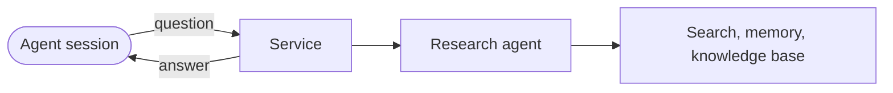

**Status:** the research agent and the desktop agent run on 2026-10-05. The project plans a third agent.

tenant-pi-durable holds the customizations and the deployment files for agents that run as services. The agents use pi-durable, the durable agent harness of the Pi project. The project uses pi-durable as an npm package and does not change its source.

## What it is for

Some work of a coding agent takes minutes, for example web research. With tenant-pi-durable, an agent session sends one question to a service and waits for the answer. The service keeps each job in a store. If the wait ends early, the session asks for the same job again.

## Main parts

| Part | What it does |
| --- | --- |
| Service | A container with an HTTP endpoint and a job store in SQLite. |
| Research agent | It searches the web with one search tool, keeps its own memory, and uses a knowledge base. |
| Desktop agent | A second profile of the same service. It does tasks on a desktop computer. |
| Clients and skills | One command sends a question and waits. A second command reads the stored trace of a job. |
| Viewer page | A browser page that sends a question, shows the progress and shows the answer. |

The trace of a job shows its status, its time, its tool calls and an estimated cost.

## Connections

- An agent session calls the agents through a skill. [tenant-pi](/tenant-pi/) generates the profile of a Pi session.
- The project publishes its viewer pages to the artifact service of [tenant-web](/tenant-web/).
- The planned third agent makes images with the stack of [tenant-comfy](/tenant-comfy/). A prototype page exists, but the agent does not.

This site has one overview page for this project.
