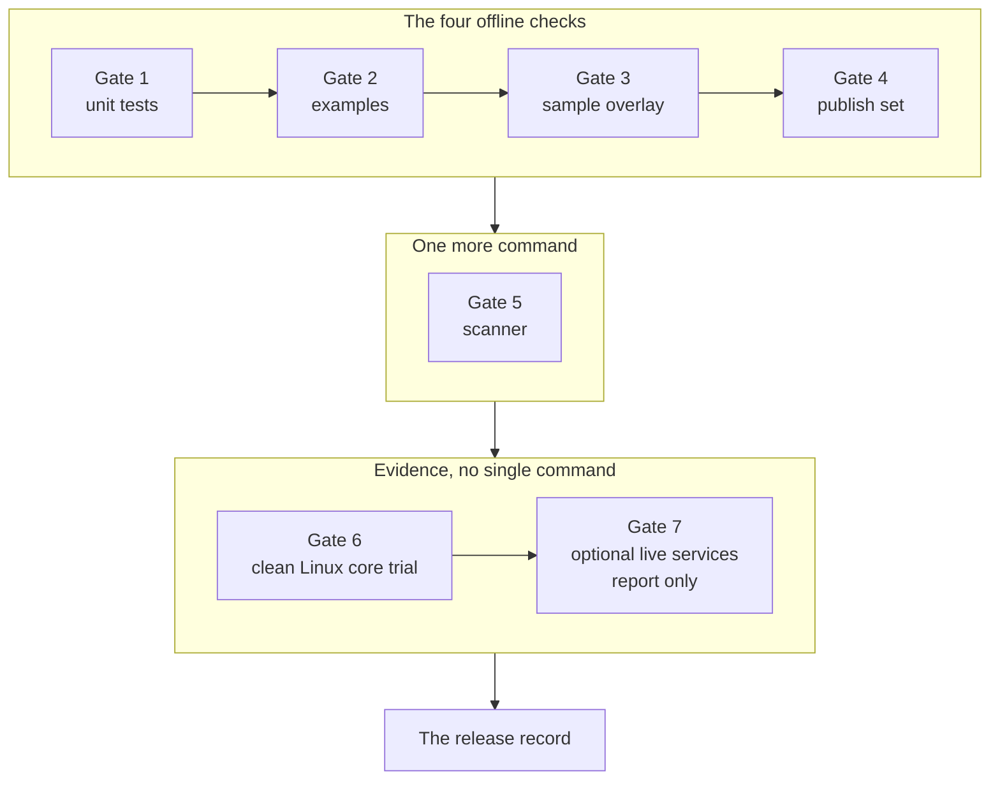
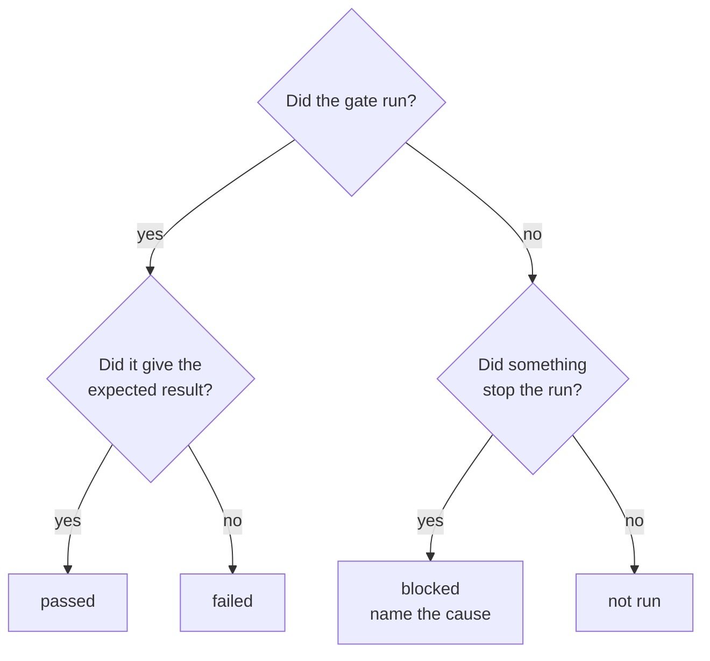

import Capture from '@/components/Capture.astro';

A gate is a condition that a release must meet. The release checklist of tenant-pi has seven gates. The reference file is `docs/guides/release-checklist.md`.

A passed gate is a fact for one release only. It is not a claim about a later release.

Each terminal frame on this page shows a command on the branch `main` of tenant-pi. The commands ran in a clean container without network access.

## The gates on one diagram



| Group | Gates | Who runs them |
| --- | --- | --- |
| The four offline checks | 1 to 4 | A worker before each merge. The coordinator on `main`. `scripts/publish_portable.py` runs them again itself. |
| The scanner | 5 | The coordinator before a release. The hooks run parts of it at each commit, merge and push. |
| Evidence | 6 and 7 | A person or an agent on a clean Linux user. The record names each result. |

## The commands

Run each command from the root of the clone, on the branch `main`.

| Gate | Command | Passes when | Required |
| --- | --- | --- | --- |
| 1. Offline unit tests | `PYTHONDONTWRITEBYTECODE=1 python3 -m unittest discover -s tests -q` | The last line is `OK`. | Yes |
| 2. Examples | `PYTHONDONTWRITEBYTECODE=1 python3 scripts/examples.py` | The command prints `examples valid`. | Yes |
| 3. Sample overlay | `PYTHONDONTWRITEBYTECODE=1 python3 scripts/validate.py --overlay config/config.example.json` | The line starts with `valid:`. | Yes |
| 4. Publish set | `PYTHONDONTWRITEBYTECODE=1 python3 scripts/publish_check.py` | The line starts with `publish set valid:`. | Yes |
| 5. Scanner | `scripts/scan.sh all` | The exit code is 0. | Yes |
| 6. Clean Linux core trial | No single command. See [gate 6](#gate-6-the-clean-linux-core-trial). | The record holds each stage and each check. | Yes |
| 7. Optional live services | No single command. See [gate 7](#gate-7-optional-live-services). | The record names each service with its result. | Report only |

`PYTHONDONTWRITEBYTECODE=1` stops Python from writing `__pycache__` files into the clone.

## The four results

Record each gate with one of four words.



| Result | Meaning | Example line |
| --- | --- | --- |
| passed | The gate ran and gave the expected result. | Gate 2: passed, `examples valid`. |
| failed | The gate ran and gave a different result. | Gate 4: failed, `unreviewed_file: repository inventory`. |
| blocked | The gate did not run, because a named cause stopped it. | Gateway route: blocked, no key on the test client. |
| not run | Nobody started the gate. | `wiki`: not run. |

Never write "passed" for a gate that did not run.

The release checklist names the four words and does not define them. The table gives their use in the release records of tenant-pi.

## Gate 1: the offline unit tests

<Capture id="tenant-pi/dev-unit-tests" />

The placeholder `<seconds>` replaces the run time of the tests.

| Question | Answer |
| --- | --- |
| What does it prove? | Each script behaves as its tests say, offline. The documents of the publish set pass the documentation check. |
| What does it not prove? | It does not prove that a generated profile starts Pi. Gate 6 does that. |
| What do you record? | The result word, the last line `OK` and the number of tests. |

The tests need a Git clone of the kit. Some tests fail in a copy that has no Git metadata.

Warning: run the tests with `unittest`, not with `pytest`. `pytest` writes a `.pytest_cache/` directory into the clone, and then gate 4 fails.

### The documentation check

Gate 1 includes the documentation check. The test `DocCheckRepoTests` of `tests/test_doc_check.py` runs it on the publish set. A finding makes the unit tests fail.

Run the script directly when you want the list of the findings:

<Capture id="tenant-pi/dev-doc-check" />

The check reads the Markdown files of the publish set. It runs offline, starts no process and writes nothing. A finding has the form `rule: path:line`.

| Rule | Meaning |
| --- | --- |
| `link_missing` | A relative link names a file that does not exist. |
| `link_outside` | A relative link leaves the repository. |
| `link_unpublished` | A link names a file outside the publish set. |
| `anchor_missing` | An anchor matches no heading of the target file. |
| `json_example` | A fenced `json` block is not valid JSON and not JSON Lines. |
| `cli_action` | A document names an action that the command line does not have. |
| `cli_flag` | A document names a flag that the action does not have. |
| `env_name` | A guide names an environment variable that the kit does not know. |
| `action_unguided` | No guide names an action of the command line. |
| `doc_missing`, `doc_text` | A file of the publish set is absent, is a link, or is not UTF-8 text. |

The check proves that a link resolves and that a command has a valid shape. It does not prove that the command works.

## Gate 2: the examples

<Capture id="tenant-pi/dev-examples" />

| Question | Answer |
| --- | --- |
| What does it prove? | `config/config.example.json` and `.env.example` are equal to the text that the manifest generates. |
| When does it fail? | The manifest changes, and nobody generates the examples again. The error is `example_mismatch`. |
| What do you record? | The result word and the line `examples valid`. |

`python3 scripts/examples.py --write` generates the two example files again. Run it after a change of `config/manifest.json`, then commit the result.

## Gate 3: the sample overlay

<Capture id="tenant-pi/dev-sample-overlay" />

| Question | Answer |
| --- | --- |
| What does it prove? | The sample overlay meets the structural contract of the manifest. |
| What does it not prove? | It is no package qualification and no runtime qualification. The output line says so. |
| What do you record? | The result word and the line that starts with `valid:`. |

## Gate 4: the publish set

<Capture id="tenant-pi/dev-publish-check" />

| Question | Answer |
| --- | --- |
| What does it prove? | Each tracked file is in a reviewed list. No file of the publish set matches a private-key pattern or a token pattern. `.env.example` holds no value. |
| What does it not prove? | It is not a secret audit. It is not a release approval, and the output line says so. |
| What do you record? | The result word and the line with the two file counts. |

The usual failure is `unreviewed_file: repository inventory`. It has two causes:

- A new tracked file is in no list of `scripts/publish_check.py`. Review the file, then add its exact path to `PUBLISH`.
- An untracked file is in the clone, for example a cache directory. Remove the file.

## Gate 5: the scanner

```sh
scripts/scan.sh all
```

The output names commits of the repository, so this block is an example with neutral values. It is not a capture.

```text title="Example"
warn  host value  tests/test_example.py:12  rule host-value-private-10 (private-10 (regex))  commit 0f1e2d3c4b5a
scan: 0 secret finding(s), 1 host-value finding(s), 0 policy finding(s), level warn
```

The scanner finds three kinds of content before it goes to a remote.

| Finding | Source | Result |
| --- | --- | --- |
| Secret | The rules in `.gitleaks.toml`. | Always fails. |
| Host value | The deny lists and `scripts/host-values.regex`. | Fails at the level `fail`. Prints a warning at the level `warn`. |
| Policy | A tracked ignore file of the scanner, a tracked file in `.local/`, or a tracked archive, database dump or Git bundle. | Always fails. |

The level depends on the branch.

| Where | Default level |
| --- | --- |
| The branch `portable` | `fail` |
| A tag `portable/*` at `HEAD` | `fail` |
| Each other branch | `warn` |

`main` holds host values and keeps them. Thus `scripts/scan.sh all` on `main` can print warnings and still exit with 0. `--level fail` sets the level for one run.

The host-value part of gate 5 applies to `portable`. The page [Portable release](/tenant-pi/develop/release/#the-scanner-level) gives the command for a snapshot.

The untracked file `.local/host-values.deny` adds the values of your host to the scan. A clone without this file scans with the tracked rules only.

| Mode | What it reads |
| --- | --- |
| `scripts/scan.sh tree` | The tracked files, the staged content and the content of archives. |
| `scripts/scan.sh staged` | The staged changes. The hooks `pre-commit` and `pre-merge-commit` use it. |
| `scripts/scan.sh history <range>` | Each commit of the range, with its message. The hook `pre-push` uses it. |
| `scripts/scan.sh all` | `tree` and `history`. |
| `scripts/scan.sh selftest` | A negative control: the rules must find a synthetic token and each host-value sample. |

<Capture id="tenant-pi/dev-scan-selftest" />

The frame shows the negative control. It ran with a `gitleaks` binary of the pinned version, without Docker.

| Question | Answer |
| --- | --- |
| What does it prove? | The tracked files and the history hold no secret and no policy finding. At the level `fail`, they also hold no host value. |
| What does it not prove? | It does not find an encoded secret. It does not read commit author names or tag messages. |
| What do you record? | The result word, the level and the result line that starts with `scan:`. |

The scanner needs Docker with the pinned scanner image, or a `gitleaks` binary of version v8.28.0. The scan does not pull the image. The exit code is 0 for a pass, 1 for a finding that fails, and 2 for a usage error or a tool error.

After a change of the scanner or of its rule files, run the test of the scanner:

```sh
sh tests/test_scan.sh
```

The test needs the scanner image and takes some minutes. The reference file is `docs/secret-handling.md`.

## Gate 6: the clean Linux core trial

Gate 6 has no single command. It is a full run of the setup guide by a user that has nothing of the development host.

1. Use a Linux user with no Pi profile, no kit credentials and no optional services.
2. Follow the setup guide with a core-only overlay, stages 1 to 9.
3. Record the Pi version, the Node version and the Python version from the action `check-runtime`.
4. Record checks 1, 2 and 4 of stage 9.
5. Record that nothing new appeared in `~/.pi/agent` of that user.
6. Report check 3 of stage 9, the model reply, as its own line.

Check 3 needs a credential. Without a credential, its result is blocked or not run.

`~/.pi/agent` is the profile directory that a bare `pi` command opens. The kit must never write into it.

The Install pages of this site describe the nine stages. See [Install](/tenant-pi/install/).

## Gate 7: optional live services

Gate 7 is a report. It does not stop a release. The record names each optional module, each route and each MCP server with one of the four results.

These lines are honest:

- `wiki`: not run.
- Gateway route: blocked, no key on the test client.
- `mcp`, server `example`: not run.

Do not write "all modules work" when only the core trial ran. A documentation review or an offline `generate` is not a live installation.

## Record the gates

Write one record for each release on the release issue. The record has one row for each gate.

```md
| Gate | Result |
| --- | --- |
| 1. Offline unit tests | passed (`OK`, <n> tests; includes the documentation check) |
| 2. Examples | passed (`examples valid`) |
| 3. Sample overlay | passed (`valid: structural contract only`) |
| 4. Publish set | passed (`publish set valid: <n> files, <n> explicit`) |
| 5. Scanner | passed (level `fail`: 0 secret, 0 host-value, 0 policy findings) |
| 6. Clean Linux core trial | passed, startup only (Pi <version>, stages 1 to 6, stage 9 checks 1, 2 and 4) |
| 7. Optional live services | not run (gateway route: not run, no key; `mcp`: not run) |
```

The record also names the tag of the snapshot and each open gap. See [Portable release](/tenant-pi/develop/release/).
