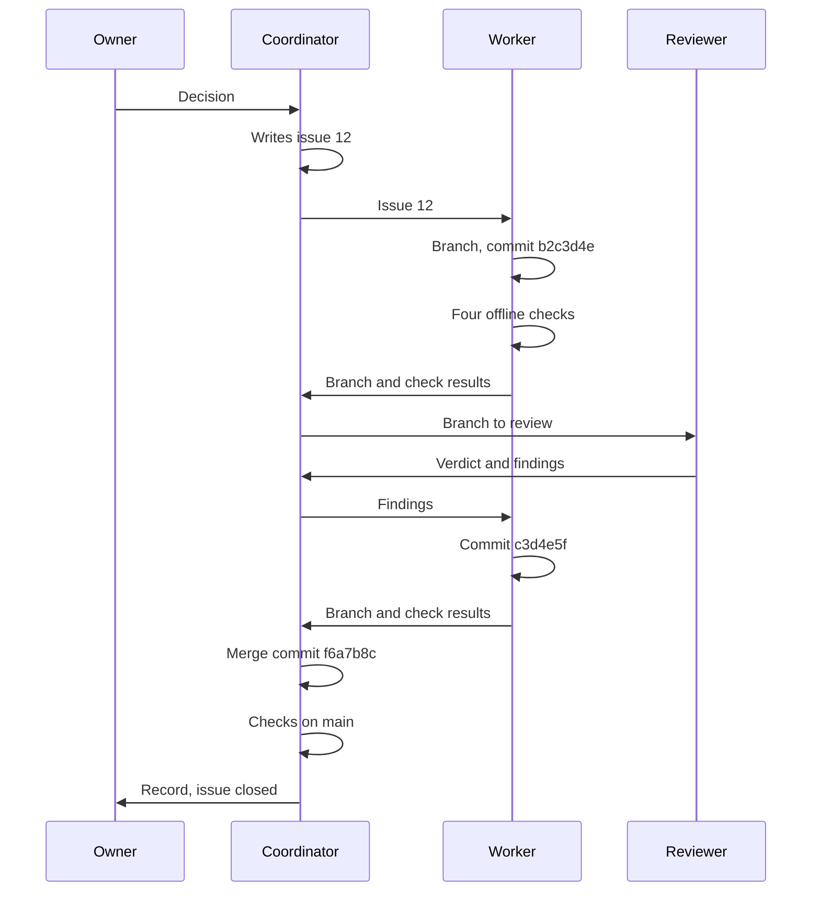
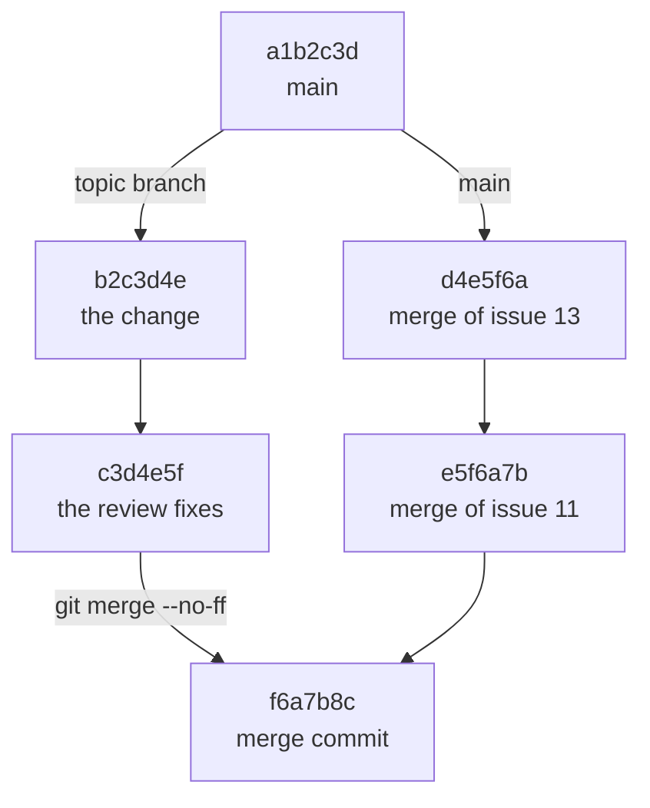
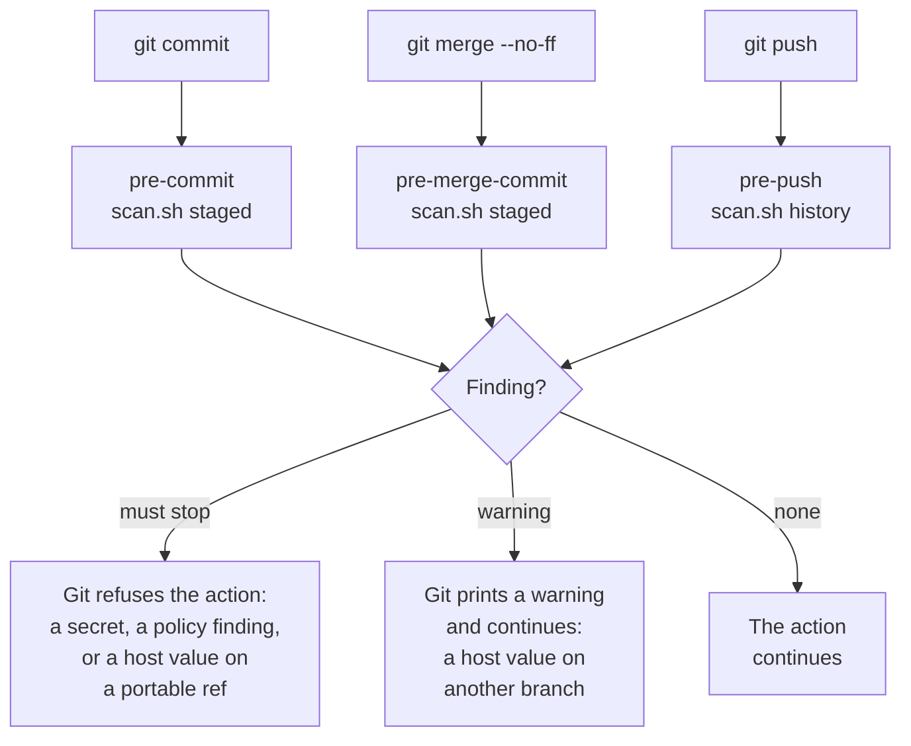

import Capture from '@/components/Capture.astro';

This page follows one change of tenant-pi from its issue to its merge. The change is small and complete: two commits, one review and one merge.

The example follows a real change. Its issue numbers, its branch name and its commit IDs are replaced with neutral values.

## The example on one diagram



The issue closes 19 minutes after it opens.

| Minute | Event |
| --- | --- |
| 0 | The coordinator opens issue 12. |
| 3 | The worker commits `b2c3d4e`. |
| 14 | The worker commits `c3d4e5f` after the review. |
| 17 | The coordinator makes the merge commit `f6a7b8c`. |
| 19 | The coordinator writes the record and closes the issue. |

## The issue

An issue of tenant-pi has three parts. The part Acceptance states the checks before the work starts.

| Part | Text of the issue, in short |
| --- | --- |
| Title | `doc_check` joins the unittest run: one command covers the five offline checks. |
| Why | The documentation check is a fifth command beside the four offline checks. The owner decides that the unit tests run it. |
| Scope 1 | Add a test that runs `doc_check.check()` on the real publish set and asserts no finding. |
| Scope 2 | `scripts/publish_portable.py` and the release checklist say that the documentation check runs inside gate 1. |
| Scope 3 | Update the troubleshooting guide and `README.md` where they list the checks. |
| Acceptance 1 | The unit test command fails when a guide has a broken link, and passes on `main`. |
| Acceptance 2 | The test runs offline and read-only, with no subprocess. |
| Acceptance 3 | The four checks pass. The documentation names four commands, not five. |

Each acceptance line is a check that a person or an agent can run. The record at the end gives one result for each line.

## The branch and the commits



The worker starts the branch at commit `a1b2c3d` of `main`. Two other workers work on issues 13 and 11 at the same time. The coordinator merges their branches first: `d4e5f6a` and `e5f6a7b`. The topic branch of issue 12 does not change for them. The merge commit `f6a7b8c` joins the two lines.

| Commit | Subject | Changed files |
| --- | --- | --- |
| `b2c3d4e` | `checks: doc_check joins the unittest run (issue 12)` | `tests/test_doc_check.py`, `scripts/publish_portable.py`, `README.md` and three documents below `docs/` |
| `c3d4e5f` | `checks: close the issue 12 review findings` | `docs/guides/release-checklist.md` and `tests/test_doc_check.py` |
| `f6a7b8c` | `Merge topic/i12-doc-check: doc_check runs inside the unittest gate (issue 12)` | The merge commit. Its parents are `e5f6a7b` and `c3d4e5f`. |

`git log` shows the three commits.

```sh
git log --oneline f6a7b8c^1..f6a7b8c
```

The next block is an example with the neutral values. It is not a capture.

```text title="Example"
f6a7b8c Merge topic/i12-doc-check: doc_check runs inside the unittest gate (issue 12)
c3d4e5f checks: close the issue 12 review findings
b2c3d4e checks: doc_check joins the unittest run (issue 12)
```

### The names

| Object | Form | Example |
| --- | --- | --- |
| Topic branch | `topic/i<number>-<short-name>` | `topic/i12-doc-check` |
| Commit of the change | `<area>: <the change> (issue <number>)` | `checks: doc_check joins the unittest run (issue 12)` |
| Commit after the review | `<area>: close the issue <number> review findings` | `checks: close the issue 12 review findings` |
| Merge commit | `Merge topic/<branch>: <the result> (issue <number>)` | `Merge topic/i12-doc-check: doc_check runs inside the unittest gate (issue 12)` |

The body of each commit message says what changes and why. It holds no value of one host.

## The steps

### The worker builds the change

1. Create the topic branch from `main`.

   ```sh
   git switch -c topic/i12-doc-check main
   ```

   One issue has one topic branch.

2. Make the change and its test.

   In the example, the new test `DocCheckRepoTests` runs the documentation check on the real publish set.

3. Run the unit tests.

   <Capture id="tenant-pi/dev-unit-tests" />

   The last line must be `OK`.

4. Run the check of the examples.

   <Capture id="tenant-pi/dev-examples" />

   The command must exit with 0.

5. Validate the sample overlay.

   <Capture id="tenant-pi/dev-sample-overlay" />

   The command must exit with 0.

6. Run the publish check.

   <Capture id="tenant-pi/dev-publish-check" />

   The command must exit with 0.

7. Stage the files of the change.

   ```sh
   git add <each changed file>
   ```

   `git status` must show only files of the issue.

8. Commit the change.

   ```sh
   git commit -m "checks: doc_check joins the unittest run (issue 12)"
   ```

   The hook `pre-commit` scans the staged changes before Git records the commit.

9. Report the branch, the commands and each result to the coordinator.

   The report names each check as passed, failed, blocked or not run.

The frames of steps 3 to 6 show the four offline checks on `main` as it is now. The numbers at the time of the example were smaller. The placeholder `<seconds>` replaces the run time of the tests.

Warning: run the tests with `unittest`, not with `pytest`. `pytest` writes a cache directory into the clone, and then the publish check fails.

### The reviewer reads the branch

The reviewer reads the difference between `main` and the topic branch. The reviewer also tests the behavior that the issue asks for.

```sh
git diff main...topic/i12-doc-check
```

The verdict of the example is: merge after one fix. The reviewer also reports three small findings.

The message of commit `c3d4e5f` names two of the fixes:

| Before the fix | After the fix |
| --- | --- |
| The gates table of the release checklist has a row for the documentation check. That row has no command. | The table has no documentation row. The scanner, the clean Linux trial and the live services are gates 5 to 7. |
| Two test classes run the documentation check on the real tree. | One test class, `DocCheckRepoTests`, holds the assertions of both. |

The worker commits the fixes on the same topic branch. Then the worker runs the four offline checks again.

### The coordinator merges

1. Go to `main`.

   ```sh
   git switch main
   ```

   The merge commit goes on `main`.

2. Merge the topic branch with a merge commit.

   ```sh
   git merge --no-ff topic/i12-doc-check -m "Merge topic/i12-doc-check: doc_check runs inside the unittest gate (issue 12)"
   ```

   `--no-ff` keeps the two commits of the branch visible as one group. The hook `pre-merge-commit` scans the merge result.

3. Run the four offline checks on `main`.

   A merge can break a check that passed on the branch, because `main` changed during the work.

4. Scan the commits of the merge at the level `fail`.

   ```sh
   scripts/scan.sh --level fail history e5f6a7b..f6a7b8c
   ```

   The range goes from the first parent of the merge commit to the merge commit.

5. Push `main` to the development repository.

   ```sh
   git push origin main
   ```

   The hook `pre-push` scans the commits that the push sends.

6. Write the record as one comment on the issue.

   The record is the evidence that the issue is done.

7. Close the issue.

   The next release takes the change from `main`.

## The record

The record of issue 12 names the merge commit, the branch, the review and each check on `main` after the merge.

| Check on `main` after the merge | Recorded result |
| --- | --- |
| Unit tests | Passed: `OK`. |
| Examples | Passed: `examples valid`. |
| Sample overlay | Passed: `valid`, the structural contract only. |
| Publish set | Passed: `publish set valid: 566 files, 106 explicit`. |
| Documentation check | Passed: `doc check valid: 38 files`. |
| History scan of the merge range | Passed: 0 findings at the level `fail`. |
| Acceptance 1, a trial with one broken link | Passed: the unit tests fail with a `link_missing` finding. |

A good record has these properties:

- It names the merge commit and the last commit of the branch.
- It gives one result for each acceptance line of the issue.
- It gives the last line of each check, not only the word "passed".
- It names each thing that is not verified.
- It holds no value of one host.

## The hooks in this flow



The hooks run only in a clone where `scripts/install-hooks.sh` ran. See [Repository layout](/tenant-pi/develop/repository/).

Warning: `git commit --no-verify` and `git push --no-verify` skip the hooks. Run `scripts/scan.sh all` before a release.
