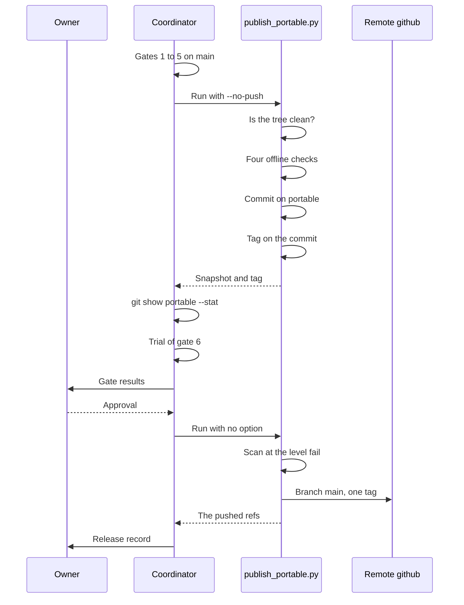

A portable release is a snapshot of the reviewed publish set on the branch `portable`. One command builds the snapshot, tags it and pushes it: `scripts/publish_portable.py`.

The reference files are `docs/publishing.md` and `docs/guides/release-checklist.md`.

## The release on one diagram



Nothing leaves the local repository before the approval of the owner.

## The steps

1. Commit each change on `main`.

   The publish command refuses a working tree that is not clean.

2. Run gates 1 to 5.

   The last line of each gate goes into the release record. The commands are on the page [Release gates](/tenant-pi/develop/gates/).

3. Build the snapshot without a push.

   ```sh
   python3 scripts/publish_portable.py --no-push
   ```

   The command prints the snapshot commit and the tag.

4. Inspect the snapshot.

   ```sh
   git show portable --stat
   ```

   The list shows each file that changes in this release.

5. Check that each new file is in `PUBLISH` of `scripts/publish_check.py`.

   A file that is not in the publish set does not reach the mirror.

6. Run the trial of gate 6 on the snapshot.

   The release records of tenant-pi run the trial before the push. The result of gate 7 goes into the same record.

7. Give the gate results and the snapshot to the owner.

   The owner approves the release or stops it.

8. Push after the approval.

   ```sh
   python3 scripts/publish_portable.py
   ```

   The command pushes the branch and the tag of this snapshot.

9. Record the tag, the gate results and the open gaps on the release issue.

   The record is the evidence for this release only.

The output of step 3 names a commit and a tag of the repository. So this block is an example with neutral values. It is not a capture.

```text title="Example"
check ok: unit tests
check ok: examples
check ok: sample overlay
check ok: publish set (500 files)
portable commit 9c0d1e2 (tree 5e6f7a8), tag portable/20260103-3c4d5e6
```

The release checklist gives no step for a release that the owner stops. The snapshot commit and its tag then stay in the local repository.

Warning: never publish with `--skip-checks`. The option is for debugging only.

Warning: use `--force` only for the first publication onto a remote that holds an unrelated history.

## What the command does

The command does five things in this order. A stop in actions 1 to 4 sends nothing to a remote.

| Order | Action | The command stops when |
| --- | --- | --- |
| 1 | It reads the state of the working tree. | The working tree is not clean. |
| 2 | It runs the four offline checks. | A check fails. The command prints the name of the check and its output. |
| 3 | It builds the tree of the publish set from `HEAD`. | A file of the publish set is absent from `HEAD`. |
| 4 | It commits the tree on `portable` and tags the commit. | No stop. With an equal tree, it makes no new commit and no new tag. |
| 5 | It pushes the branch ref and the tag ref of the snapshot by name. | The hook or the remote refuses the push. With `--no-push`, the command ends before this action. |

The command writes no file inside the checkout. A failed check stops the command before it writes a commit.

## The publish set

The publish set is the list of the files that a snapshot holds. `scripts/publish_check.py` defines it.

| List | Content |
| --- | --- |
| `PUBLISH` | Exact paths. A person reviews each file before its path goes into the list. |
| `PUBLISH_DIRS` | One rule for each imported package: the directory, and the excluded paths below it. |

- The command takes each file from the committed `HEAD`. It never takes a file from the working tree.
- The command builds the tree through a temporary index. The working tree does not change.
- A file outside the publish set never reaches the mirror, whatever `main` holds.

### Add a file to the publish set

1. Review the new file for secrets and host values.

   The pattern scan of the publish check is not a secret audit.

2. Add the exact path of the file to `PUBLISH` in `scripts/publish_check.py`.

   Without the entry, gate 4 fails with `unreviewed_file: repository inventory`.

3. Run gate 4.

   ```sh
   PYTHONDONTWRITEBYTECODE=1 python3 scripts/publish_check.py
   ```

   The count of the explicit files grows by one.

The publish check has these failure codes for the publish set:

| Code | Cause |
| --- | --- |
| `unreviewed_file` | A file is in no reviewed list. An untracked file below the directory of a rule gives the same code. |
| `tracked_in_node_modules` | A tracked file is below a `node_modules` directory. |
| `publish_duplicates` | A file is in `PUBLISH` and also below a rule. |
| `publish_secret_pattern` | A file of the publish set matches a private-key pattern or a token pattern. |

## The scanner level

The scanner has two levels for a host value. At the level `warn`, a host value gives a warning. At the level `fail`, a host value stops the action.

| Ref | Default level |
| --- | --- |
| The branch `portable` | `fail` |
| A tag `portable/*` | `fail` |
| `main` and each topic branch | `warn` |

The publish command pushes the local branch `portable` to the remote branch `main`. The hook `pre-push` reads both ref names, so this push has the level `fail`.

The hook scans the commits that the push sends:

| Pushed ref | Scanned commits |
| --- | --- |
| The remote ref exists, and its commit is in the local repository. | The commits from the remote commit to the local commit. |
| The remote ref is new. | The commits that no remote-tracking ref of that remote contains. |
| The remote has no remote-tracking ref. | All of the history of the local ref. |

To see the result before the push, scan the new snapshot commit yourself:

```sh
scripts/scan.sh --level fail history <the previous snapshot commit>..portable
```

The exit code must be 0. Record the result line that starts with `scan:`.

A host value in the publish set stops the release. Correct the content on `main`, then build the snapshot again. The file `scripts/host-values.allow-lines` accepts one exact line by its hash. A new entry needs a decision of the owner.

## The tag

Each snapshot commit gets one annotated tag.

| Part | Rule | Example |
| --- | --- | --- |
| Name | `portable/<yyyymmdd>-<source sha>` | `portable/20260103-3c4d5e6` |
| `<yyyymmdd>` | The date of the run, in UTC. | `20260103` |
| `<source sha>` | The first seven characters of the `main` commit. | `3c4d5e6` |
| Commit subject | `Portable snapshot of <source sha> (<date>)` | `Portable snapshot of 3c4d5e6 (2026-01-03)` |

The body of the snapshot commit names the full ID of the source commit. Thus each snapshot leads back to one commit of `main`.

The snapshot commit and the tag carry a neutral identity:

- The name is `tenant-pi portable`.
- The e-mail is `portable@tenant-pi.invalid`.
- The commit and the tag have no signature.
- The dates have the offset of UTC.

The scanner does not read commit metadata. The neutral identity keeps the Git identity and the signing key of the publishing host out of a snapshot.

## The push

The command pushes two refs by name:

| Ref | Meaning |
| --- | --- |
| `refs/heads/portable:refs/heads/main` | The local branch `portable` becomes the branch `main` of the remote `github`. |
| `refs/tags/<tag>:refs/tags/<tag>` | The tag of this snapshot. |

- The command pushes no other tag and no other branch.
- After a build with `--no-push`, the next run makes no new tag. It pushes the tag of the earlier build.
- A refused push stops the command with the Git error.
- A remote can accept one named ref and refuse the other. Read the Git error to see which ref moved.
- The push needs a GitHub credential in the environment that runs the command. The script never reads or prints it.

## The options

| Option | Use |
| --- | --- |
| `--no-push` | Build and tag only. Inspect the snapshot before a push. |
| `--remote`, `--remote-branch` | Another destination. The defaults are `github` and `main`. |
| `--branch` | Another local snapshot branch. The default is `portable`. |
| `--identity-name`, `--identity-email` | Another identity on the snapshot commit and the tag. |
| `--force` | The first publication onto a remote with an unrelated history. It uses `--force-with-lease`. |
| `--skip-checks` | Debugging only. |

The variables `TENANT_PI_PUBLISH_NAME` and `TENANT_PI_PUBLISH_EMAIL` also set the identity. An option replaces a variable.

## The release record

Write the record as one comment on the release issue.

| Part | Content |
| --- | --- |
| Source | The commit of `main` that the snapshot comes from. |
| Snapshot | The commit of `portable` before the release and after it, and the tag. |
| Gates | One row for each gate: passed, failed, blocked or not run, with its evidence. |
| Push | Each ref that the push moved. |
| Open gaps | Each thing that is not verified. |

The table of the gates is on the page [Release gates](/tenant-pi/develop/gates/#record-the-gates).

## The limits

- A snapshot is a copy. It is not a filter of the history of `main`.
- The history of the mirror is the sequence of the snapshots.
- The pattern scan of gate 4 is not a secret audit.
- A passed gate is a fact for one release. A later release needs its own record.
