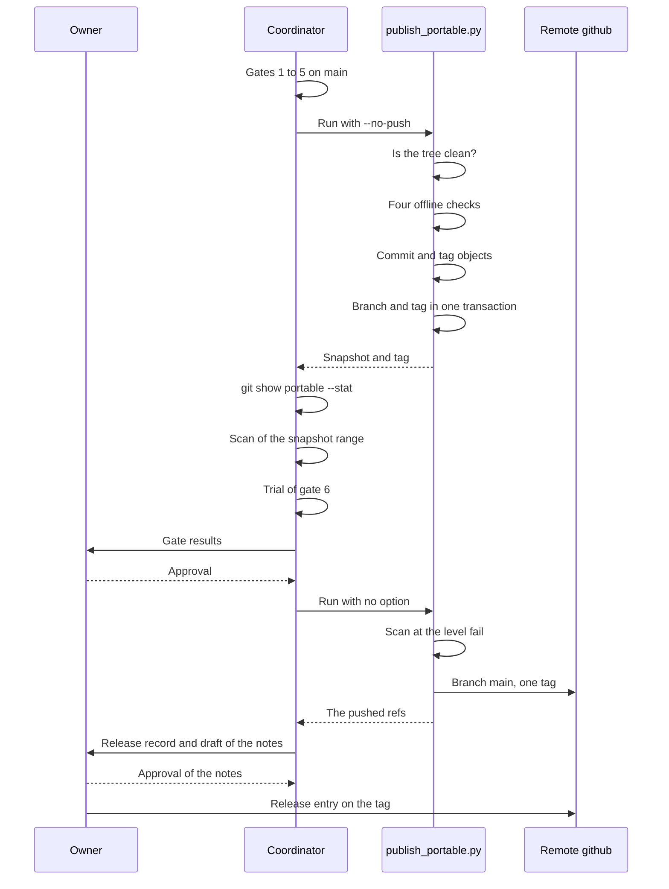

A portable release is a snapshot of the reviewed publish set on the branch `portable`. One command builds the snapshot, tags it and pushes it: `scripts/publish_portable.py`.

The reference files are `docs/publishing.md`, `docs/guides/release-checklist.md` and `docs/guides/pin-move-release.md`.

## The release on one diagram



Nothing leaves the local repository before the approval of the owner.

## The steps

1. Commit each change on `main`.

   The publish command refuses a working tree that is not clean.

2. Run gates 1 to 5.

   The last line of each gate goes into the release record. The commands are on the page [Release gates](/tenant-pi/develop/gates/).

3. Build the snapshot without a push.

   ```sh
   python3 scripts/publish_portable.py --no-push
   ```

   The command prints the snapshot commit and the tag.

4. Inspect the snapshot.

   ```sh
   git show portable --stat
   ```

   The list shows each file that changes in this release.

5. Check that each new file is in `PUBLISH` of `scripts/publish_check.py`.

   A file that is not in the publish set does not reach the mirror.

6. Scan the new snapshot commits at the level `fail`.

   The command is in [The scanner level](#the-scanner-level). The exit code must be 0.

7. Run the trial of gate 6 on the snapshot.

   The release records of tenant-pi run the trial before the push. The results of gates 7 and 8 go into the same record.

8. Give the gate results and the snapshot to the owner.

   The owner approves the release or stops it.

9. Push after the approval.

   ```sh
   python3 scripts/publish_portable.py
   ```

   The command pushes the branch and the tag of this snapshot.

10. Record the tag, the gate results and the open gaps on the release issue.

    The record is the evidence for this release only.

11. Write the release notes after the last gate.

    The section [The release notes](#the-release-notes) lists their content.

12. Create the release entry on the tag after the owner approves the notes.

    The snapshot holds no notes file, because a later file changes the tested tree.

13. Update the documentation site for the new tag.

    The site sets the tag in its version file, runs its capture script and updates the changed pages.

The output of step 3 names a commit and a tag of the repository. So this block is an example with neutral values. It is not a capture.

```text title="Example"
check ok: unit tests
check ok: examples
check ok: sample overlay
check ok: publish set (500 files)
portable commit 9c0d1e2 (tree 5e6f7a8), tag portable/20260103-3c4d5e6
```

The release checklist gives no step for a release that the owner stops. The snapshot commit and its tag then stay in the local repository.

Warning: never publish with `--skip-checks`. The option is for debugging only.

Warning: `--force` can replace the snapshot history of the remote. It does not remove the earlier tags of the remote.

## What the command does

The command does six things in this order. A stop in actions 1 to 5 sends nothing to a remote.

| Order | Action | The command stops when |
| --- | --- | --- |
| 1 | It reads the state of the working tree. | The working tree is not clean. |
| 2 | It runs the four offline checks. | A check fails. The command prints the name of the check and its output. |
| 3 | It builds the tree of the publish set from `HEAD`. | A file of the publish set is absent from `HEAD`, or the snapshot branch is not permitted. |
| 4 | It builds the snapshot commit and the annotated tag as Git objects. | No stop. With an equal tree, it makes no new commit and no new tag. |
| 5 | It moves the branch and creates the tag in one Git transaction. | The tag exists, or the branch changed during the run. Then no ref moves. |
| 6 | It pushes the branch ref and the tag ref of the snapshot by name. | The hook or the remote refuses the push. With `--no-push`, the command ends before this action. |

The command writes no file inside the checkout. A failed check stops the command before it writes a commit.

- The snapshot commit has the snapshot before it as its parent.
- The snapshot branch has the name `portable`, `portable-*` or `portable/*`. The command refuses another name.
- The command refuses a snapshot branch that a worktree has as its checkout.
- The command needs Git 2.36 or later.

## The publish set

The publish set is the list of the files that a snapshot holds. `scripts/publish_check.py` defines it.

| List | Content |
| --- | --- |
| `PUBLISH` | Exact paths. A person reviews each file before its path goes into the list. |
| `PUBLISH_DIRS` | One rule for each package below `packages/`: the directory, and the excluded paths below it. |

The file `scripts/dev-only-files.txt` is the exclusion list. It is optional. Each line is one reviewed file or one directory prefix that stays on `main`. The list itself is never in a snapshot.

- The command takes each file from the committed `HEAD`. It never takes a file from the working tree.
- The command reads the exclusion list from the same commit.
- An entry of the exclusion list cannot remove a file of `PUBLISH`.
- The command builds the tree through a temporary index. The working tree does not change.
- A file outside the publish set never reaches the mirror, whatever `main` holds.

Warning: without an exclusion list, each tracked file below the directory of a rule goes into the snapshot. This includes a private file that no scan finds.

### Add a file to the publish set

1. Review the new file for secrets and host values.

   The pattern scan of the publish check is not a secret audit.

2. Add the exact path of the file to `PUBLISH` in `scripts/publish_check.py`.

   Without the entry, gate 4 fails with `unreviewed_file: repository inventory`.

3. Run gate 4.

   ```sh
   PYTHONDONTWRITEBYTECODE=1 python3 scripts/publish_check.py
   ```

   The count of the explicit files grows by one.

A reviewed file that must stay on `main` goes into the exclusion list. Do not add it to `PUBLISH`.

Gate 4 also applies the public reader rules to the new file. See [Release gates](/tenant-pi/develop/gates/#the-public-reader-check).

The publish check has these failure codes for the publish set:

| Code | Cause |
| --- | --- |
| `unreviewed_file` | A file is in no reviewed list. An untracked file below the directory of a rule gives the same code. |
| `tracked_in_node_modules` | A tracked file is below a `node_modules` directory. |
| `tracked_build_output` | A tracked file is below the build output directory of a package. |
| `publish_duplicates` | A file is in `PUBLISH` and also below a rule. |
| `publish_path` | A file of the publish set is absent, is a link, or is not a regular file. |
| `publish_secret_pattern` | A file of the publish set matches a private-key pattern or a token pattern. |
| `env_example_value` | A line of `.env.example` holds a value, or a name that the manifest does not have. |
| `publish_public_reader` | A file of the publish set breaks a public reader rule. |
| `private_exclude_*`, `private_excludes_explicit` | The exclusion list has an error, for example an entry that matches no tracked file. |

## The scanner level

The scanner has two levels for a host value. At the level `warn`, a host value gives a warning. At the level `fail`, a host value stops the action.

| Ref | Default level |
| --- | --- |
| The branch `portable` | `fail` |
| A tag `portable/*` | `fail` |
| `main` and each topic branch | `warn` |

The publish command pushes the local branch `portable` to the remote branch `main`. The hook `pre-push` reads both ref names, so this push has the level `fail`.

The hook scans the commits that the push sends:

| Pushed ref | Scanned commits |
| --- | --- |
| The remote ref exists, and its commit is in the local repository. | The commits from the remote commit to the local commit. |
| The remote ref is new. | The commits that no remote-tracking ref of that remote contains. |
| The remote has no remote-tracking ref. | All of the history of the local ref. |

To see the result before the push, scan the new snapshot commit yourself:

```sh
scripts/scan.sh --level fail history <the previous snapshot commit>..portable
```

The exit code must be 0. Record the result line that starts with `scan:`.

The record of gate 5 has two scan results: `scripts/scan.sh all` on `main`, and this scan of the snapshot range. A result at the level `warn` on `main` does not approve the content of a snapshot. When the snapshot did not change, the range is empty, and the scan reads no new commit.

A host value in the publish set stops the release. Correct the content on `main`, then build the snapshot again. The file `scripts/host-values.allow-lines` accepts one exact line by its hash. A new entry needs a decision of the owner.

## The tag

Each snapshot commit gets one annotated tag.

| Part | Rule | Example |
| --- | --- | --- |
| Name | `portable/<yyyymmdd>-<source sha>` | `portable/20260103-3c4d5e6` |
| `<yyyymmdd>` | The date of the run, in UTC. | `20260103` |
| `<source sha>` | The first seven characters of the `main` commit. | `3c4d5e6` |
| Commit subject | `Portable snapshot of <source sha> (<date>)` | `Portable snapshot of 3c4d5e6 (2026-01-03)` |

The body of the snapshot commit names the full ID of the source commit. Thus each snapshot leads back to one commit of `main`. The tag carries the same message.

The snapshot commit and the tag carry a neutral identity:

- The name is `tenant-pi portable`.
- The e-mail is `portable@tenant-pi.invalid`.
- The commit and the tag have no signature.
- The dates have the offset of UTC.

The scanner does not read commit metadata. The neutral identity keeps the Git identity and the signing key of the publishing host out of a snapshot.

## The push

The command pushes two refs by name:

| Ref | Meaning |
| --- | --- |
| `refs/heads/portable:refs/heads/main` | The local branch `portable` becomes the branch `main` of the remote `github`. |
| `refs/tags/<tag>:refs/tags/<tag>` | The tag of this snapshot. |

- The command pushes no other tag and no other branch.
- After a build with `--no-push`, the next run makes no new tag. It pushes the tag of the earlier build.
- A refused push stops the command with the Git error.
- A remote can accept one named ref and refuse the other. Read the Git error to see which ref moved.
- The push needs a GitHub credential in the environment that runs the command. The script never reads or prints it.
- The command does not push to the development repository. The pin move guide sends the branch `portable` and the tag there with one `git push` of the two named refs.

## The options

| Option | Use |
| --- | --- |
| `--no-push` | Build and tag only. Inspect the snapshot before a push. |
| `--remote`, `--remote-branch` | Another destination. The defaults are `github` and `main`. |
| `--branch` | Another local snapshot branch with the name `portable-*` or `portable/*`. The default is `portable`. |
| `--identity-name`, `--identity-email` | Another identity on the snapshot commit and the tag. |
| `--force` | Replace the branch of the remote, also an existing snapshot history. It uses `--force-with-lease`. Not for a routine run. |
| `--new-root` | Start a new history: the snapshot commit has no parent. It needs `--no-push`. |
| `--skip-checks` | Debugging only. |

The variables `TENANT_PI_PUBLISH_NAME` and `TENANT_PI_PUBLISH_EMAIL` also set the identity. An option replaces a variable.

### A new history

Each snapshot has the snapshot before it as its parent. So a value that a later snapshot removes stays in the history. `--new-root` prepares a history without the earlier snapshots.

- The command with `--new-root` does not push. The push of a new history is a separate step.
- The earlier local tags stay, and they keep the earlier commits. Do not push them.
- A push of the new history to a remote that holds the old history needs `--force`.
- The safe destination of a new history is a new, empty repository.
- The next run without `--new-root` continues the new history.

Warning: the earlier tags of a remote can still show the commits of a history that `--force` replaced.

## The release record

Write the record as one comment on the release issue.

| Part | Content |
| --- | --- |
| Source | The commit of `main` that the snapshot comes from. |
| Snapshot | The commit of `portable` before the release and after it, and the tag. |
| Gates | One row for each gate: passed, failed, blocked or not run, with its evidence. |
| Push | Each ref that the push moved. |
| Open gaps | Each thing that is not verified. |

The table of the gates is on the page [Release gates](/tenant-pi/develop/gates/#record-the-gates).

## The release notes

The release notes of a snapshot are a release entry on its tag at the publication service. The publication service is the Git host of the published repository, for example GitHub. The owner approves the notes before the entry exists.

| Part of the notes | Content |
| --- | --- |
| Identity | The tag, the source commit and the snapshot commit. |
| Pins | The Pi pin `runtime.piVersion` and the accepted range `runtime.piAcceptedRange` of `config/manifest.json`. |
| Kind of release | A full qualification, or a fast track with gate 6 not run. |
| Gates 1 to 6 | One result word and the result line for each gate. |
| Two more result lines | The result line of the public reader check and of the documentation check. |
| Gates 7 and 8 | One result word for each part. These two gates have no word for the whole gate. |
| Changes | A short list of the changes since the tag before. |
| Platforms | A link to the table of the platforms that are not qualified, in the checklist at the tag. |
| Defects and gaps | Each known defect and each open gap. |

The release checklist holds a template for the notes, in its section "Release notes".

1. Write the notes into a file outside the clone.

   The snapshot must ship with no change after the gates.

2. Check the notes against the public reader rules.

   The publish check does not read the notes, because they are not in the publish set.

3. Get the approval of the owner for the notes.

   Warning: a release entry is public when the repository is public.

4. Create the release entry on the tag.

   ```sh
   gh release create "<tag>" --repo '<owner>/<repo>' --verify-tag --title "<tag>" --notes-file <the notes file>
   ```

   Warning: a published release locks its tag when the repository has release immutability on.

   `--verify-tag` stops the command when the remote repository does not have the tag.

5. Read the entry.

   ```sh
   gh release view "<tag>" --repo '<owner>/<repo>' --json tagName,isDraft,url
   ```

   The output must name the tag, `isDraft` as `false` and the URL of the entry.

The two commands use the command line of GitHub.

Warning: a list of changes from commit messages can hold a reference to a private tracker. Check the list against the public reader rules.

Not verified: the commands for a publication service other than GitHub.

## A pin move and the fast track

The notes name one of two kinds of release.

| Kind | Gate 6 | Meaning |
| --- | --- | --- |
| Full qualification | It ran. | The clean Linux core trial has a result for this snapshot. |
| Fast track | Not run. | The owner approved a release without the trial. It is not a full qualification. |

A pin move is a change of the Pi version that the kit tests. The guide `docs/guides/pin-move-release.md` gives the steps from the new Pi version to the snapshot. The guide records a fast track.

| Phase | Action | Command or file |
| --- | --- | --- |
| Preconditions | Run the four offline checks on a clean `main`. Review each new file of the publish set as a public reader. | `scripts/publish_check.py --public` |
| Detect | Find the new version, and read the notes of each version between the pin and the new version. | `scripts/pi_update.py detect`, `scripts/pi_update.py notes` |
| Qualify | Test the new version in a work directory outside the clone, before an edit. | `scripts/pi_update.py qualify --version <new version> --workdir <work directory>` |
| Move the pin | Change the pin and the accepted range with the function `pin_contents`. | `config/manifest.json`, `scripts/validate.py` |
| Merge | Run the checks, commit on a topic branch, get a review, merge with `--no-ff`. | The steps of [From an issue to a merge](/tenant-pi/develop/issue-to-merge/) |
| Release | Run the gates, build the snapshot, scan the snapshot range, push the named refs. | `scripts/publish_portable.py` |
| Notes | Write the release notes, and create the release entry. | [The release notes](#the-release-notes) |

- `pin_contents` of `scripts/pi_update.py` changes two tracked files: the manifest and the reviewed core anchor in `scripts/validate.py`.
- `runtime.piVersion` is the tested version. `runtime.piAcceptedRange` is the accepted range.
- A new stable pin sets the range from the new version to the next minor line.
- The exit code 10 of `detect` means a difference between the pin and the registry.
- A passed qualification is not gate 6. It does not prove an interactive session or an optional live service.

Warning: `pin_contents` replaces both tracked files. Keep a copy of each edit that is not committed.

## The limits

- A snapshot is a copy. It is not a filter of the history of `main`.
- The history of the mirror is the sequence of the snapshots.
- The pattern scan of gate 4 is not a secret audit.
- A passed gate is a fact for one release. A later release needs its own record.
