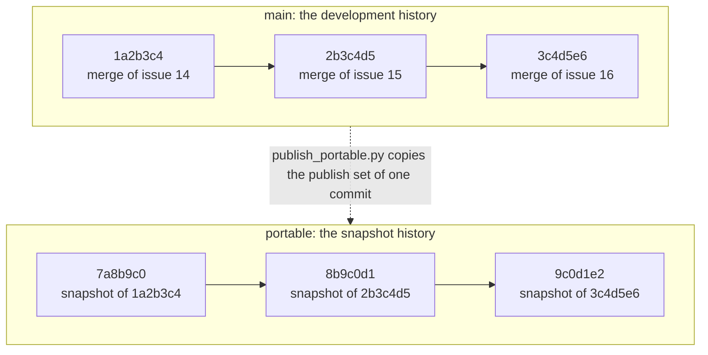
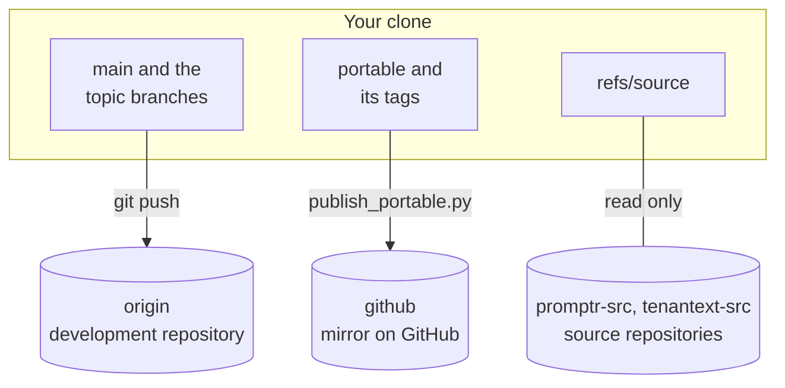

The tenant-pi repository has two long-lived branches. Development happens on `main`. A release is a snapshot on `portable`.

## The two branches



Each box on `main` is one merge commit. The diagram leaves out the merges between them. Each box on `portable` is one snapshot commit.

The commit IDs, the issue numbers and the tags in the diagram and in the table are example values.

The dotted arrow is `scripts/publish_portable.py`. One run copies the publish set of one `main` commit into one new `portable` commit. The publish set is the list of the reviewed files that a release holds.

| Snapshot commit | Tag | Source commit on `main` |
| --- | --- | --- |
| `7a8b9c0` | `portable/20260101-1a2b3c4` | `1a2b3c4` |
| `8b9c0d1` | `portable/20260102-2b3c4d5` | `2b3c4d5` |
| `9c0d1e2` | `portable/20260103-3c4d5e6` | `3c4d5e6` |

The two branches share no commit. `portable` is not a filter of the history of `main`. Its history is the sequence of the snapshots.

| Property | `main` | `portable` |
| --- | --- | --- |
| Purpose | Development. | Release. |
| Files | All tracked files: the kit, the drafts and the planning notes. | The publish set and no other file. |
| History | Topic branches and merge commits. | One commit for each snapshot, in one line. |
| Commit identity | The Git identity of the developer. | The neutral identity `tenant-pi portable`, with no signature. |
| Host values | The scanner prints a warning (level `warn`). | The scanner fails (level `fail`). |
| Remote | The development repository, remote `origin`. | The mirror on GitHub, remote `github`, branch `main`. |
| Tags | One tag of the form `pre-split-<date>` marks the state before the package imports. | `portable/<yyyymmdd>-<source sha>` for each snapshot. |

A host value is text that identifies one private host, for example a host name, a private address or a home path.

## The files on `main`

| Path | Content | In the publish set |
| --- | --- | --- |
| `README.md`, `INSTALL.md` | The overview, and the install text for an agent. | Yes |
| `config/manifest.json` | The components and the runtime pins of the kit. | Yes |
| `config/config.example.json`, `.env.example` | The generated examples. They hold synthetic values only. | Yes |
| `config/private/` | The templates for the private directory of a user. | Yes |
| `scripts/tenant_pi.py` | The command line of the kit. | Yes |
| `scripts/` | The modules of each action, the checks, the scanner and the publish command. | Yes |
| `scripts/git-hooks/` | The hooks `pre-commit`, `pre-merge-commit` and `pre-push`, and their dispatcher. | Yes |
| `tests/` | The unit tests, and `test_scan.sh` for the scanner. | Yes |
| `docs/guides/` | The guides for a user, and the release checklist. | Yes |
| `docs/` | One reference document for each action and each module. | Yes, without the planning drafts |
| `extensions/` | One Pi extension of the kit. | Yes |
| `skills/` | The skills of the kit, for example the install skill. | Yes |
| `packages/tenantext/`, `packages/promptr/` | Two imported packages. Their extensions and skills are optional components. | Yes, without the excluded directories |
| `.gitleaks.toml`, `scripts/host-values.*` | The rules of the scanner. | Yes |
| `docs/wayfinder/` | The planning map and the planning notes. | No |
| `docs/promptr-history/` | The history documents of an imported package. | No |
| `HANDOFF.md` | The first planning brief. | No |
| `.local/` | Values of one host. Git does not track this directory. | Never |

### The files that stay on `main`

`scripts/publish_check.py` holds three lists. Together they account for each tracked file.

| List | Meaning |
| --- | --- |
| `PUBLISH` | Exact paths of the reviewed files. Each path goes to `portable`. |
| `PUBLISH_DIRS` | One rule for each imported package: the directory, and the excluded paths below it. |
| `DRAFT_DIRS` | Directories of reviewed drafts. They stay on `main`. |

These files stay on `main`:

- The planning packet: `docs/README.md`, `docs/design.md`, `docs/setup-checklist.md`, `docs/tasks.md`, `docs/inventory.md` and `docs/owner-decisions.md`.
- The planning map: each file below `docs/wayfinder/`.
- Three draft files below `config/`: `settings.template.json`, `hermes-memory-config.template.json` and `keybindings.json`.
- `HANDOFF.md` and each file below `docs/promptr-history/`.
- The excluded paths of the package rules, for example `packages/promptr/dist/`.

A tracked file that is in no list makes the publish check fail. See [Release gates](/tenant-pi/develop/gates/).

## The remotes



| Remote | Purpose | Push |
| --- | --- | --- |
| `origin` | Development: `main` and the topic branches. | Permitted |
| `github` | Portable snapshots. The local branch `portable` becomes the branch `main` of this remote. | Permitted, through `scripts/publish_portable.py` |
| `promptr-src` | Read the source of the imported package Promptr. | Disabled |
| `tenantext-src` | Read the source of the imported package Tenantext. | Disabled |

`origin` is a private repository. The GitHub repository is the public version of tenant-pi. It is private at this time.

`scripts/setup_remotes.sh` creates the two source remotes. It never changes `origin` or `github`. The script contacts no server.

| Command | Result |
| --- | --- |
| `scripts/setup_remotes.sh` | Creates the two source remotes. A second run changes nothing. |
| `scripts/setup_remotes.sh --check` | Changes nothing. The exit code is 0 when both source remotes are correct. |
| `scripts/setup_remotes.sh --fetch promptr-src <commit>` | Fetches one source commit into `refs/source/`. `<commit>` is a full object ID. |

A source remote has three guards:

- The push URL is the text `DISABLED`, so a push fails.
- The option `--no-tags` keeps the source tags out of `refs/tags/`.
- The fetch refspec matches no branch, so a plain `git fetch` transfers no object.

The reference file is `docs/remotes.md`.

## The private files

Two different places hold private data. Neither place is in the publish set.

| Place | Owner | Content |
| --- | --- | --- |
| `.local/` in the clone | A developer of the kit | Values of the development host. For example `.local/host-values.deny`, the local deny list of the scanner. |
| The private directory, for example `~/.config/tenant-pi` | A user of the kit | The overlay, the registry, the install log and the accepted-drift list of one host. |

`.gitignore` ignores `.local/`. The scanner also fails on a tracked file in `.local/`.

Warning: the ignore rule for `.local/` is not a security control. Do not copy a value of `.local/` into a tracked file, a report or a commit message.

The action `init-private` creates the private directory of a user outside the clone. See [Modules and privacy](/tenant-pi/use/modules-and-privacy/).

## Set up a development clone

You need Git and Python 3.11 or later. The scanner also needs Docker with the scanner image, or the `gitleaks` binary.

1. Clone the repository.

   ```sh
   git clone <the URL of the tenant-pi repository> ~/tenant-pi
   ```

   The clone is on the branch `main`.

2. Go to the clone.

   ```sh
   cd ~/tenant-pi
   ```

   Each command on the Develop pages runs from this directory.

3. Install the hooks.

   ```sh
   scripts/install-hooks.sh
   ```

   The hooks scan each commit, each merge and each push.

4. Check the hooks.

   ```sh
   scripts/install-hooks.sh --check
   ```

   The exit code is 0 when the hooks are installed and current.

5. Create the source remotes.

   ```sh
   scripts/setup_remotes.sh
   ```

   A clone does not copy the remote configuration, so each clone needs one run.

6. Add the remote `github` if you publish releases from this clone.

   ```sh
   git remote add github <the URL of the mirror repository>
   ```

   `scripts/publish_portable.py` pushes to the remote with this name.

7. Run the four offline checks.

   The commands are on the page [Release gates](/tenant-pi/develop/gates/). Each check must pass on a new clone.

Warning: `core.hooksPath` is shared configuration. One run of `scripts/install-hooks.sh` changes the main checkout and each worktree.

Warning: a Git worktree shares the remote configuration of its main checkout. A run of `scripts/setup_remotes.sh` in a worktree changes the main checkout too.
