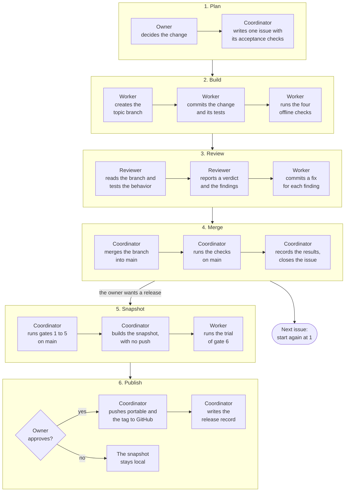
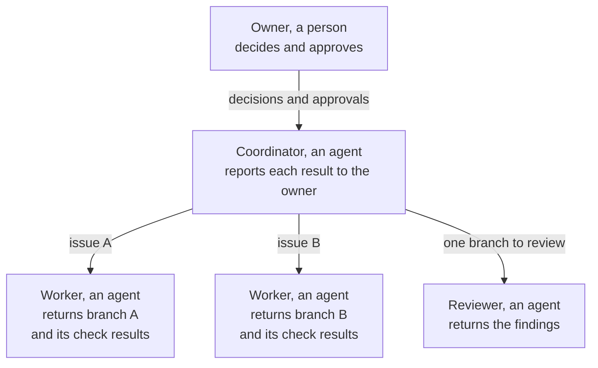

tenant-pi changes in one loop. A change starts as an issue. It ends as a merge commit on the branch `main`. A release then copies the reviewed files of `main` to the branch `portable`.

This page shows the whole loop on one diagram. The other Develop pages explain each part.

## The loop

Read the diagram from the top to the bottom. Each group with a title is one phase. The first line of each step names the role that does the step.

Phases 1 to 4 repeat for each issue. Each merged issue changes `main`. Phases 5 and 6 run when the owner wants a release. A release changes `portable` and the mirror on GitHub.

When the review has no finding, the worker commits nothing more in phase 3. When the owner does not approve, the snapshot stays local.

## The roles

The loop has four roles. One role is a person. Three roles are agents. An agent is a program that works with a language model.

| Role | Task | Limit |
| --- | --- | --- |
| Owner | Decides each change. Answers the open questions. Approves each release. | Does not need to write code. |
| Coordinator | Splits the work into issues. Gives each issue to one worker. Merges the branches. Runs a release. | Does not push a release without the approval of the owner. |
| Worker | Takes one issue. Works on one topic branch. Reports the commands and the results. | Changes only the files of its issue. |
| Reviewer | Reads one branch. Tests the behavior. Reports the findings. | Makes no unrelated change. |

The method does not depend on agents. A person can take each agent role and run the same commands.

Workers can work at the same time, because each worker has its own issue and its own topic branch. A Git worktree gives each worker its own working tree of the same repository.

## Each step

| Step | Role | Action | Result | Page |
| --- | --- | --- | --- | --- |
| 1 | Owner | Decides the change. | A decision that the issue records. | This page |
| 2 | Coordinator | Writes the issue. | An issue with the parts Why, Scope and Acceptance. | [From an issue to a merge](/tenant-pi/develop/issue-to-merge/) |
| 3 | Worker | Creates the topic branch from `main`. | The branch `topic/i<number>-<short-name>`. | [From an issue to a merge](/tenant-pi/develop/issue-to-merge/) |
| 4 | Worker | Commits the change and its tests. | Small commits. Each subject names the area and the issue. | [From an issue to a merge](/tenant-pi/develop/issue-to-merge/) |
| 5 | Worker | Runs the four offline checks. | The last line of each check. | [Release gates](/tenant-pi/develop/gates/) |
| 6 | Reviewer | Reads the branch and tests the behavior. | A verdict and a list of findings. | [From an issue to a merge](/tenant-pi/develop/issue-to-merge/) |
| 7 | Worker | Commits the fixes for the findings. | One more commit on the topic branch. | [From an issue to a merge](/tenant-pi/develop/issue-to-merge/) |
| 8 | Coordinator | Merges the branch into `main` with `git merge --no-ff`. | A merge commit that names the branch and the issue. | [From an issue to a merge](/tenant-pi/develop/issue-to-merge/) |
| 9 | Coordinator | Runs the checks on `main` and records them on the issue. | A closed issue with its evidence. | [From an issue to a merge](/tenant-pi/develop/issue-to-merge/) |
| 10 | Coordinator | Runs gates 1 to 5 on `main`. | The last line of each gate. | [Release gates](/tenant-pi/develop/gates/) |
| 11 | Coordinator | Builds the snapshot with `python3 scripts/publish_portable.py --no-push`. | A new commit and a new tag on the local branch `portable`. | [Portable release](/tenant-pi/develop/release/) |
| 12 | Worker | Runs the trial of gate 6 on a clean Linux user, from the snapshot. | Gates 6 and 7 recorded as passed, failed, blocked or not run. | [Release gates](/tenant-pi/develop/gates/) |
| 13 | Owner | Approves the release. | An approval that the release issue records. | [Portable release](/tenant-pi/develop/release/) |
| 14 | Coordinator | Pushes with `python3 scripts/publish_portable.py`. | The branch and the tag on the mirror on GitHub. | [Portable release](/tenant-pi/develop/release/) |
| 15 | Coordinator | Writes the release record on the release issue. | The tag, each gate result and each open gap. | [Portable release](/tenant-pi/develop/release/) |

## The rules of the loop

- One issue has one topic branch and one writer.
- An issue states its acceptance checks before the work starts.
- A check has one of four results: passed, failed, blocked or not run.
- Do not record a check as passed when it did not run.
- A merge uses `--no-ff`, so the history shows each topic branch.
- `main` stays in the development repository. Only the reviewed publish set goes to `portable`.
- The coordinator pushes a release only after the owner approves it.

## Where to read next

| Question | Page |
| --- | --- |
| What do the two branches hold, and where are the remotes? | [Repository layout](/tenant-pi/develop/repository/) |
| How does one issue go from its start to its merge? | [From an issue to a merge](/tenant-pi/develop/issue-to-merge/) |
| Which commands are the gates, and what does each gate prove? | [Release gates](/tenant-pi/develop/gates/) |
| How does a snapshot go to `portable` and to GitHub? | [Portable release](/tenant-pi/develop/release/) |
