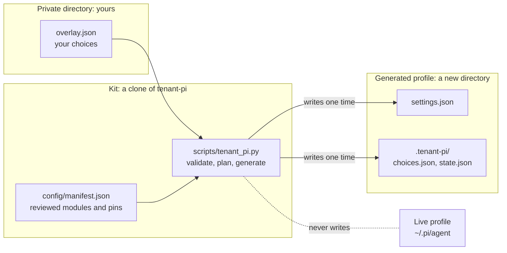

import { CardGrid, LinkCard } from '@astrojs/starlight/components';
import DocVersion from '@/components/DocVersion.astro';

<DocVersion project="tenant-pi" />

tenant-pi is a guided kit for a Pi profile. Pi is a coding agent that runs in a terminal. A profile is the directory that holds the configuration of one Pi installation.

You write your choices into a private JSON file, the overlay. The kit checks the overlay offline. Then the kit generates a new, separate profile directory.

## How the parts fit

| Part | What it is | Who owns it |
| --- | --- | --- |
| Private directory | A directory outside the kit that only you can read. It holds the overlay and your records. | You |
| Overlay | The JSON file with your choices: the target directory, the modules, the model roles. | You |
| Kit | A clone of the tenant-pi repository. It holds reviewed source and no value of yours. | The tenant-pi project |
| Generated profile | A new directory that the kit writes one time. Pi uses it when you launch Pi with this profile. | You |
| Live profile | `~/.pi/agent`, the profile that Pi uses by default. The kit never writes into it. | You |

## Who it is for

- You use Pi, and you want a second profile that does not change the first one.
- You want each choice of a profile in one file that a tool can check.
- You want to read each install command before you run it.
- You are an agent that installs a profile for a user. The file `INSTALL.md` of the kit is your guide.

You must know how to use a shell and a text editor.

## What the kit never does

- It never writes into a profile that exists. It writes only into a new directory.
- It installs no package. It does not run `npm`, `pip`, `git` or a system package manager.
- It stores no credential. It does not write, print or resolve a secret value.
- It edits no shell startup file, and it does not change `PATH`.
- It starts no service, no timer and no daemon.
- It opens no network connection, and it makes no model call.
- It does not copy auth, sessions or memory between profiles.
- It runs `pi` in one case only: `pi --version` in the action `check-runtime`, with an empty temporary profile directory.

The kit prints the install commands and the launch command as display text. You read them and run them by hand.

A profile directory separates configuration. It is not a sandbox of the operating system. Each process of your user can read each profile.

## Status of this release

- This release is a release candidate.
- Linux is the first target.
- The offline stages 1 to 5 are tested.
- Not verified: a complete run on a clean client, with authentication and a model reply.
- No optional module has the label `ready` in this release.
- The kit pins Pi `1.0.2`, Node `>=22.22.0 <23` and Python `>=3.11`.

## Platforms that are not qualified

These platforms are not qualified in this release. The kit uses POSIX paths and file modes.

| Platform | Status |
| --- | --- |
| macOS | Not qualified |
| Windows, also WSL | Not qualified |
| Pi in a browser terminal | Not qualified |
| Pi in a Herdr pane | Not qualified |

The file `docs/guides/release-checklist.md` of the kit names the evidence that changes each status.

## Where to go next

<CardGrid>
	<LinkCard title="Install" description="The nine stages, from a clone of the kit to a tested profile." href="/tenant-pi/install/" />
	<LinkCard title="Use" description="The commands, the candidate update loop, the modules and privacy." href="/tenant-pi/use/commands/" />
	<LinkCard title="Develop" description="The loop from an issue to a portable release." href="/tenant-pi/develop/workflow/" />
	<LinkCard title="Reference" description="Where the reference files are." href="/tenant-pi/reference/" />
</CardGrid>
