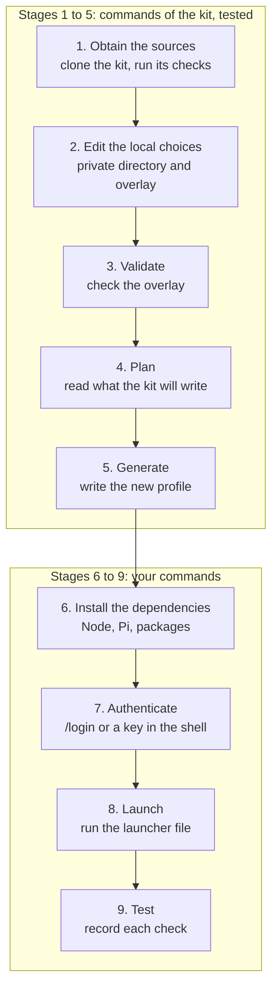

import { CardGrid, LinkCard, Steps } from '@astrojs/starlight/components';
import Capture from '@/components/Capture.astro';
import DocVersion from '@/components/DocVersion.astro';

<DocVersion project="tenant-pi" />

The install has nine stages. The stages stay separate and keep this order. Each stage has its own page with a goal, the steps and the result to check.

## The stages at a glance



| Stage | What you get | Commands | State in this release |
| --- | --- | --- | --- |
| [1. Obtain the sources](/tenant-pi/install/stage-1-obtain-the-sources/) | A clone of the kit that passes its offline checks. | `git clone`, then the kit | Tested |
| [2. Edit the local choices](/tenant-pi/install/stage-2-edit-the-local-choices/) | A private directory with an overlay that names a new target. | The kit, then your editor | Tested |
| [3. Validate](/tenant-pi/install/stage-3-validate/) | An overlay that passes the offline check. | The kit | Tested |
| [4. Plan](/tenant-pi/install/stage-4-plan/) | The list of files, gaps and commands, with nothing written. | The kit | Tested |
| [5. Generate](/tenant-pi/install/stage-5-generate/) | A new profile directory and a launcher file. | The kit | Tested |
| [6. Install the dependencies](/tenant-pi/install/stage-6-install-the-dependencies/) | Node, Pi and the packages of the modules that you enabled. | Yours | Tested on a clean client, core only |
| [7. Authenticate](/tenant-pi/install/stage-7-authenticate/) | A credential that reaches the Pi process. | Yours | Tested on a clean client, with an API key |
| [8. Launch](/tenant-pi/install/stage-8-launch/) | Pi runs with the generated profile. | Yours | Tested on a clean client, with no credential |
| [9. Test](/tenant-pi/install/stage-9-test/) | A record of each check. | Yours | Tested on a clean client, core only |

### Stages 1 to 5: the kit

The kit runs these stages. You type commands of the kit, and the kit does the work. After the clone, these stages use no network. They need no credential.

### Stages 6 to 9: you

These stages are yours. The kit runs none of their commands. The plan of Stage 4 prints some of the commands as display text. You read each command, and then you run it by hand.

## Requirements

| Item | Required | Notes |
| --- | --- | --- |
| Linux | The first target | Other platforms are not qualified. See the [overview](/tenant-pi/#platforms-that-are-not-qualified). |
| Git | Any current version | Only to clone the kit. |
| Python | `>=3.11` | Standard library only. The kit has no Python dependency. |
| Node | `>=22.22.0 <23` | The same Node installs Pi and builds native addons later. |
| Pi | `1.0.2` | The package `@earendil-works/pi-coding-agent`. Stage 6 installs it. |

Stages 1 to 5 need only Git and Python. Stage 1 reports the state of Node and Pi. Stage 6 installs what is absent.

## Words in this guide

| Word | Meaning | Example in this guide |
| --- | --- | --- |
| Kit | The tenant-pi repository, cloned on your machine. | `"$HOME/tenant-pi"` |
| Private directory | A directory outside the kit that only you can read. It holds the overlay and your records. | `"$HOME/.config/tenant-pi"` |
| Overlay | The JSON file with your choices. | `"$HOME/.config/tenant-pi/overlay.json"` |
| Target | The new profile directory. It must not exist before Stage 5. | `"$HOME/.pi/profiles/main"` |
| Launcher file | A file that starts Pi with the generated profile. Stage 5 writes it. | `"$HOME/.config/tenant-pi/launch-main.sh"` |
| Live profile | `~/.pi/agent`, or the directory in `PI_CODING_AGENT_DIR`. The kit never writes into it. | |

## Rules for each command

- The kit takes absolute paths only. It does not expand `~`.
- Write `"$HOME/..."` in a command. The shell expands it.
- Put each path that starts with `$HOME` in double quotes. A path can hold a space.
- Run each command of stages 1 to 5 from the kit directory.
- Copy each command as the page shows it.

## The command line of the kit

The kit has one command line: `python3 scripts/tenant_pi.py <action>`. An action is one function of that command line, for example `validate`. The option `--help` lists the actions. Each action has its own `--help`.

- An action prints one JSON object on one line of standard output.
- A refused action exits with code 2. It prints one JSON line on standard error.
- That line has an `error` of the form `rule: field`. An `error` never holds a path, a value or a secret.
- A page names a key inside a key with a dot. `commands.launchDisplayOnly` is the key `launchDisplayOnly` inside the key `commands`.
- In display text, the kit puts quotes around a path only when the shell needs them.

Stage 1 also runs two check scripts of the kit: the unit tests and the publish check. They are not actions, and they print plain text.

The frame shows the list of the actions.

<Capture id="tenant-pi/help" />

## Before Stage 1

<Steps>

1. Open a terminal as the user who will launch Pi later.

   Result: the terminal shows the shell prompt of that user.

2. Print each `PI_CODING_AGENT_` variable of that shell.

   ```sh
   env | grep '^PI_CODING_AGENT_' || echo "no PI_CODING_AGENT_ variable"
   ```

   Result: the shell prints each variable, or the text `no PI_CODING_AGENT_ variable`.

3. Write each printed variable name into your own notes.

   Result: you know if the shell moves the live profile or the sessions.

</Steps>

Keep your notes outside the kit. Stage 2 creates the install log, and Stage 9 writes the record into it.

`PI_CODING_AGENT_DIR` names the live profile. `PI_CODING_AGENT_SESSION_DIR` moves the sessions of every profile to one directory.

- In stages 1 to 5, the kit does not read these variables. The runtime check gives `pi --version` an empty temporary directory.
- In stages 8 and 9, the variables are important. The launch line of the kit sets the first variable and removes the second one, for the one `pi` process.
- Do not edit a shell startup file to remove a variable.

If you open a new terminal in a later stage, do steps 2 and 3 again in that terminal.

Warning: a bare `pi` command opens the live profile `~/.pi/agent`. To read the Pi version, use the action `check-runtime` of Stage 1.

## Start

<CardGrid>
	<LinkCard title="Stage 1: Obtain the sources" description="Clone the kit and run its offline checks." href="/tenant-pi/install/stage-1-obtain-the-sources/" />
	<LinkCard title="Stage 2: Edit the local choices" description="Create the private directory and edit the overlay." href="/tenant-pi/install/stage-2-edit-the-local-choices/" />
	<LinkCard title="Stage 3: Validate" description="Check the overlay offline." href="/tenant-pi/install/stage-3-validate/" />
	<LinkCard title="Stage 4: Plan" description="Read what the kit will write. The command writes nothing." href="/tenant-pi/install/stage-4-plan/" />
	<LinkCard title="Stage 5: Generate" description="Write the new profile and the launcher file." href="/tenant-pi/install/stage-5-generate/" />
	<LinkCard title="Stage 6: Install the dependencies" description="Install Node, Pi and the packages by hand." href="/tenant-pi/install/stage-6-install-the-dependencies/" />
	<LinkCard title="Stage 7: Authenticate" description="Give Pi a credential. The kit stores none." href="/tenant-pi/install/stage-7-authenticate/" />
	<LinkCard title="Stage 8: Launch" description="Start Pi with the generated profile." href="/tenant-pi/install/stage-8-launch/" />
	<LinkCard title="Stage 9: Test" description="Record each check as passed, failed, blocked or not run." href="/tenant-pi/install/stage-9-test/" />
</CardGrid>
