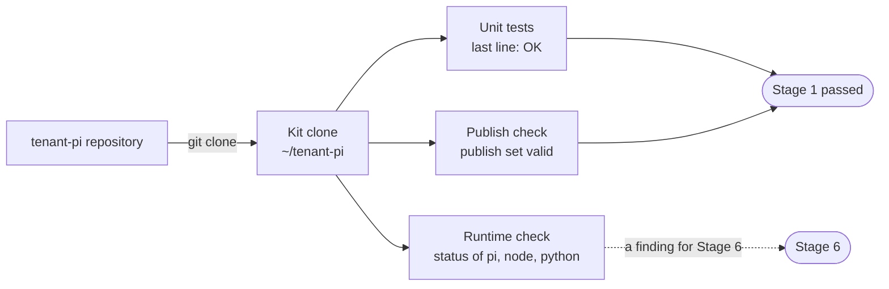

import { Steps } from '@astrojs/starlight/components';
import Capture from '@/components/Capture.astro';
import Cast from '@/components/Cast.astro';
import DocVersion from '@/components/DocVersion.astro';

<DocVersion project="tenant-pi" />

## Goal

A clean clone of the kit that passes its own offline checks.



## Before you start

| Item | How to check |
| --- | --- |
| Git is installed. | `git --version` prints a version. |
| Python 3.11 or later is installed as `python3`. | `python3 --version` prints `3.11` or a later version. |
| The directory `~/tenant-pi` does not exist. | `ls -d "$HOME/tenant-pi"` reports that the directory does not exist. |
| You can read the tenant-pi repository on GitHub. | `git ls-remote https://github.com/ryg40/tenant-pi.git` prints a list of refs. The repository is private at this time, so you need a GitHub account with access. |
| You did the steps of [Before Stage 1](/tenant-pi/install/#before-stage-1). | Your notes hold the result. |

## Steps

<Steps>

1. Clone the kit into your home directory.

   ```sh
   git clone https://github.com/ryg40/tenant-pi.git "$HOME/tenant-pi"
   ```

   Result: Git ends with no error, and the directory `~/tenant-pi` exists.

2. Go to the kit directory.

   ```sh
   cd "$HOME/tenant-pi"
   ```

   Result: the command `pwd` prints the path of the kit.

3. Run the three offline checks of the kit.

   <Cast id="tenant-pi/stage1-clone-checks" />

   Result: the unit tests print `OK`, and the publish check prints `publish set valid`. The last line is one JSON object.

4. Write the status of `pi`, `node` and `python` from the JSON object into your own notes.

   Result: you know what Stage 6 must install.

5. Print the release of the clone.

   ```sh
   git describe --tags
   ```

   Result: Git prints the release name that the top of this page shows.

</Steps>

- Run each command of stages 2 to 5 from the kit directory.
- The command of step 3 runs the unit tests, the publish check and the runtime check, in this order. A check runs only when the check before it passes.
- The unit tests print nothing until they end.
- The publish check also prints two file counts and the words `not a release approval`. That is normal.
- The exit code of step 3 can be 1. The section [The runtime check](#the-runtime-check) gives the cause.
- The frame of step 3 shows the run in a clean container. The button below the frame plays the recording.
- The placeholder `<seconds>` in the frame replaces the run time of the tests.
- The container of the frame has Node. So the frame shows `match` for `node`, and the tests print `OK (skipped=1)`.
- On a client with no Node, the tests print `OK (skipped=4)`, and the status of `node` is `missing`. That is normal.
- The release is a tag. The publish command of tenant-pi pushes the branch `portable` under the name `main`. So the branch of your clone can have the name `main`.

## The runtime check

The runtime check compares the installed Pi, Node and Python with the versions that the kit requires. It changes nothing.

| Status | Meaning | What to do in this stage |
| --- | --- | --- |
| `match` | The version satisfies the requirement. | Nothing. |
| `mismatch` | The tool is installed in another version. | Write it down. Stage 6 has the options. |
| `missing` | The shell cannot find the tool. | Write it down. Stage 6 installs it. |
| `unparsed` | The tool gave no version that the kit can read. | Write it down. Stage 6 has the options. |

The exit code is 1 when a status is not `match`. In this stage, that is a finding and not a failure. On a clean client, `pi` is `missing`, and the exit code is 1. On a client with no Node, `node` is `missing` too.

The status of `python` must be `match`. The kit commands of stages 2 to 5 need Python 3.11 or later.

The frame shows the help text of the action `check-runtime`.

<Capture id="tenant-pi/help-check-runtime" />

## The result

Stage 1 is passed when both of these are true:

- The unit tests print `OK`.
- The publish check prints `publish set valid`.

Do not move the clone later, and do not delete it. A profile with a package of the kit names the directory `packages/` of the clone by its absolute path. A core-only profile holds no such path.

## What can go wrong

| What you see | Cause | What to do |
| --- | --- | --- |
| The unit tests print `FAILED`. | The clone is not the reviewed kit. | Stop. Do not continue with this clone. |
| Two tests of `test_publish_rules` fail. | The directory is a copy without Git data, for example an archive. | Get the kit with `git clone`. |
| The publish check prints `unreviewed_file: repository inventory`. | The clone holds a file that Git does not track. `pytest` writes `.pytest_cache/`, for example. | Remove the untracked file. Run the tests with `unittest`, not with `pytest`. |
| `git clone` stops because the directory exists. | `~/tenant-pi` exists and is not empty. | Use another directory name. Then use that name in each later command. |
| The runtime check exits with code 1. | A status is not `match`. | Read the statuses. Continue when `python` is `match`. |
| `git describe --tags` prints another name, or an error. | The clone is not the release that this page describes. | A command or an output can differ from this guide. Read the `--help` of an action when a step fails. |
| `python3 --version` prints a version below 3.11. | The kit needs Python 3.11 or later. | Install Python 3.11 or later. Then run the stage again. |
