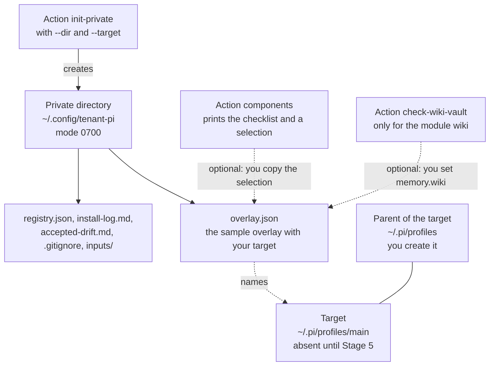

import { Steps } from '@astrojs/starlight/components';
import Capture from '@/components/Capture.astro';
import Cast from '@/components/Cast.astro';
import DocVersion from '@/components/DocVersion.astro';

<DocVersion project="tenant-pi" />

## Goal

A private directory with an overlay that names a new target.



## Before you start

| Item | How to check |
| --- | --- |
| [Stage 1](/tenant-pi/install/stage-1-obtain-the-sources/) is passed. | Your notes hold the result. |
| Your shell is in the kit directory `~/tenant-pi`. | `pwd` prints the path of the kit. |
| The directory `~/.config/tenant-pi` does not exist. | `ls -d "$HOME/.config/tenant-pi"` reports that the directory does not exist. |
| The directory `~/.pi/profiles/main` does not exist. | `ls -d "$HOME/.pi/profiles/main"` reports that the directory does not exist. |

## Steps

<Steps>

1. Create the parent of the private directory.

   ```sh
   mkdir -p "$HOME/.config"
   ```

   Result: the directory `~/.config` exists. The kit does not create a parent.

2. Create the private directory with the kit.

   <Cast id="tenant-pi/stage2-init-private" />

   Result: the output has `"complete":true` and seven entries under `created`. The key `targetAgentDir` holds your target.

3. List the private directory.

   ```sh
   ls -la "$HOME/.config/tenant-pi"
   ```

   Result: the list shows five files with the mode `-rw-------` and the directory `inputs`.

4. Create the parent of the target.

   ```sh
   mkdir -p "$HOME/.pi/profiles"
   ```

   Result: the directory `~/.pi/profiles` exists. It is beside the live profile `~/.pi/agent`, not inside it.

5. Print the overlay.

   <Capture id="tenant-pi/stage2-overlay" />

   Result: the field `agentDir` under `target` holds the absolute path of your target.

6. List the parent of the target.

   ```sh
   ls -la "$HOME/.pi/profiles"
   ```

   Result: the list has no entry `main`. Your user is the owner of the entry `.`.

</Steps>

- The option `--target` of step 2 gives the target of the new profile to the overlay.
- A core-only profile needs no edit of the overlay. Go to [Stage 3](/tenant-pi/install/stage-3-validate/).
- The shell expands `"$HOME/..."` in double quotes. The kit refuses a path that starts with `~`.
- The action does not create the target. Stage 5 creates it.
- The action refuses a target inside the live profile `~/.pi/agent`, inside the private directory or inside the kit clone.
- The frames of steps 2 and 5 show the run in a clean container. The button below the frame of step 2 plays the recording.

## What the action creates

| Path | Kind | Mode | Content |
| --- | --- | --- | --- |
| `~/.config/tenant-pi` | Directory | `0700` | |
| `overlay.json` | File | `0600` | The sample overlay `config/config.example.json` of the kit. With `--target`, the field `target.agentDir` holds your target. |
| `registry.json` | File | `0600` | `{}`. A core-only profile does not use it. |
| `install-log.md` | File | `0600` | A template for your record of each install. |
| `accepted-drift.md` | File | `0600` | A template for a later update of the profile. This guide does not use it. |
| `.gitignore` | File | `0600` | Names that Git must not track in this directory. |
| `inputs` | Directory | `0700` | Empty. It holds input files of optional modules. |

The action also prints three commands as display text: an edit command, a `validate` command and a `git init` command. The action runs none of them.

- The edit command opens the overlay in your text editor.
- The `validate` command has the option `--local-dir`. Stage 3 uses a shorter command. For a core-only overlay, the two commands print the same result.
- Git in the private directory is optional. This guide does not use it.

The frame shows the help text of the action `init-private`.

<Capture id="tenant-pi/help-init-private" />

The option `--overlay` is for a machine that has an older overlay. Give it one time for each such file. The action then refuses a private directory inside the target of that overlay.

Not verified: a run with the option `--overlay`.

## Without the option `--target`

Without `--target`, the new overlay has a sample target in the home directory of the user `EXAMPLE_USER`. Stage 3 then stops with `sample_target: overlay.target.agentDir`. Do these steps only in that case.

<Steps>

1. Print the absolute path of the target.

   ```sh
   echo "$HOME/.pi/profiles/main"
   ```

   Result: the shell prints an absolute path, for example `/home/<name>/.pi/profiles/main`.

2. Open the overlay in a text editor.

   ```sh
   ${EDITOR:-vi} "$HOME/.config/tenant-pi/overlay.json"
   ```

   Result: the field `agentDir` under `target` holds the sample target.

3. Replace the sample value with the path that step 1 printed.

   Result: the field holds your absolute path in double quotes. The path has no `~` and no `$HOME`.

4. Save the file.

   Result: the file on the disk holds your change.

5. Close the editor.

   Result: the shell prompt shows again.

6. Check the syntax of the overlay.

   <Capture id="tenant-pi/stage2-json-check" />

   Result: the shell prints `JSON valid`.

</Steps>

- Change nothing else, and do not paste a JSON fragment into the file.
- Do step 6 after each edit of the overlay by hand.
- The command of step 2 opens `vi` when the variable `EDITOR` is not set. You can use another text editor.
- In `vi`, press `Esc`, type `:wq`, and press `Enter` to save the file and close the editor.

## The sample overlay

The sample overlay enables one component, `core`. That is a core-only profile. Its key `selection.disable` lists each of the 26 optional components.

A core-only profile needs no credential, no model choice, no registry and no optional service.

The `selection` object of the sample overlay is the output of this command:

<Capture id="tenant-pi/stage2-components-core" />

Warning: do not write a secret value into the overlay, the registry or the two Markdown files. An `env` value is a `${NAME}` reference only.

Warning: the `.gitignore` file is not a security control. Read `git status` before each commit in the private directory.

## Select the components

A component is one part of a profile that you can select: the core, an extension, a set of skills or a module. This release has 27 components. This section is optional. A first profile can stay core only.

Not verified: a profile with an optional component. Each frame of this guide comes from a core-only profile.

<Steps>

1. Print the checklist of all components.

   <Capture id="tenant-pi/stage2-components" />

   Result: the output has one numbered line for each of the 27 components.

2. Read [Modules and privacy](/tenant-pi/use/modules-and-privacy/) for each component that you want.

   Result: you know what each chosen component needs, and what it stores or sends.

3. Print the `selection` object of your choice.

   <Capture id="tenant-pi/stage2-components-select" />

   Result: the output has the keys `added`, `prerequisites` and `selection`.

4. Replace the `selection` object of `overlay.json` with the `selection` object of the output.

   Result: the overlay enables the components that you chose.

5. Add each `overlay:` key that the key `prerequisites` names.

   Result: the overlay holds each key that a chosen component needs.

6. Check the syntax of the overlay with the command of [the syntax check](#without-the-option---target).

   Result: the shell prints `JSON valid`.

</Steps>

The command of step 3 is an example with the components `core` and `ops-footer`. Name each component that you want, as IDs or as numbers of the checklist, with a comma between them.

### How to read the checklist

Each line of the checklist has these parts, in this order:

| Part | Example | Meaning |
| --- | --- | --- |
| Number | `7` | The number of the component. You can use it with `--select`. |
| Mark | `[x]` or `[ ]` | `[x]` marks the recommended set. The marks are a proposal. |
| ID | `ops-footer` | The name of the component in `selection`. `(locked)` marks the core: it stays on. |
| Content | `extension: ops-footer` | The extensions or the skills of the component. |
| Status | `tested` or `unverified` | The status of the component in the manifest. `tested` is not the label `ready`. |
| `requires:` | `requires: context-meter` | The components that this component needs. |
| `needs:` | `needs: consent.memoryCapture` | What the component needs: an overlay key, a variable, a gap of the plan or a setup line of Stage 6. |

- The action reads the manifest. It writes nothing, and it enables nothing.
- The last line of the output is a question for an agent that installs a profile for a user.
- With `--overlay "$HOME/.config/tenant-pi/overlay.json"`, the marks are the selection of your overlay.
- The recommended set holds the core, the extensions and skills of the kit for daily work, and two memory modules.
- The two memory modules are `hermes` and `wiki`. Both store text of your sessions on this machine.
- With the default setting, `wiki` also adds text from your vault to each prompt, in each directory. That text goes to your model provider.
- Keep `hermes` and `wiki` in your selection only when you agree to that.

### How to read the selection

| Key | In the frame | Meaning |
| --- | --- | --- |
| `added` | `["context-meter"]` | The components that the action added. `ops-footer` requires `context-meter`. |
| `prerequisites` | `{}` | What each chosen component needs: an `overlay:` key, an `env:` name, a `gap:` of the plan or a `setup:` line of Stage 6. |
| `selection` | `enable` and `disable` | The object for the overlay. Each component is in one of the two lists. |
| `scope` | A sentence | The action prints the selection only. It writes no file. |

## The memory consent

Do this part only when you selected `hermes` or `wiki`. Set `consent.memoryCapture` to `true`, and add the key `memory` to the overlay:

```json
{
  "consent": {"memoryCapture": true, "remoteMemoryWrites": false, "telemetry": false},
  "memory": {
    "schemaVersion": 1,
    "hermes": {"backgroundReview": false},
    "wiki": {"ambientPersonalVault": true, "backgroundTasks": false},
    "openviking": null
  }
}
```

- The block shows two keys of the overlay. Do not replace the whole file with it.
- The key `memory` holds all three module keys. The key of a module that is off is `null`.
- With these values, no module makes a model call of its own. The overlay needs no `roles.memory`.
- Without the key `memory`, Stage 3 stops with `memory_choices_required: overlay.memory`.
- With the key `memory` and without the consent, Stage 3 stops with `memory_consent_required: overlay.consent.memoryCapture`.
- After each of these two errors, the kit generates nothing, and no module captures text.
- The file `POST_INSTALL.md` of the kit clone has the steps for the background model calls of a memory module.

Not verified: a profile with a memory module that runs in Pi. This site has no capture of one.

## An LLM Wiki vault

A vault is the directory `.llm-wiki` where the module `wiki` keeps its pages. Do this part only when you selected `wiki`, before you write `memory.wiki`.

<Capture id="tenant-pi/stage2-check-wiki-vault" />

The action reads the variables `HOME` and `WIKI_HOME`. It opens no file, and it writes nothing. The frame shows a clean container, so the key `result` is `no_vault`. Read the key `result` of your output:

| In the output | Meaning | What to do |
| --- | --- | --- |
| `"result":"no_vault"` | No vault exists. With `ambientPersonalVault: true`, the extension makes `~/.llm-wiki/` at the first start. | Nothing. With `WIKI_HOME` set, set `memory.wiki.wikiHome` to that directory. The new vault then starts there. |
| `"result":"vault_exists"` and `"personalVault":"home"` | The vault is `~/.llm-wiki/`. The profile uses your vault as it is. | Nothing. The overlay needs no other setting. |
| `"result":"vault_exists"` and `"personalVault":"wikiHome"` | The vault is in the directory of `WIKI_HOME`. | Set `memory.wiki.wikiHome` to the value of `wikiHome.root`. |
| `"result":"second_vault"` | `WIKI_HOME` names a directory with no vault, and your home directory has a vault. | Set no `wikiHome`. The profile uses the vault of the home directory, and the launch line removes the variable. |
| `"doubled":true` | The vault holds an inner vault. The extension moves it one level up at the first start. | Keep `wiki` off until you decide. |
| `"embeddings":{"exists":true}` | The vault has an embedding store. | Leave `memory.wiki.embedding` out. Embeddings then stay off, and the store does not change. |

- The kit refuses each place of its own that is a vault or is below one, with the rule `under_wiki_vault`.
- These places are a target, a launcher file, a results directory, a baseline file and a private directory.
- With `ambientPersonalVault: false`, a start writes nothing into the vault. The wiki tools still use the vault.
- The file `docs/memory-modules.md` of the kit clone has the section "An existing vault".

This site has no capture of the results `second_vault` and `"doubled":true`, or of a vault with an embedding store.

Not verified: with version 0.12.5 of the package `@zosmaai/pi-llm-wiki`, a start changes no file that exists in a vault. It adds only the index directory `meta/qmd/`. The release states this, and this site did not test it.

## The result

Stage 2 is passed when all of these are true:

- The overlay names a target by its absolute path.
- The target does not exist.
- The parent of the target exists, and you own it.

## What can go wrong

A refused action prints one JSON line with an `error`. The action has no rollback.

| Error | Cause | What to do |
| --- | --- | --- |
| `target_exists: init-private.dir` | The private directory exists. The action never adopts a directory. | Keep the directory that exists, or name a new one. |
| `parent_missing: init-private.dir.parent` | The parent of the private directory does not exist. | Do step 1. |
| `absolute_path: init-private.dir` | The path is not absolute. The kit does not expand `~`. | Write `"$HOME/.config/tenant-pi"`. |
| `under_kit: init-private.dir` | The path is inside the kit clone. | Use a directory outside the clone. |
| `under_pi_agent: init-private.dir` | The path is inside the live profile `~/.pi/agent`. | Use a directory outside the live profile. |
| `under_wiki_vault: init-private.dir` | The path is the vault `~/.llm-wiki` or is inside it. | Use a directory outside the vault. |
| `absolute_path: init-private.target` | The target is not absolute, or it starts with `~`. | Write `"$HOME/.pi/profiles/main"`. |
| `under_private_dir: init-private.target` | The target is inside the private directory. | Use a target outside the private directory. |
| `under_kit: init-private.target` | The target is inside the kit clone. | Use a target outside the clone. |
| `under_pi_agent: init-private.target` | The target is inside the live profile `~/.pi/agent`. | Use a target beside the live profile, for example `"$HOME/.pi/profiles/main"`. |
| `under_wiki_vault: init-private.target` | The target is the vault `~/.llm-wiki` or is inside it. | Use a target outside the vault. |
| `unsafe_parent_owner: init-private.dir.parent` | The user `root` owns the parent, and you are not `root`. | Use a parent that you own. |
| `home_required: init-private.home` | The variable `HOME` is not set. | Run the command in a shell with `HOME` set. |

| What you see | Cause | What to do |
| --- | --- | --- |
| The line with the `error` has `"candidate_created": true`. | The private directory exists, but it is not complete. | Inspect the directory. Remove it yourself. Then do step 2 again. |
| `mkdir` cannot create `~/.pi/profiles`. | `~/.pi` belongs to another user, for example `root`. | Use the parent `"$HOME/.pi-profiles"`. Use that path in each later command. |
| Step 5 shows the sample target of the user `EXAMPLE_USER`. | You did not give the option `--target`. | Do the steps of [Without the option `--target`](#without-the-option---target). |
| The syntax check prints an error and not `JSON valid`. | The overlay is not correct JSON. | Correct the line that the error names. Then check the syntax again. |
