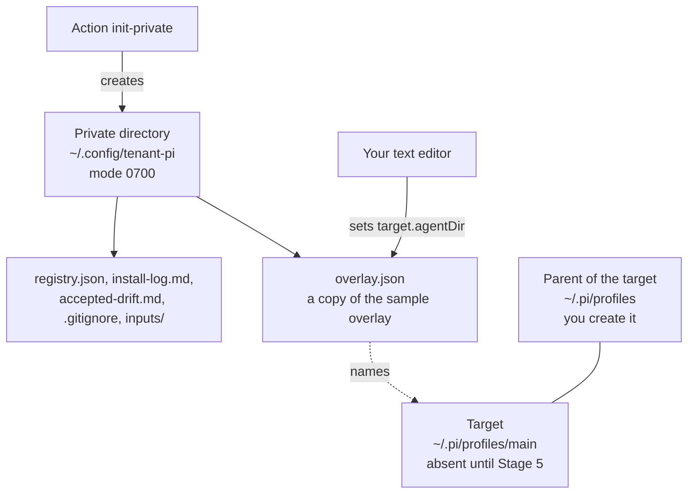

import { Steps } from '@astrojs/starlight/components';
import Capture from '@/components/Capture.astro';
import Cast from '@/components/Cast.astro';
import DocVersion from '@/components/DocVersion.astro';

<DocVersion project="tenant-pi" />

## Goal

A private directory with an overlay that names a new target.



## Before you start

| Item | How to check |
| --- | --- |
| [Stage 1](/tenant-pi/install/stage-1-obtain-the-sources/) is passed. | Your notes hold the result. |
| Your shell is in the kit directory `~/tenant-pi`. | `pwd` prints the path of the kit. |
| The directory `~/.config/tenant-pi` does not exist. | `ls -d "$HOME/.config/tenant-pi"` reports that the directory does not exist. |
| The directory `~/.pi/profiles/main` does not exist. | `ls -d "$HOME/.pi/profiles/main"` reports that the directory does not exist. |

## Steps

<Steps>

1. Create the parent of the private directory.

   ```sh
   mkdir -p "$HOME/.config"
   ```

   Result: the directory `~/.config` exists. The kit does not create a parent.

2. Create the private directory with the kit.

   <Cast id="tenant-pi/stage2-init-private" />

   Result: the output has `"complete":true` and seven entries under `created`.

3. List the private directory.

   ```sh
   ls -la "$HOME/.config/tenant-pi"
   ```

   Result: the list shows five files with the mode `-rw-------` and the directory `inputs`.

4. Create the parent of the target.

   ```sh
   mkdir -p "$HOME/.pi/profiles"
   ```

   Result: the directory `~/.pi/profiles` exists. It is beside the live profile `~/.pi/agent`, not inside it.

5. Print the absolute path of the target.

   ```sh
   echo "$HOME/.pi/profiles/main"
   ```

   Result: the shell prints an absolute path, for example `/home/<name>/.pi/profiles/main`.

6. Open the overlay in a text editor.

   ```sh
   ${EDITOR:-vi} "$HOME/.config/tenant-pi/overlay.json"
   ```

   Result: the field `agentDir` under `target` holds a sample path of the user `EXAMPLE_USER`.

7. Replace the sample value with the path that step 5 printed.

   Result: the field holds your absolute path in double quotes. The path has no `~` and no `$HOME`.

8. Save the file.

   Result: the file on the disk holds your change.

9. Close the editor.

   Result: the shell prompt shows again.

10. Print the overlay.

    <Capture id="tenant-pi/stage2-edit-overlay" />

    Result: the field `agentDir` holds the path that step 5 printed.

11. List the parent of the target.

    ```sh
    ls -la "$HOME/.pi/profiles"
    ```

    Result: the list has no entry `main`. Your user is the owner of the entry `.`.

</Steps>

- Change no other field for a first profile.
- The command of step 6 opens `vi` when the variable `EDITOR` is not set. You can use another text editor.
- In `vi`, press `Esc`, type `:wq`, and press `Enter` to save the file and close the editor.
- The frames of steps 2 and 10 show the run in a clean container. The button below the frame of step 2 plays the recording.

## What the action creates

| Path | Kind | Mode | Content |
| --- | --- | --- | --- |
| `~/.config/tenant-pi` | Directory | `0700` | |
| `overlay.json` | File | `0600` | A copy of the sample overlay `config/config.example.json` of the kit. |
| `registry.json` | File | `0600` | `{}`. A core-only profile does not use it. |
| `install-log.md` | File | `0600` | A template for your record of each install. |
| `accepted-drift.md` | File | `0600` | A template for a later update of the profile. This guide does not use it. |
| `.gitignore` | File | `0600` | Names that Git must not track in this directory. |
| `inputs` | Directory | `0700` | Empty. It holds input files of optional modules. |

The action also prints three commands as display text: an edit command, a `validate` command and a `git init` command. The action runs none of them.

- The edit command is the command of step 6.
- The `validate` command has the option `--local-dir`. Stage 3 uses a shorter command. For a core-only overlay, the two commands print the same result.
- Git in the private directory is optional. This guide does not use it.

The frame shows the help text of the action `init-private`.

<Capture id="tenant-pi/help-init-private" />

## The sample overlay

The sample overlay enables one module, `core`. That is a core-only profile. For a core-only profile, you change one field only: `target.agentDir`.

A core-only profile needs no credential, no model choice, no registry and no optional service.

Add an optional module only after you read [Modules and privacy](/tenant-pi/use/modules-and-privacy/). To add a module, move its ID from `selection.disable` to `selection.enable`.

Warning: do not write a secret value into the overlay, the registry or the two Markdown files. An `env` value is a `${NAME}` reference only.

Warning: the `.gitignore` file is not a security control. Read `git status` before each commit in the private directory.

## The result

Stage 2 is passed when all of these are true:

- The overlay names a target by its absolute path.
- The target does not exist.
- The parent of the target exists, and you own it.

## What can go wrong

A refused action prints one JSON line with an `error`. The action has no rollback.

| Error | Cause | What to do |
| --- | --- | --- |
| `target_exists: init-private.dir` | The private directory exists. The action never adopts a directory. | Keep the directory that exists, or name a new one. |
| `parent_missing: init-private.dir.parent` | The parent of the private directory does not exist. | Do step 1. |
| `absolute_path: init-private.dir` | The path is not absolute. The kit does not expand `~`. | Write `"$HOME/.config/tenant-pi"`. |
| `under_kit: init-private.dir` | The path is inside the kit clone. | Use a directory outside the clone. |
| `under_pi_agent: init-private.dir` | The path is inside the live profile `~/.pi/agent`. | Use a directory outside the live profile. |
| `unsafe_parent_owner: init-private.dir.parent` | The user `root` owns the parent, and you are not `root`. | Use a parent that you own. |
| `home_required: init-private.home` | The variable `HOME` is not set. | Run the command in a shell with `HOME` set. |

| What you see | Cause | What to do |
| --- | --- | --- |
| The line with the `error` has `"candidate_created": true`. | The private directory exists, but it is not complete. | Inspect the directory. Remove it yourself. Then do step 2 again. |
| `mkdir` cannot create `~/.pi/profiles`. | `~/.pi` belongs to another user, for example `root`. | Use the parent `"$HOME/.pi-profiles"`. Use that path in each later command. |
| Step 10 shows the sample path of `EXAMPLE_USER`. | You did not do step 7, or you did not save the file. | Do steps 6 to 10 again. Stage 3 does not find this error. |
