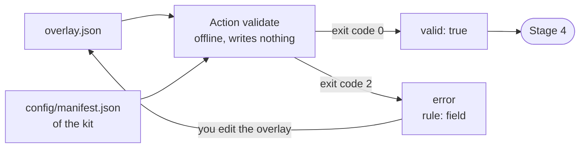

import { Steps } from '@astrojs/starlight/components';
import Capture from '@/components/Capture.astro';
import Cast from '@/components/Cast.astro';
import DocVersion from '@/components/DocVersion.astro';

<DocVersion project="tenant-pi" />

## Goal

An overlay that passes the offline check of the kit.



## Before you start

- [Stage 2](/tenant-pi/install/stage-2-edit-the-local-choices/) is passed.
- Your shell is in the kit directory `~/tenant-pi`.

## Steps

<Steps>

1. Validate the overlay.

   <Cast id="tenant-pi/stage3-validate" />

   Result: the output is one JSON line that holds `"valid":true`.

2. Print the exit code of the command.

   ```sh
   echo $?
   ```

   Result: the shell prints `0`.

</Steps>

Do this stage again after each edit of the overlay.

The frame of step 1 shows the run in a clean container. The button below the frame plays the recording.

## What the check covers

The output names its scope: offline structural and supported-input checks only. The action reads the overlay and the manifest of the kit. It starts no process, and it opens no network connection.

A valid overlay does not prove that Pi can run the profile. Stage 9 tests that.

## Options

A core-only overlay needs no option other than `--overlay`. Add an option only when the overlay needs it.

| Option | When |
| --- | --- |
| `--registry "$HOME/.config/tenant-pi/registry.json"` | The overlay has `modelRoutes` with a role or a cycle model. |
| `--local-dir "$HOME/.config/tenant-pi"` | The module `mcp` is enabled. |
| `--require-role <role>` | A later stage needs a role, for example `review`. |

Use the same options in Stage 4 and in Stage 5.

The action `init-private` of Stage 2 prints a `validate` command with `--local-dir`. For a core-only overlay, that command and the command of step 1 print the same result.

The frame shows the help text of the action `validate`.

<Capture id="tenant-pi/help-validate" />

## The result

Stage 3 is passed when `validate` prints `"valid":true`.

## What can go wrong

A refused overlay gives exit code 2 and one JSON line on standard error. The `error` has the form `rule: field`. It never holds a value.

| Error | Cause | What to do |
| --- | --- | --- |
| `read_or_json: overlay.file` | The file is absent, is not JSON, or is a link. A path with `~` in quotes also gives this error. | Give the absolute path of a regular file. Check the JSON with `python3 -m json.tool "<file>"`. |
| `absolute_path: overlay.target.agentDir` | The target in the overlay is not an absolute path. | Write the expanded path, for example `/home/<name>/.pi/profiles/main`. |
| `under_kit: overlay.target.agentDir` | The target is inside the kit clone. | Choose a target outside the clone. |
| `registry_without_routes: registry` | You gave `--registry`, but the overlay has no `modelRoutes`. | Remove `--registry` for a core-only overlay. |
| `registry_required: registry` | The overlay has `modelRoutes` with a role or a cycle model, and you gave no `--registry`. | Add the option `--registry`. |
| `blocked_component: overlay.selection.enable` | A blocked module is enabled. | Move the module back to `selection.disable`. |
| `missing_dependency: overlay.selection.enable` | An enabled module needs a module that is not enabled. | Enable the necessary module. |
| `unknown_fields: overlay` | The overlay has a key that the kit does not define. | Remove the key. |

The check does not find an overlay that has the sample target of the user `EXAMPLE_USER`. Stage 5 refuses that overlay.
