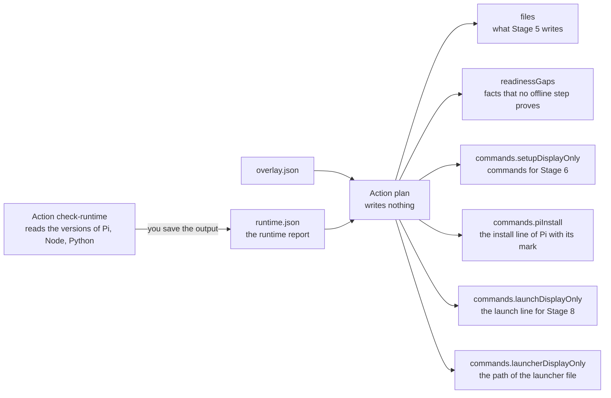

import { Steps } from '@astrojs/starlight/components';
import Capture from '@/components/Capture.astro';
import Cast from '@/components/Cast.astro';
import DocVersion from '@/components/DocVersion.astro';

<DocVersion project="tenant-pi" />

## Goal

You know each file that Stage 5 writes, each gap, and each command of the later stages.



## Before you start

- [Stage 3](/tenant-pi/install/stage-3-validate/) is passed.
- Your shell is in the kit directory `~/tenant-pi`.
- Your shell is the shell that will launch Pi.

## Steps

<Steps>

1. Save the runtime report into the private directory.

   <Capture id="tenant-pi/stage4-runtime-report" />

   Result: the command prints nothing. The file `runtime.json` holds the report.

2. Print the runtime report.

   <Capture id="tenant-pi/stage4-runtime-report-file" />

   Result: the output is the JSON object of the runtime check of Stage 1.

3. Run the plan.

   <Cast id="tenant-pi/stage4-plan" />

   Result: the output is one long JSON line.

4. Print the exit code of the command.

   ```sh
   echo $?
   ```

   Result: the shell prints `0`.

5. Print the plan again in a form that is easy to read.

   ```sh
   python3 scripts/tenant_pi.py plan --overlay "$HOME/.config/tenant-pi/overlay.json" \
     --launcher "$HOME/.config/tenant-pi/launch-main.sh" \
     --runtime-report "$HOME/.config/tenant-pi/runtime.json" | python3 -m json.tool
   ```

   Result: the output shows the same JSON with one key on each line.

6. Read the key `targetAgentDir`.

   Result: the value is the target that the overlay holds.

7. Read the key `files`.

   Result: a core-only plan lists two directories and three files. The list is in the table below.

8. Read the key `readinessGaps`.

   Result: each entry has a `code`. The codes are in the tables below.

9. Read the key `piInstall` inside the key `commands`.

   Result: the key `command` holds the install line of Pi `1.1.0`. The key `status` is the mark of the line.

10. Read the key `setupDisplayOnly` inside the key `commands`.

    Result: the list holds each command that Stage 6 needs for this plan. Do not run a line now.

11. Read the key `launchDisplayOnly` inside the key `commands`.

    Result: the line holds your target after `PI_CODING_AGENT_DIR=`. Do not run the line now.

12. Read the key `launcherDisplayOnly` inside the key `commands`.

    Result: the value is the launcher path that you gave.

13. List the parent of the target.

    ```sh
    ls -la "$HOME/.pi/profiles"
    ```

    Result: the list shows only the entries `.` and `..`. The plan wrote nothing.

</Steps>

This page names a key inside a key with a dot. `commands.setupDisplayOnly` is the key `setupDisplayOnly` inside the key `commands`.

- The exit code of step 1 is 1 when a requirement fails, for example when Pi is absent. That is a finding and not a failure.
- The file holds the report also when the exit code is 1.
- The actions `plan` and `generate` start no process. So they read the versions from the report.
- The frames of steps 1 to 3 show the run in a clean container. That container has Node 24 and no Pi.
- The button below the frame of step 3 plays the recording.

## The runtime report

The runtime report is the output of the action `check-runtime` in a file. It shows the state at the time of the command.

- At this stage, Node or Pi can be absent. The report then has `missing`, and the plan lists a gap for it.
- That gap is a finding of this order of the stages. It is not a failure.
- Stage 6 changes the facts. After each install or change of Node or Pi, do steps 1 and 3 again.
- The kit cannot tell an old report from a current one.
- The option `--runtime-report` is optional. Without it, the plan has the three gaps of the first table below.

The file `INSTALL.md` of the kit uses another order: it installs Node and Pi before the plan. Both orders give the same generated files. Only the gaps of the plan differ.

## The files of a core-only plan

Each path is relative to the target.

| Path | Kind | Mode |
| --- | --- | --- |
| `.` | Directory | `0700` |
| `.tenant-pi` | Directory | `0700` |
| `.tenant-pi/choices.json` | File | `0600` |
| `settings.json` | File | `0600` |
| `.tenant-pi/state.json` | File | `0600` |

## The gaps of a core-only plan

A gap is a fact that no offline step can prove. A gap is a fact to carry, not an error.

Without a runtime report, a core-only plan has three gaps:

| Gap | Subject | Meaning |
| --- | --- | --- |
| `target_absence_unverified` | The target path | The plan does not prove that the target is absent. |
| `node_runtime_unverified` | The Node range `>=24.0.0 <25` | The plan does not know the installed Node. |
| `core_runtime_unverified` | The Pi package at version `1.1.0` | The plan does not know the installed Pi. |

With a runtime report, the two runtime gaps follow the status of the report:

| Status in the report | Gap for Node | Gap for Pi |
| --- | --- | --- |
| `match` | No gap | No gap |
| `untested_in_range` | Not possible for Node | `core_runtime_untested_in_range` |
| `mismatch` | `node_runtime_mismatch` | `core_runtime_mismatch` |
| `missing` | `node_runtime_missing` | `core_runtime_missing` |
| `unparsed` | `node_runtime_unparsed` | `core_runtime_unparsed` |

- A gap from the report has two more keys, `installed` and `required`.
- The plan always keeps `target_absence_unverified`. It writes nothing, and it proves nothing about the target.
- The frame of step 3 has two gaps: `target_absence_unverified` and `core_runtime_missing`. Node is `match` in that container.
- With `untested_in_range`, keep the installed Pi. Record the gap `core_runtime_untested_in_range` in your notes.

Not verified: a plan with the gap `core_runtime_untested_in_range`, or with a gap for `unparsed`.

Stage 5 refuses a target that exists. The report compares version numbers only. It does not prove that Pi runs.

## The install line of Pi

The key `commands.piInstall` always holds the install line of Pi, with a mark in the key `status`. Read it before you run that line in Stage 6.

| Pi in the report | `status` | The line is in `setupDisplayOnly` |
| --- | --- | --- |
| No report, or `unparsed` | `installed_version_unknown` | Yes |
| `missing` | `needed` | Yes |
| `match` or `untested_in_range` | `not_needed` | No |
| `mismatch` | `replaces_installed` | No |

- The key `warning` is `global_install_replaces_pi_for_all_profiles`. The line installs Pi for each profile of your user.
- With `replaces_installed`, the key `change` is `upgrade`, `downgrade` or `unordered`. The key `installed` holds the installed version.
- The frame of step 3 shows the status `needed`.

The run of Stage 6 on a clean client saw the status `not_needed` after the install. This site has no capture of that output.

## The setup lines of the optional components

`commands.setupDisplayOnly` of a core-only plan holds the install line of Pi only, or nothing. A plan with a declared npm package holds more lines:

- One `pi install <source>` line for each declared npm package. The components `mcp`, `hermes`, `wiki` and `questions` declare such a package.
- One line with `node scripts/patch_extension_peers.mjs` for the components `hermes`, `wiki` and `questions`. That line runs only from the kit directory.
- Each of these lines starts with `PI_CODING_AGENT_DIR=` and your target.

Stage 6 runs these lines. The plan does not print the installs of Node and Python.

Not verified: a run of these lines. This site has no capture of a profile with an optional component.

In the plan, the keys `runtimeReady` and `filesComplete` are `false`.

## The other keys of a core-only plan

The plan holds more keys. These values are normal for a core-only plan. They are not errors.

| Key | Value | Meaning |
| --- | --- | --- |
| `commands.launchStatus` | `not_runnable_until_generation_succeeds` | Always this value in a plan, also after Stage 5. The plan does not read the target. |
| `commands.providerKeyWarning` | Absent | The key is in the plan only when the shell has a known provider key variable. See below. |
| `routeStatus` | `unset` for each role | The overlay selects no model for a role. |
| `memory` | `null` | No memory module is enabled. |
| `workflow.mcp.enabled` | `false` | The module `mcp` is not enabled. |
| `workflow.promptr.status` | `unverified` | The component Promptr is not enabled. The plan lists what it needs under `prerequisites`. |
| `ownerPackages`, `routeSetup`, `unmanaged` | Empty lists | The overlay has no such optional entry. |
| `ownerResources` | Empty lists for `prompts` and `skills` | The overlay has no such optional entry. |

### The warning for a provider key

A provider key variable is an environment variable that holds an API key of a model provider. Pi reads such a variable from the shell that launches it.

- The key `commands.providerKeyWarning` names each known variable of this kind that your shell has. It holds the names only, no value.
- With such a variable, a model reply can come from a provider that you did not choose.
- The key `remedy` of the warning says how to name the model on the launch line.
- The frame of step 3 has no such key, because the container has no such variable.

## Options

Use the same options as in [Stage 3](/tenant-pi/install/stage-3-validate/#options). The plan has more options.

| Option | Rule |
| --- | --- |
| `--launcher <path>` | The absolute path of a launcher file that does not exist. The plan prints the path and writes nothing. |
| `--runtime-report <file>` | The path of a file with the output of the action `check-runtime`. The gaps then show the measured versions. |
| `--herdr-report <file>` | The path of a file with the output of the action [`check-herdr`](/tenant-pi/use/commands/check-herdr/). Only a plan with the component `herdr` uses it. The plan runs without it. |

A good place for the launcher file is the private directory. The file name is free.

The frame shows the help text of the action `plan`.

<Capture id="tenant-pi/help-plan" />

## The result

Stage 4 is passed when the plan exits with code 0 and you read the keys of steps 6 to 12. The plan writes nothing. The one new file is the runtime report of step 1.

## What can go wrong

The plan checks the overlay first. Each error of [Stage 3](/tenant-pi/install/stage-3-validate/#what-can-go-wrong) can show here too.

| Error | Cause | What to do |
| --- | --- | --- |
| `absolute_path: launcher.path` | The launcher path is relative. | Give an absolute path. |
| `under_target: launcher.path` | The launcher path is the target or is inside it. | Put the launcher file into the private directory. |
| `under_kit: launcher.path` | The launcher path is inside the kit clone. | Put the launcher file into the private directory. |
| `under_pi_agent: launcher.path` | The launcher path is inside the live profile `~/.pi/agent`. | Put the launcher file into the private directory. |
| `under_wiki_vault: launcher.path` | The launcher path is inside an LLM Wiki vault. | Put the launcher file into the private directory. |
| `input_missing: runtime_report.file` | The file of `--runtime-report` is absent. | Do step 1 again. Give the same path in both commands. |
| `invalid_json: runtime_report.file` | The file of `--runtime-report` is empty or is not JSON. | Do step 1 again. |
| `home_required: launcher.home` | The variable `HOME` is not set. | Run the command in a shell with `HOME` set. |

The plan does not check that the launcher file is absent. Stage 5 checks it.
