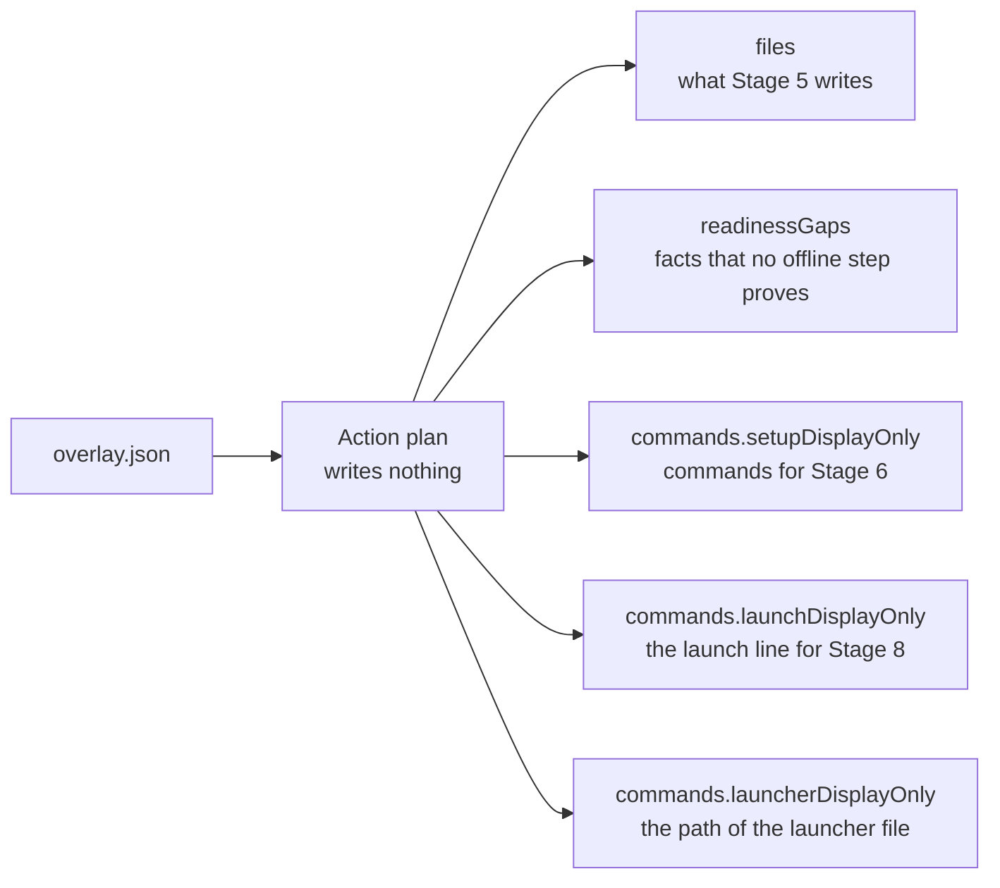

import { Steps } from '@astrojs/starlight/components';
import Capture from '@/components/Capture.astro';
import Cast from '@/components/Cast.astro';
import DocVersion from '@/components/DocVersion.astro';

<DocVersion project="tenant-pi" />

## Goal

You know each file that Stage 5 writes, each gap, and each command of the later stages.



## Before you start

- [Stage 3](/tenant-pi/install/stage-3-validate/) is passed.
- Your shell is in the kit directory `~/tenant-pi`.

## Steps

<Steps>

1. Run the plan.

   <Cast id="tenant-pi/stage4-plan" />

   Result: the output is one long JSON line.

2. Print the exit code of the command.

   ```sh
   echo $?
   ```

   Result: the shell prints `0`.

3. Print the plan again in a form that is easy to read.

   ```sh
   python3 scripts/tenant_pi.py plan --overlay "$HOME/.config/tenant-pi/overlay.json" \
     --launcher "$HOME/.config/tenant-pi/launch-main.sh" | python3 -m json.tool
   ```

   Result: the output shows the same JSON with one key on each line.

4. Read the key `targetAgentDir`.

   Result: the value is the target that you wrote into the overlay.

5. Read the key `files`.

   Result: a core-only plan lists two directories and three files. The list is in the table below.

6. Read the key `readinessGaps`.

   Result: a core-only plan has three gaps. The gaps are in the table below.

7. Read the key `setupDisplayOnly` inside the key `commands`.

   Result: the list holds the install line of Pi `1.0.2`. Do not run the line now.

8. Read the key `launchDisplayOnly` inside the key `commands`.

   Result: the line holds your target after `PI_CODING_AGENT_DIR=`. Do not run the line now.

9. Read the key `launcherDisplayOnly` inside the key `commands`.

   Result: the value is the launcher path that you gave.

10. List the parent of the target.

    ```sh
    ls -la "$HOME/.pi/profiles"
    ```

    Result: the list shows only the entries `.` and `..`. The plan wrote nothing.

</Steps>

This page names a key inside a key with a dot. `commands.setupDisplayOnly` is the key `setupDisplayOnly` inside the key `commands`.

The frame of step 1 shows the run in a clean container. The button below the frame plays the recording.

## The files of a core-only plan

Each path is relative to the target.

| Path | Kind | Mode |
| --- | --- | --- |
| `.` | Directory | `0700` |
| `.tenant-pi` | Directory | `0700` |
| `.tenant-pi/choices.json` | File | `0600` |
| `settings.json` | File | `0600` |
| `.tenant-pi/state.json` | File | `0600` |

## The gaps of a core-only plan

A gap is a fact that no offline step can prove. A gap is a fact to carry, not an error.

| Gap | Subject | Meaning |
| --- | --- | --- |
| `target_absence_unverified` | The target path | The plan does not prove that the target is absent. |
| `node_runtime_unverified` | The Node range `>=22.22.0 <23` | The plan does not prove that Node runs. |
| `core_runtime_unverified` | The Pi package at version `1.0.2` | The plan does not prove that Pi runs. |

Stage 5 refuses a target that exists. The runtime check of Stage 6 compares the versions of Node and Pi.

In the plan, the keys `runtimeReady` and `filesComplete` are `false`.

## The other keys of a core-only plan

The plan holds more keys. These values are normal for a core-only plan. They are not errors.

| Key | Value | Meaning |
| --- | --- | --- |
| `commands.launchStatus` | `not_runnable_until_generation_succeeds` | The launch line does not work before Stage 5. |
| `routeStatus` | `unset` for each role | The overlay selects no model for a role. |
| `memory` | `null` | No memory module is enabled. |
| `workflow.mcp.enabled` | `false` | The module `mcp` is not enabled. |
| `workflow.promptr.status` | `blocked` | The module Promptr is blocked in this release. The plan lists the reasons under `prerequisites`. |
| `ownerPackages`, `routeSetup`, `unmanaged` | Empty lists | The overlay has no such optional entry. |
| `ownerResources` | Empty lists for `prompts` and `skills` | The overlay has no such optional entry. |

## Options

Use the same options as in [Stage 3](/tenant-pi/install/stage-3-validate/#options). The plan has one more option.

| Option | Rule |
| --- | --- |
| `--launcher <path>` | The absolute path of a launcher file that does not exist. The plan prints the path and writes nothing. |

A good place for the launcher file is the private directory. The file name is free.

The frame shows the help text of the action `plan`.

<Capture id="tenant-pi/help-plan" />

## The result

Stage 4 is passed when the plan exits with code 0 and you read the keys of steps 4 to 9. The plan changes nothing on the machine.

## What can go wrong

The plan checks the overlay first. Each error of [Stage 3](/tenant-pi/install/stage-3-validate/#what-can-go-wrong) can show here too.

| Error | Cause | What to do |
| --- | --- | --- |
| `absolute_path: launcher.path` | The launcher path is relative. | Give an absolute path. |
| `under_target: launcher.path` | The launcher path is the target or is inside it. | Put the launcher file into the private directory. |
| `under_kit: launcher.path` | The launcher path is inside the kit clone. | Put the launcher file into the private directory. |
| `under_pi_agent: launcher.path` | The launcher path is inside the live profile `~/.pi/agent`. | Put the launcher file into the private directory. |
| `home_required: launcher.home` | The variable `HOME` is not set. | Run the command in a shell with `HOME` set. |

The plan does not check that the launcher file is absent. Stage 5 checks it.
