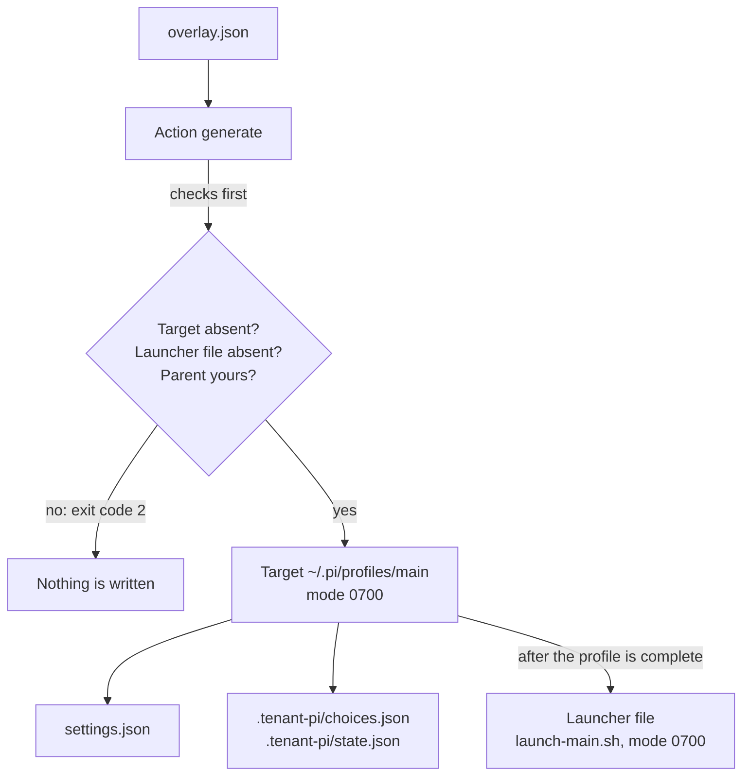

import { Steps } from '@astrojs/starlight/components';
import Capture from '@/components/Capture.astro';
import Cast from '@/components/Cast.astro';
import DocVersion from '@/components/DocVersion.astro';

<DocVersion project="tenant-pi" />

## Goal

A new profile directory with complete files, and a launcher file for Stage 8.



## Before you start

| Item | How to check |
| --- | --- |
| [Stage 4](/tenant-pi/install/stage-4-plan/) is passed. | Your notes hold the result. |
| Your shell is in the kit directory `~/tenant-pi`. | `pwd` prints the path of the kit. |
| The target `~/.pi/profiles/main` does not exist. | `ls -d "$HOME/.pi/profiles/main"` reports that the directory does not exist. |
| The file `~/.config/tenant-pi/launch-main.sh` does not exist. | `ls "$HOME/.config/tenant-pi/launch-main.sh"` reports that the file does not exist. |

## Steps

<Steps>

1. Generate the profile.

   <Cast id="tenant-pi/stage5-generate-launcher" />

   Result: the output is one JSON line that holds `"filesComplete":true`.

2. Print the exit code of the command.

   ```sh
   echo $?
   ```

   Result: the shell prints `0`.

3. Read the key `launcher` of the output of step 1.

   Result: `complete` is `true`, and `mode` is `0700`.

4. List the profile.

   ```sh
   ls -la "$HOME/.pi/profiles/main"
   ```

   Result: the list shows the file `settings.json` and the directory `.tenant-pi`.

5. List the record directory of the profile.

   ```sh
   ls -la "$HOME/.pi/profiles/main/.tenant-pi"
   ```

   Result: the list shows the files `choices.json` and `state.json`.

6. Print the launcher file.

   <Capture id="tenant-pi/stage5-launcher-file" />

   Result: the file has two lines. The second line starts with `exec env` and holds your target.

</Steps>

- Do not run the launcher file now. Stage 8 runs it, after Stage 6 installs Pi.
- The second line of the launcher file holds the word `env` two times. That is correct.
- The first `env` belongs to `exec env`. The second `env` starts the launch line of the plan.
- The frames of steps 1 and 6 show the run in a clean container. The button below the frame of step 1 plays the recording.

## What the action writes

| Path | Mode | Content |
| --- | --- | --- |
| `~/.pi/profiles/main` | `0700` | The profile directory. |
| `settings.json` | `0600` | The Pi settings of the profile. |
| `.tenant-pi/choices.json` | `0600` | The inputs of the generation: the overlay, the registry, the MCP definitions and data of the manifest. Keep it private. |
| `.tenant-pi/state.json` | `0600` | The record of this generation: the time, the kit commit, the pins. |
| `~/.config/tenant-pi/launch-main.sh` | `0700` | The launcher file: `#!/bin/sh` and one `exec env` line with the launch line of the plan. |

The action writes the launcher file only after the profile is complete. The launcher file holds no key and no other secret value.

## Rules of the action

- The option `--target` must be equal to `target.agentDir` of the overlay, byte for byte.
- The target must not exist. The action never writes into a directory that exists.
- The parent of the target must exist, and you must own it.
- The target must be outside the kit clone.
- The launcher file must not exist. Its parent must exist, and you must own the parent.

## What the output means

| Key | Value | Meaning |
| --- | --- | --- |
| `candidate_created` | `true` | The action created the target directory. This key is also in a correct output. |
| `complete` | `true` | The generation is complete. The output has no key `error`. |
| `filesComplete` | `true` | Each file of the plan is written. |
| `runtimeReady` | `false` | Always `false`. The kit cannot prove that Pi runs with the profile. |
| `launcher.complete` | `true` | The launcher file is written and checked. |
| `commands.launchStatus` | `manual_review_required` | The kit does not run the launch line. You read it, and you run it in Stage 8. |
| `readinessGaps` | A list | The same gaps as in Stage 4. They are facts to carry, not errors. |

| Exit code | Meaning |
| --- | --- |
| 0 | The profile is complete, and the launcher file is complete. |
| 1 | The profile is complete, but the launcher file is not. The key `launcher.error` names the rule. |
| 2 | A refusal or a failed generation. No launcher file is written. |

The frame shows the help text of the action `generate`.

<Capture id="tenant-pi/help-generate" />

## Without a launcher file

The option `--launcher` is optional. Without it, the action writes the profile only:

<Capture id="tenant-pi/stage5-generate" />

The output then has no key `launcher`. In Stage 8, you type the launch line of the plan by hand.

## The result

Stage 5 is passed when `filesComplete` is `true`. The runtime is not verified until Stage 9.

Stages 1 to 5 are done. The kit runs no command of the next stages.

## What can go wrong

| Error | Cause | What to do |
| --- | --- | --- |
| `invalid_plan: target_mismatch: plan.targetAgentDir` | `--target` is not equal to `target.agentDir` of the overlay. The overlay can hold the sample target. | Use the same absolute path in both places. |
| `target_exists: target` | The target exists. A second run without `--launcher` gives this error. | Choose a new target name. Edit `target.agentDir` to match. |
| `target_exists: launcher.path` | The launcher file exists. The action checks the launcher file first, so a second run of step 1 gives this error. | Use a new file name, or remove the old file after you read it. |
| `unsafe_path: target.parents` | The parent of the target does not exist, or a directory above it is a link. | Create the parent with `mkdir -p`. Do not use a linked parent. |
| `unsafe_parent_owner: target.parent` | The user `root` owns the parent of the target, and you are not `root`. | Use a parent that you own, for example `"$HOME/.pi-profiles"`. |
| `under_kit: overlay.target.agentDir` | The target is inside the kit clone. | Choose a target outside the clone. |

| What you see | Cause | What to do |
| --- | --- | --- |
| A line with the key `error` and with `"candidate_created": true`. | The target directory exists, but it is not complete. | Inspect the directory. The kit has no rollback and deletes nothing. |
| Exit code 1 and the key `launcher.error`. | The profile is complete. The launcher file is not. | Keep the profile. In Stage 8, type the launch line of the plan by hand. |
| You want to generate again. | The action does not replace a profile. | Use a new target and a new launcher path. See [Candidate update loop](/tenant-pi/use/candidate-update/). |
