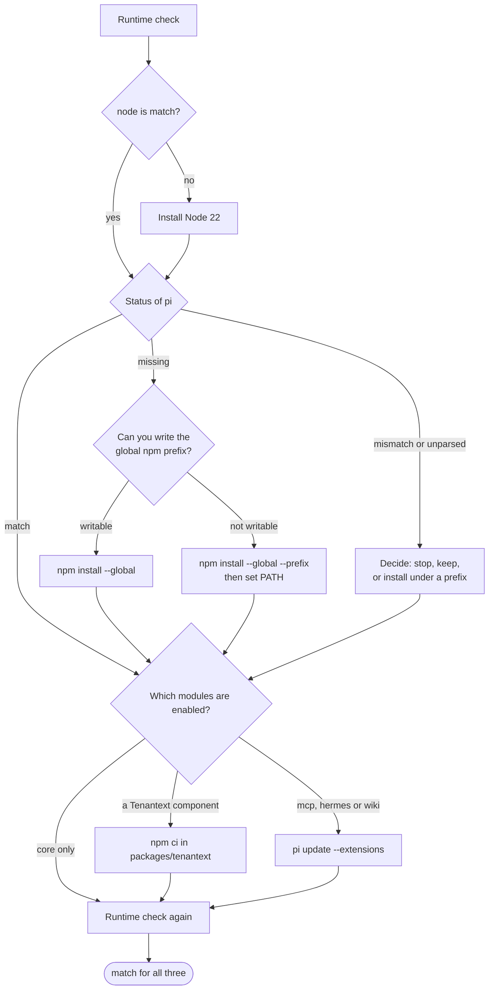

import { Aside, Steps, TabItem, Tabs } from '@astrojs/starlight/components';
import Capture from '@/components/Capture.astro';
import Cast from '@/components/Cast.astro';
import DocVersion from '@/components/DocVersion.astro';

<DocVersion project="tenant-pi" />

<Aside type="note" title="Verified on a clean client">
	A run on a clean Debian 12 client verified this stage for a core-only profile. Node came from nvm. Each "Not verified:" line names a part that the run did not do.
</Aside>

## Goal

The runtime check prints `match` for Pi, Node and Python in the shell that will launch Pi.

The kit installs nothing. You copy each command, read it, and run it yourself.



## Before you start

- [Stage 5](/tenant-pi/install/stage-5-generate/) is passed.
- You have the three statuses of the runtime check of [Stage 1](/tenant-pi/install/stage-1-obtain-the-sources/#the-runtime-check).
- You work in the shell that will launch Pi.

Warning: each command of this stage changes the machine. Read each command before you run it.

## Steps

### Check the runtime

<Steps>

1. Go to the kit directory.

   ```sh
   cd "$HOME/tenant-pi"
   ```

   Result: the command `pwd` prints the path of the kit.

2. Run the runtime check.

   <Capture id="tenant-pi/stage6-check-runtime" />

   Result: the output has a `status` for `pi`, `node` and `python`.

</Steps>

A tool with the status `match` needs no install. Skip its section.

The frame shows a clean client: `node` and `pi` are `missing`, and the exit code is 1.

### Node

Do this section only when the status of `node` is not `match`. The same Node installs Pi and builds native addons later.

<Steps>

1. Install Node 22 with the package source of your distribution, or with a version manager.

   <Tabs syncKey="distribution">
   <TabItem label="Fedora">

   ```sh
   dnf install nodejs22
   ```

   Not verified: the exact package name `nodejs22` on every Fedora release.

   </TabItem>
   <TabItem label="Debian or Ubuntu">

   The sources are the NodeSource 22 repository and nvm. This page gives no command for the NodeSource repository. For nvm, use the tab "nvm, for one user".

   Not verified: an install from the NodeSource 22 repository.

   </TabItem>
   <TabItem label="nvm, for one user">

   nvm is not a package of a distribution. If your shell does not find `nvm`, do the steps of [Install nvm](#install-nvm) first.

   <Cast id="tenant-pi/stage6-node-nvm" />

   </TabItem>
   </Tabs>

   Result: the command `node --version` prints a version in the range `>=22.22.0 <23`.

</Steps>

Warning: `nvm use` changes the default `node` of your user. A Pi that another Node installed can stop working.

Warning: the install script of nvm adds lines to your shell startup file. Read the script before you run it.

In a new terminal, do steps 2 and 3 of [Before Stage 1](/tenant-pi/install/#before-stage-1) again. A new terminal starts in your home directory, not in the kit directory.

#### Install nvm

Do these steps only for the tab "nvm, for one user", and only when your shell does not find `nvm`. The steps get nvm `0.40.3` with the install script of the nvm project.

<Steps>

1. Download the install script into your home directory.

   ```sh
   curl -fsSL -o "$HOME/nvm-install.sh" https://raw.githubusercontent.com/nvm-sh/nvm/v0.40.3/install.sh
   ```

   Result: the file `~/nvm-install.sh` exists. The command needs `curl`.

2. Read the file `~/nvm-install.sh` in a text editor.

   Result: you know what the script changes. It puts nvm into `~/.nvm`, and it adds lines to your shell startup file.

3. Run the script.

   ```sh
   bash "$HOME/nvm-install.sh"
   ```

   Result: the script prints the lines that it added to the shell startup file. This terminal does not find `nvm`.

4. Open a new terminal.

   Result: the command `command -v nvm` prints `nvm`.

</Steps>

Then run the command of the tab "nvm, for one user" in the new terminal.

### Pi

Do this section only when the status of `pi` is not `match`. The steps below are for the status `missing`.

<Steps>

1. Test if you can write the global npm prefix.

   <Capture id="tenant-pi/stage6-npm-prefix" />

   Result: the shell prints `writable` or `not writable`.

2. Install Pi with the command for the result of step 1.

   <Tabs>
   <TabItem label="writable">

   <Cast id="tenant-pi/stage6-install-pi" />

   </TabItem>
   <TabItem label="not writable">

   ```sh
   npm install --global --prefix "$HOME/.npm-global" -- @earendil-works/pi-coding-agent@1.0.2
   ```

   </TabItem>
   </Tabs>

   Result: npm ends with no error.

3. Only after the command for `not writable`: add the prefix to `PATH` of this shell.

   ```sh
   export PATH="$HOME/.npm-global/bin:$PATH"
   ```

   Result: the shell finds `pi`. The command `command -v pi` prints its path.

</Steps>

Warning: a global install replaces the `pi` command of every profile of your user.

Warning: do not use `npm config set prefix`. It changes the npm configuration for every later global install.

- With Node from nvm, the npm prefix is inside `~/.nvm`. The test of step 1 then prints `writable`.
- The test of step 1 writes nothing into the npm prefix. `npm config get prefix` writes one debug log file into the npm cache directory of your user.
- The plan of Stage 4 prints the global install line under `commands.setupDisplayOnly`.
- The command fixes the version of the Pi package. It does not fix all versions of its dependencies.
- The directory `"$HOME/.npm-global"` is an example. You can name another directory that you own.
- The `export` line changes the current shell only. To keep it, add the line to your shell startup file yourself.
- The kit never edits a shell startup file.

Not verified: the command for `not writable` and the `export` line of step 3.

#### The status `mismatch` or `unparsed`

Another Pi version is installed, or the kit cannot read the version. With `unparsed`, read the version yourself first:

```sh
PI_CODING_AGENT_DIR="$(mktemp -d)" pi --version
```

Then make a decision. You have three options:

- Stop.
- Keep the Pi that exists, and record the version mismatch as a gap.
- Install the pin with the command for `not writable`, under a prefix that you name. The Pi that exists stays in its place.

Not verified: the statuses `mismatch` and `unparsed` on a clean client.

### Packages of optional modules

A core-only profile needs none of these steps. Skip this section.

Not verified: each step of this section. The run used a core-only profile.

<Steps>

1. Only with a Tenantext component: install the Node dependencies of the package.

   ```sh
   cd "$HOME/tenant-pi/packages/tenantext" && npm ci --ignore-scripts
   ```

   Result: the directory `packages/tenantext/node_modules/yaml` exists.

2. Only with `mcp`, `hermes` or `wiki`: install the declared npm packages.

   ```sh
   PI_CODING_AGENT_DIR="$HOME/.pi/profiles/main" pi update --extensions
   ```

   Result: Pi installs the current registry version of each declared package.

3. Only with `mcp`, `hermes` or `wiki`: list the packages of the profile.

   ```sh
   PI_CODING_AGENT_DIR="$HOME/.pi/profiles/main" pi list
   ```

   Result: the list shows the declared sources.

4. Only with `hermes` or `wiki`: correct the peer entries of the memory packages.

   ```sh
   PI_CODING_AGENT_DIR="$HOME/.pi/profiles/main" node "$HOME/tenant-pi/scripts/patch_extension_peers.mjs"
   ```

   Result: the command ends with no error.

</Steps>

- The Tenantext components are `tenantext`, `codex-accounts`, `slopscore`, `context-meter`, `ops-footer`, `copilot-usage`, `anthropic-usage`, `doctor`, `resources`, `herdr` and `slopscore-pr`.
- The kit reviewed `pi-mcp-adapter` 3.2.0, `pi-hermes-memory` 0.9.9 and `@zosmaai/pi-llm-wiki` 0.12.4. A newer version is not verified.
- Hermes builds `better-sqlite3`. That needs a compiler toolchain for the Node that runs Pi.
- The plan prints the lines of steps 2 and 4 under `commands.setupDisplayOnly`, when the modules are enabled.

### Check again

Do the two steps of [Check the runtime](#check-the-runtime) again, in the shell that will launch Pi.

<Capture id="tenant-pi/stage6-check-runtime-again" />

Result: each of the three statuses is `match`, and the exit code is 0.

Each frame shows the run on a clean Debian 12 client. The frames of the Node install and of the Pi install have a button that plays the recording. The frame of the Pi install has no progress display of npm and no notice about a newer npm. Your terminal can show both.

## The result

Stage 6 is passed when the runtime check prints `match` for all three tools in the shell that will launch Pi.

- Exit code 0 means only that three version numbers agree with the kit. It does not prove that Pi runs.
- A module whose dependency step you did not run has the label `skipped`.

## Pi commands that change the profile

`pi update`, `pi install`, `pi remove`, `/model` and settings changes inside Pi can write to `settings.json` of the profile. After each such operation, run the action `compare` and read each difference that it reports. See [Candidate update loop](/tenant-pi/use/candidate-update/).

Not verified: the exact list of Pi commands that write to `settings.json` at Pi `1.0.2`.

## What can go wrong

| What you see | Cause | What to do |
| --- | --- | --- |
| The global install fails. | You cannot write the global npm prefix. | Use the command for `not writable`. |
| `pi` stays `missing` after the install. | The `PATH` line is not set in this shell. | Run the `export` line of the Pi section in the shell that launches Pi. |
| `pi` is `mismatch`. | Another Pi version is installed. | Use one of the three options above. |
| `node` is `mismatch`. | The shell finds another Node. | Select Node 22 with your version manager in the shell that launches Pi. |
| A status is `unparsed`. | The kit cannot read the version of the tool. | Run the tool with `--version` by hand, and read the output. |
| Pi stops at start with `Cannot find module 'yaml'`. | The Node dependencies of `packages/tenantext` are absent. | Do step 1 of the packages section. |
