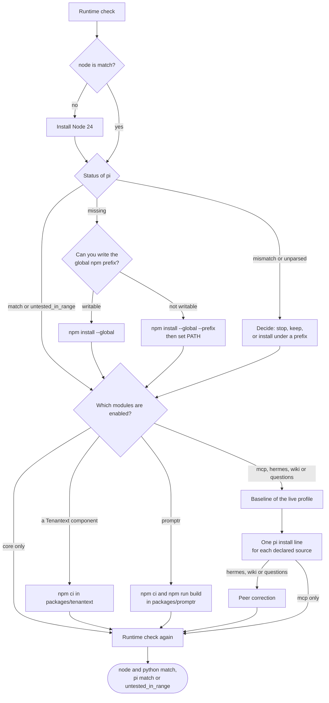

import { Aside, Steps, TabItem, Tabs } from '@astrojs/starlight/components';
import Capture from '@/components/Capture.astro';
import Cast from '@/components/Cast.astro';
import DocVersion from '@/components/DocVersion.astro';

<DocVersion project="tenant-pi" />

<Aside type="note" title="Verified on a clean client">
	A run on a clean Debian 12 client verified this stage for a core-only profile, with Node 24 from nvm and Pi 1.1.0. Each "Not verified:" line names a part that the run did not do.
</Aside>

## Goal

In the shell that will launch Pi, the runtime check prints `match` for Node and Python. It prints `match` or `untested_in_range` for Pi.

The kit installs nothing. You copy each command, read it, and run it yourself.



## Before you start

- [Stage 5](/tenant-pi/install/stage-5-generate/) is passed.
- You have the three statuses of the runtime check of [Stage 1](/tenant-pi/install/stage-1-obtain-the-sources/#the-runtime-check), or of the runtime report of [Stage 4](/tenant-pi/install/stage-4-plan/).
- You work in the shell that will launch Pi.

Warning: each command of this stage changes the machine. Read each command before you run it.

## Steps

### Check the runtime

<Steps>

1. Go to the kit directory.

   ```sh
   cd "$HOME/tenant-pi"
   ```

   Result: the command `pwd` prints the path of the kit.

2. Run the runtime check.

   <Capture id="tenant-pi/stage6-check-runtime" />

   Result: the output has a `status` for `pi`, `node` and `python`.

</Steps>

A tool with the status `match` needs no install. Skip its section. For `pi`, the status `untested_in_range` needs no install too.

The frame shows a clean client: `node` and `pi` are `missing`, and the exit code is 1. The entry `pi` also names the accepted range and the tested version.

### Node

Do this section only when the status of `node` is not `match`. The same Node installs Pi and builds native addons later.

<Steps>

1. Install Node 24 with the package source of your distribution, or with a version manager.

   <Tabs syncKey="distribution">
   <TabItem label="Fedora">

   ```sh
   dnf install nodejs24
   ```

   Not verified: the exact package name `nodejs24` on every Fedora release.

   </TabItem>
   <TabItem label="Debian or Ubuntu">

   The sources are the NodeSource 24 repository and nvm. This page gives no command for the NodeSource repository. For nvm, use the tab "nvm, for one user".

   Not verified: an install from the NodeSource 24 repository.

   </TabItem>
   <TabItem label="nvm, for one user">

   nvm is not a package of a distribution. If your shell does not find `nvm`, do the steps of [Install nvm](#install-nvm) first.

   <Cast id="tenant-pi/stage6-node-nvm" />

   </TabItem>
   </Tabs>

   Result: the command `node --version` prints a version in the range `>=24.0.0 <25`.

</Steps>

Warning: `nvm use` changes the default `node` of your user. A Pi that another Node installed can stop working.

Warning: the install script of nvm adds lines to your shell startup file. Read the script before you run it.

In a new terminal, do steps 2 and 3 of [Before Stage 1](/tenant-pi/install/#before-stage-1) again. A new terminal starts in your home directory, not in the kit directory.

#### Install nvm

Do these steps only for the tab "nvm, for one user", and only when your shell does not find `nvm`. The steps get nvm `0.40.3` with the install script of the nvm project.

<Steps>

1. Download the install script into your home directory.

   ```sh
   curl -fsSL -o "$HOME/nvm-install.sh" https://raw.githubusercontent.com/nvm-sh/nvm/v0.40.3/install.sh
   ```

   Result: the file `~/nvm-install.sh` exists. The command needs `curl`.

2. Read the file `~/nvm-install.sh` in a text editor.

   Result: you know what the script changes. It puts nvm into `~/.nvm`, and it adds lines to your shell startup file.

3. Run the script.

   ```sh
   bash "$HOME/nvm-install.sh"
   ```

   Result: the script prints the lines that it added to the shell startup file. This terminal does not find `nvm`.

4. Open a new terminal.

   Result: the command `command -v nvm` prints `nvm`.

</Steps>

Then run the command of the tab "nvm, for one user" in the new terminal.

- The script edits only a startup file that exists, for example `~/.bashrc` for bash. Without such a file, it prints `Profile not found` and edits nothing.
- To keep your startup file unchanged, put `PROFILE=/dev/null` before the command of step 3. Then run `. "$HOME/.nvm/nvm.sh"` in each shell that runs a kit command or the launcher file.
- The kit gives no checksum for the install script.

Not verified: the install script with `PROFILE=/dev/null`. The run on the clean client let the script edit `~/.bashrc`.

### Pi

Do this section only when the status of `pi` is `missing`, `mismatch` or `unparsed`. With `match` or `untested_in_range`, skip the Pi install. The steps below are for the status `missing`.

<Steps>

1. Test if you can write the global npm prefix.

   <Capture id="tenant-pi/stage6-npm-prefix" />

   Result: the shell prints `writable` or `not writable`.

2. In the kit directory, install Pi with the command for the result of step 1.

   <Tabs>
   <TabItem label="writable">

   <Cast id="tenant-pi/stage6-install-pi" />

   </TabItem>
   <TabItem label="not writable">

   ```sh
   pin="$(python3 -c 'import json; print(json.load(open("config/manifest.json"))["runtime"]["piVersion"])')" && \
     npm install --global --prefix "$HOME/.npm-global" -- @earendil-works/pi-coding-agent@"${pin:?}"
   ```

   </TabItem>
   </Tabs>

   Result: npm ends with no error.

3. Only after the command for `not writable`: add the prefix to `PATH` of this shell.

   ```sh
   export PATH="$HOME/.npm-global/bin:$PATH"
   ```

   Result: the shell finds `pi`. The command `command -v pi` prints its path.

</Steps>

Warning: a global install replaces the `pi` command of every profile of your user.

Warning: do not use `npm config set prefix`. It changes the npm configuration for every later global install.

- The command reads the Pi pin `runtime.piVersion` from `config/manifest.json` of the kit. So it runs only in the kit directory. In this release, the pin is `1.1.0`.
- With npm 11, the command can print lines that start with `npm warn install-scripts` and `npm warn deprecated`. These lines are expected output, not a failure.
- The lines `npm warn install-scripts` propose an `allow-scripts` command of npm. The kit needs no such command.
- With Node from nvm, the npm prefix is inside `~/.nvm`. The test of step 1 then prints `writable`.
- The test of step 1 writes nothing into the npm prefix. `npm config get prefix` writes one debug log file into the npm cache directory of your user.
- The command fixes the version of the Pi package. It does not fix all versions of its dependencies.
- The directory `"$HOME/.npm-global"` is an example. You can name another directory that you own.
- The `export` line changes the current shell only. To keep it, add the line to your shell startup file yourself.
- The kit never edits a shell startup file. Record the prefix and its `PATH` line as an adaptation.

Not verified: the command for `not writable` and the `export` line of step 3.

#### The mark of the Pi install line

The plan of Stage 4 always prints the Pi install line in `commands.piInstall`. The key `status` of that entry is the mark. It depends on the runtime report that you give to the plan with `--runtime-report`.

| Pi in the runtime report | `status` | The line is also in `commands.setupDisplayOnly` |
| --- | --- | --- |
| No report | `installed_version_unknown` | Yes |
| `missing` | `needed` | Yes |
| `match` or `untested_in_range` | `not_needed` | No |
| `mismatch` | `replaces_installed` | No |
| `unparsed` | `installed_version_unknown` | Yes |

- With `replaces_installed`, the key `change` says if the line is a `downgrade` or an `upgrade` of the installed Pi.
- After each install or change of Node or Pi, make the runtime report again. Then run the plan again. The kit cannot tell an old report from a current one.
- In the run on the clean client, the plan with a new report after the install marked the line `not_needed`. Its list `commands.setupDisplayOnly` was empty.

#### The status `mismatch` or `unparsed`

The installed Pi is outside the accepted range `>=1.1.0 <1.2`, or the kit cannot read the version. With `unparsed`, read the version yourself first:

```sh
PI_CODING_AGENT_DIR="$(mktemp -d)" pi --version
```

Then make a decision. You have three options:

- Stop.
- Keep the Pi that exists, and record the version mismatch as a gap.
- Install the pin with the command for `not writable`, under a prefix that you name. The Pi that exists stays in its place. Record the prefix and its `PATH` line as an adaptation.

The global install command is not the default for `mismatch`. It replaces the installed Pi for every profile of your user. It is a downgrade when the installed Pi is newer.

Not verified: the statuses `untested_in_range`, `mismatch` and `unparsed` on a clean client.

### Packages of optional modules

A core-only profile needs none of these steps. Skip this section.

Not verified: each step of this section. The run used a core-only profile.

#### In-tree packages

<Steps>

1. Only with a Tenantext component: install the Node dependencies of the package.

   ```sh
   cd "$HOME/tenant-pi/packages/tenantext" && npm ci --ignore-scripts
   ```

   Result: the directory `packages/tenantext/node_modules/yaml` exists.

2. Only with `promptr`: install the Node dependencies of the package with its build.

   ```sh
   cd "$HOME/tenant-pi/packages/promptr" && npm ci --ignore-scripts && npm run build
   ```

   Result: the directory `packages/promptr/dist/` exists.

</Steps>

- The Tenantext components are `tenantext`, `codex-accounts`, `slopscore`, `context-meter`, `ops-footer`, `copilot-usage`, `anthropic-usage`, `doctor`, `resources`, `herdr`, `coordinator-skills`, `knowledge-skills` and `slopscore-pr`.
- Observed with Pi 0.99.1: without step 1, Pi stops at start with `Cannot find module 'yaml'`.
- Without the build of step 2, Pi cannot load the extension. The tree of the kit has no `packages/promptr/dist/`.
- When no tracker binding exists, set `GITEA_HOST`, `GITEA_OWNER` and `OPENKNOWLEDGE_ORIGIN` in the shell that starts Pi. Without them, Promptr shows placeholder defaults.

#### Declared npm packages

Do these steps only with `mcp`, `hermes`, `wiki` or `questions`.

<Steps>

1. Record the baseline of the live profile, and with `wiki` the baseline of the vault. [Stage 8](/tenant-pi/install/stage-8-launch/#record-the-baselines) has the commands.

   Result: each baseline file exists in the private directory.

2. Run each `pi install` line that your plan prints, in the order of the plan. These are the lines of `hermes`, `wiki`, `mcp` and `questions`:

   ```sh
   PI_CODING_AGENT_DIR="$HOME/.pi/profiles/main" pi install npm:pi-hermes-memory
   PI_CODING_AGENT_DIR="$HOME/.pi/profiles/main" pi install npm:@zosmaai/pi-llm-wiki
   PI_CODING_AGENT_DIR="$HOME/.pi/profiles/main" pi install npm:pi-mcp-adapter
   PI_CODING_AGENT_DIR="$HOME/.pi/profiles/main" pi install npm:@juicesharp/rpiv-ask-user-question@2.11.0
   ```

   Result: npm ends each line with no error.

3. Only with `hermes`, `wiki` or `questions`: correct the peer entries of the installed packages.

   ```sh
   PI_CODING_AGENT_DIR="$HOME/.pi/profiles/main" node "$HOME/tenant-pi/scripts/patch_extension_peers.mjs"
   ```

   Result: the command ends with no error.

4. List the packages of the profile.

   ```sh
   PI_CODING_AGENT_DIR="$HOME/.pi/profiles/main" pi list
   ```

   Result: below each declared `npm:` source, a path line starts with the target and `/npm/node_modules/`.

5. Only with `questions`: run the inventory of the target in the kit directory.

   ```sh
   python3 scripts/tenant_pi.py inventory --dir "$HOME/.pi/profiles/main"
   ```

   Result: the output shows `coordination.questionExtension` as `installed`.

</Steps>

The first `pi install` line is the first Pi command that names the target. So the baselines come first.

- The plan prints one `pi install` line for each declared npm source, in the order of `packages` in `settings.json`. Run only the lines that your plan prints.
- Use each source string as the plan prints it. With another string, Pi rewrites `settings.json` of the profile.
- `mcp`, `hermes` and `wiki` have no version in the declaration. Their lines install the newest registry version of the package.
- The kit reviewed `pi-mcp-adapter` 3.2.0, `pi-hermes-memory` 0.9.9 and `@zosmaai/pi-llm-wiki` 0.12.4. A newer version is not verified.
- `questions` has the exact version 2.11.0. Its line installs that version.
- `pi update --extensions` is not a setup command. With Pi `1.1.0`, it does not install a source with an exact version.
- The plan prints the peer correction as `node scripts/patch_extension_peers.mjs`. That form runs only in the kit directory.
- `mcp` alone needs no peer correction. `pi-mcp-adapter` lists no host module under `dependencies`.
- `pi list` prints a declared source also when its package is not installed. So read the path lines.
- No part of this check compares the installed version with the declared version.
- With `pi-hermes-memory` 0.9.10 and `@zosmaai/pi-llm-wiki` 0.12.5, the peer correction prints nothing at the first run too. Only the question extension gets a correction.
- With npm 11.19.0 on Linux x64, the install of Hermes ran no install script. The module `better-sqlite3` loaded from a prebuilt file.
- The line of `wiki` prints an audit summary of npm and a line `npm warn install-scripts`. At the release, the summary had 8 vulnerabilities: 3 high and 5 critical. The kit did not review these findings.

Warning: do not run `npm audit fix` in the profile.

Not verified: the install of Hermes on other platforms, and the need for a compiler toolchain there.

### Check again

Do the two steps of [Check the runtime](#check-the-runtime) again, in the shell that will launch Pi.

<Capture id="tenant-pi/stage6-check-runtime-again" />

Result: each of the three statuses is `match`, and the exit code is 0. For `pi`, the status `untested_in_range` passes too.

Each frame shows the run on a clean Debian 12 client with Node 24 and Pi 1.1.0. The frames of the Node install and of the Pi install have a button that plays the recording. The frame of the Pi install has no progress display of npm and no notice about a newer npm. Your terminal can show both.

## The result

Stage 6 is passed when Node and Python are `match`, and Pi is `match` or `untested_in_range`, in the shell that will launch Pi.

- With `untested_in_range`, record the gap `core_runtime_untested_in_range`. The kit tests ran on the tested version only.
- Exit code 0 means only that three version numbers agree with the kit. It does not prove that Pi runs.
- A module whose dependency step you did not run has the label `skipped`.

## Pi commands that change the profile

`pi remove`, `/model` and settings changes inside Pi can write to `settings.json` of the profile. `pi install` writes it only for a new source, or for a source string that differs from the declared string. `pi update` does not write it.

After each such operation, run the action `compare` and read each difference that it reports. See [Candidate update loop](/tenant-pi/use/candidate-update/).

Not verified: the exact list of Pi commands that write to `settings.json` at Pi `1.1.0`.

## What can go wrong

| What you see | Cause | What to do |
| --- | --- | --- |
| The global install fails. | You cannot write the global npm prefix. | Use the command for `not writable`. |
| `pi` stays `missing` after the install. | The `PATH` line is not set in this shell. | Run the `export` line of the Pi section in the shell that launches Pi. |
| `pi` is `mismatch`. | The installed Pi is outside the accepted range. | Use one of the three options above. |
| `node` is `mismatch`. | The shell finds another Node. | Select Node 24 with your version manager in the shell that launches Pi. |
| The Pi install prints lines `npm warn install-scripts`. | npm 11 lists install scripts that it did not run. | Nothing. The lines are not a failure. The kit needs no `allow-scripts` command. |
| A status is `unparsed`. | The kit cannot read the version of the tool. | Run the tool with `--version` by hand, and read the output. |
| Pi stops at start with `Cannot find module 'yaml'`. | The Node dependencies of `packages/tenantext` are absent. | Do step 1 of [In-tree packages](#in-tree-packages). |
