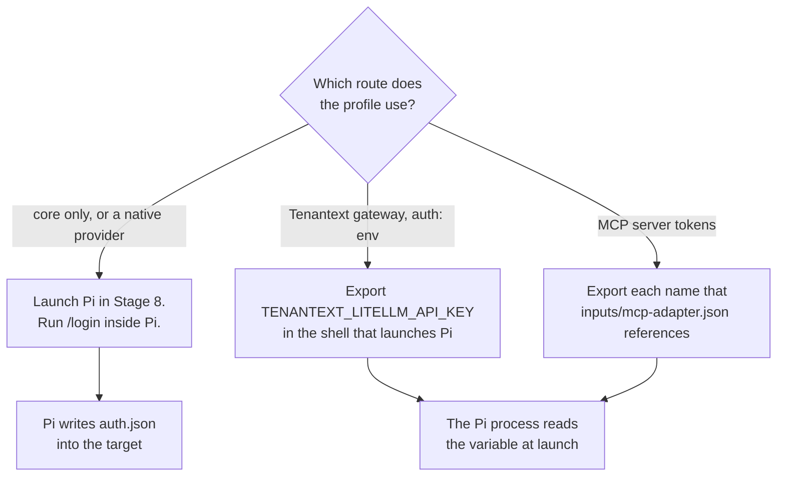

import { Aside, Steps, TabItem, Tabs } from '@astrojs/starlight/components';
import DocVersion from '@/components/DocVersion.astro';
import Shot from '@/components/Shot.astro';
import login from '../../../../../captures/tenant-pi/stage7-login.png';
import loginResult from '../../../../../captures/tenant-pi/stage7-login-result.png';

<DocVersion project="tenant-pi" />

<Aside type="note" title="Partly verified on a clean client">
	A run on a clean Debian 12 client verified the tab "Core only or native provider" with an API key. Each "Not verified:" line names a part that the run did not do.
</Aside>

## Goal

The credential of your route reaches the Pi process.

The kit writes no credential, and it needs no credential store. The kit cannot check a credential.



## Before you start

- [Stage 6](/tenant-pi/install/stage-6-install-the-dependencies/) is passed.
- You know which route the profile uses. The table below lists the routes.
- You work in the shell that will launch Pi.

| Route | What you do |
| --- | --- |
| Core only | Nothing now. Pi asks for a provider when you use it. |
| Native provider | Launch Pi, and run `/login` inside Pi. |
| Tenantext gateway with `auth: "env"` | Export `TENANTEXT_LITELLM_API_KEY` in the shell that launches Pi. |
| Tenantext gateway with `auth: "login"` | Blocked in this release. Stage 5 refuses it with `pi_login_blocked`. |
| MCP server tokens | Export each `${NAME}` that `inputs/mcp-adapter.json` references. |

Warning: do not write a key into the overlay, the registry, the launcher file or a file of the kit.

## Steps

<Tabs>
<TabItem label="Core only or native provider">

<Steps>

1. Do [Stage 8](/tenant-pi/install/stage-8-launch/) to launch Pi.

   Result: Pi shows its terminal interface.

2. Type `/login` inside Pi.

   Result: Pi starts the login. It shows the list of the login methods.

   <Shot
   	src={login}
   	alt="The terminal interface of Pi 1.0.2 after the command /login. Below the start text, a list has the title Select authentication method and three entries."
   	callouts={[
   		{ n: 1, x: 34.6, y: 64.2, text: 'The title of the list. Pi shows the list after you type /login and press Enter.' },
   		{ n: 2, x: 28.8, y: 70.5, text: 'The arrow marks the selected method. The first method signs in with an account of a provider.' },
   		{ n: 3, x: 36.5, y: 73.6, text: 'The second method signs in with an API key.' },
   		{ n: 4, x: 45.2, y: 76.7, text: 'Pi shows the third method as not configured.' },
   		{ n: 5, x: 53.8, y: 83.0, text: 'The arrow keys move the selection. Enter selects a method. Escape closes the list and changes nothing.' },
   	]}
   />

3. Follow the instructions of Pi to the end.

   Result: Pi prints that it saved the credential. It stores the result in the file `auth.json` of the target.

   <Shot
   	src={loginResult}
   	alt="The terminal interface of Pi 1.0.2 after a login with an API key. A new line says that Pi saved the key, names the selected model and names the file auth.json. The status line shows the name of the model."
   	callouts={[
   		{ n: 1, x: 84.7, y: 70.5, text: 'Pi names the provider of the saved key and the model that it selected. Both names are examples from the run.' },
   		{ n: 2, x: 42.3, y: 73.6, text: 'Pi names the file that holds the credential. The file is in the target of the profile.' },
   		{ n: 3, x: 61.6, y: 94.6, text: 'The status line now shows the name of the model. Before the login, it showed no model name.' },
   	]}
   />

</Steps>

The screenshot of step 3 shows a run with the method `Sign in with an API key`. The provider and the model in it are examples.

The run made no capture of the screens where you select the provider and type the key.

</TabItem>
<TabItem label="Tenantext gateway">

<Steps>

1. Export the variable `TENANTEXT_LITELLM_API_KEY` in the shell that launches Pi.

   Result: the variable holds your key. The key is in no file of the kit.

2. Check that the name is set. The command does not print the value.

   ```sh
   test -n "${TENANTEXT_LITELLM_API_KEY:-}" && echo set || echo unset
   ```

   Result: the shell prints `set`.

</Steps>

The launch line of the plan carries `TENANTEXT_LITELLM_BASE_URL`. That URL is configuration, not a key.

</TabItem>
<TabItem label="MCP server tokens">

<Steps>

1. Read the names that the file `inputs/mcp-adapter.json` of the private directory references.

   Result: you have a list of `${NAME}` references.

2. Export each name of the list in the shell that launches Pi.

   Result: each variable holds its token.

</Steps>

</TabItem>
</Tabs>

How the key reaches the process is your decision. These are examples:

- Export the key by hand in the terminal before you run the launcher file.
- Read the key from a secret store that you use already. Bitwarden (`bw`), `pass` and an OS keyring are examples. None is necessary.

## The result

This stage has the label `skipped` until you run it.

- With `/login`: the file `auth.json` in the target holds the result of the login.
- The file `auth.json` alone does not prove a login. Pi writes that file at the first launch, with a size of 2 bytes.
- In the run, the size of `auth.json` went from 2 bytes to 135 bytes after a login with an API key.
- After the login, a new launch shows no warning `No models available`.
- With an exported key: the `test -n` command prints `set` in the shell that runs the launcher file.

Warning: the file `auth.json` can hold your key. Keep it private, and do not put it into a repository.

Not verified: the method `Sign in with an account`. The run used an API key.

Not verified: the tabs "Tenantext gateway" and "MCP server tokens". They need a credential and an optional module.

## Shells that do not get your variables

A variable that your interactive shell exports does not reach every process. These starts often miss it:

- A command through SSH without a terminal, for example `ssh host 'command'`.
- A terminal in a browser page, in a web IDE or in a remote desktop session.
- A desktop launcher, a systemd unit, a cron job, or a tmux server that started before the export.

In each of these, run the `test -n` command in the same shell that runs the launcher file. Run the runtime check there too. A `PATH` line can be absent in the same way.

Do not correct this with an edit of a shell startup file that you did not review.

## What can go wrong

| What you see | Cause | What to do |
| --- | --- | --- |
| The `test -n` command prints `unset`. | The variable is not exported in this shell. | Export it in the shell that runs the launcher file. |
| Pi reports an auth error with the gateway. | The key did not reach the Pi process. | Run the `test -n` command in the shell that runs the launcher file. |
| Stage 5 stops with `pi_login_blocked: overlay.modelRoutes.gateway.auth`. | The gateway uses `auth: "login"`. | Use `{"auth": "env"}` in the overlay, and export the key. |
