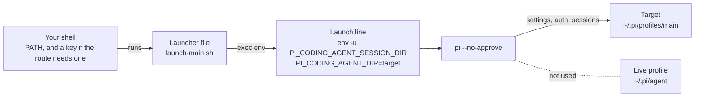

import { Aside, Steps, TabItem, Tabs } from '@astrojs/starlight/components';
import Cast from '@/components/Cast.astro';
import DocVersion from '@/components/DocVersion.astro';
import Shot from '@/components/Shot.astro';
import launch from '../../../../../captures/tenant-pi/stage8-launch.png';

<DocVersion project="tenant-pi" />

<Aside type="note" title="Verified on a clean client">
	A run on a clean Debian 12 client verified this stage for a core-only profile with no credential. Each "Not verified:" line names a part that the run did not do.
</Aside>

## Goal

Pi runs with the generated profile, and it keeps its state in the target.



## Before you start

- [Stage 6](/tenant-pi/install/stage-6-install-the-dependencies/) is passed.
- The key of your route is exported, if the route needs one. See [Stage 7](/tenant-pi/install/stage-7-authenticate/).
- You work in the shell where the runtime check prints `match` for `pi`.

## Steps

<Tabs>
<TabItem label="With the launcher file">

<Steps>

1. Run the launcher file of Stage 5.

   <Cast id="tenant-pi/stage8-launch" />

   Result: Pi starts and shows its own terminal interface.

2. Read the text that Pi prints at start.

   Result: the text has no extension error and no peer warning.

</Steps>

The screenshot shows Pi after the first launch of a core-only profile with no credential.

<Shot
	src={launch}
	alt="The terminal interface of Pi after the first launch. It shows the version 1.0.2, two downloaded tools, a warning that no models are available, an empty input line and a status line."
	callouts={[
		{ n: 1, x: 17.2, y: 7.5, text: 'The Pi version. It is the version that the kit requires.' },
		{ n: 2, x: 61.6, y: 34.3, text: 'At the first launch, Pi downloads the tools fd and ripgrep into the directory bin of the target. This needs the network.' },
		{ n: 3, x: 95.2, y: 45.3, text: 'Without a credential, Pi prints this warning. It is not an extension error. Stage 7 gives Pi a credential.' },
		{ n: 4, x: 11.5, y: 86.2, text: 'The input line. You type a prompt or a command such as /login here.' },
		{ n: 5, x: 86.6, y: 94.6, text: 'The status line. It shows no model name, because no model is available. The line above it shows the working directory.' },
	]}
/>

</TabItem>
<TabItem label="Without a launcher file">

<Steps>

1. Print the plan again.

   ```sh
   python3 scripts/tenant_pi.py plan --overlay "$HOME/.config/tenant-pi/overlay.json"
   ```

   Result: the key `commands.launchDisplayOnly` holds one launch line with your target.

2. Type that launch line into the shell as one line.

   Result: Pi starts and shows its own terminal interface.

</Steps>

Do not divide the line. Each assignment belongs to the same `pi` process.

The run on the clean client also started Pi with the typed launch line. That start has no capture.

</TabItem>
</Tabs>

To stop Pi, press `Ctrl+D` when the input line is empty. The shell prompt shows again.

The frame of step 1 shows the first launch of a core-only profile with no credential. The button below the frame plays the recording, which ends with `Ctrl+D`.

## What the launcher file runs

The launcher file has two lines: `#!/bin/sh`, and `exec env` with the launch line of the plan. For a core-only profile, the second line has this form:

```sh
exec env env -u PI_CODING_AGENT_SESSION_DIR PI_CODING_AGENT_DIR=/home/<name>/.pi/profiles/main pi --no-approve
```

| Part | What it does |
| --- | --- |
| `exec env` | Replaces the shell with the command, and sets the assignments for the one `pi` process. |
| `env -u PI_CODING_AGENT_SESSION_DIR` | Removes an inherited session directory for the one `pi` process. |
| `PI_CODING_AGENT_DIR=<target>` | Selects the generated profile for the one `pi` process. |
| `pi --no-approve` | Starts Pi. The shell finds `pi` on its `PATH`. |

- With the gateway, the line also holds `TENANTEXT_LITELLM_BASE_URL`.
- With `mcp`, the line also holds `PI_MCP_CONFIG_MODE=exclusive`.
- With a relocated wiki vault, the line also holds `WIKI_HOME`.
- The file holds no key. The key comes from the environment of the shell that runs the file.
- The file gives no argument to Pi. To give Pi an argument, type the launch line by hand.

Pi starts with its own terminal interface. The kit does not wrap it or replace it.

Not verified: a launch line with the gateway, with `mcp` or with a wiki vault. The run used a core-only profile.

## The session directory

The profile keeps its sessions in its own directory `sessions/`. A login shell can export `PI_CODING_AGENT_SESSION_DIR`. Pi then writes the sessions of every profile to that one directory.

The launch line removes the variable for the one `pi` process. The kit edits no shell startup file to do this.

Warning: do not remove the part `env -u PI_CODING_AGENT_SESSION_DIR` from the launch line.

Warning: do not start the profile with a bare `PI_CODING_AGENT_DIR=<target> pi` command in a shell that has `PI_CODING_AGENT_SESSION_DIR`.

Not verified: `env -u` on BusyBox, on the BSDs and on macOS. The option is in GNU coreutils.

## The result

Stage 8 is passed when Pi starts with the generated profile. [Stage 9](/tenant-pi/install/stage-9-test/) has the checks.

- The first launch writes into the target: `auth.json`, `models-store.json`, `bin/` and `sessions/`.
- The first launch also changes `settings.json` of the target. In the run, Pi added the key `lastChangelogVersion` with the Pi version. The size of the file went from 99 to 150 bytes.
- The line above the status line shows the working directory. In a Git directory, it also shows the branch name.

- After the login of Stage 7, a launch shows no warning `No models available`, and the status line names the model.

Not verified: a launch of a profile with an optional module.

## What can go wrong

| What you see | Cause | What to do |
| --- | --- | --- |
| The shell cannot find `pi`. | The `PATH` line of Stage 6 is not set in this shell. | Run the runtime check in this shell. Then set `PATH` as in Stage 6. |
| Pi stops at start with `Cannot find module 'yaml'`. | The Node dependencies of `packages/tenantext` are absent. | Do the packages section of Stage 6. |
| Pi warns about host-provided extension packages. | A memory package lists a host module under `dependencies`. | Run the peer correction of Stage 6. |
| Pi reports an auth error with the gateway. | The key did not reach the Pi process. | Do Stage 7 in the shell that runs the launcher file. |
| Pi opens another profile. | You started Pi with a bare `pi` command. That command uses the live profile, or the directory in `PI_CODING_AGENT_DIR`. | Start the profile only with its launcher file or with the exact launch line. |

Not verified: the warning about host-provided extension packages on Pi `1.0.2`. Pi `0.99.x` printed it.

The file `docs/guides/troubleshooting.md` of the kit lists each known error and its correction.
