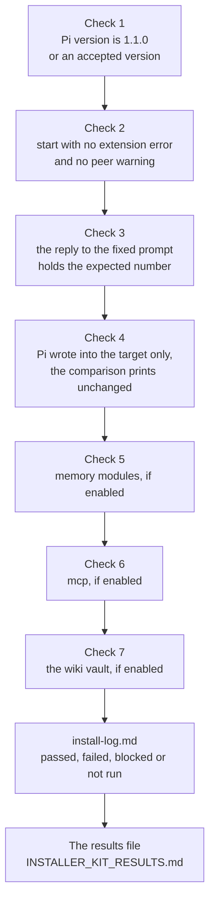

import { Aside, CardGrid, LinkCard, Steps } from '@astrojs/starlight/components';
import Capture from '@/components/Capture.astro';
import DocVersion from '@/components/DocVersion.astro';
import Shot from '@/components/Shot.astro';
import prompt from '../../../../../captures/tenant-pi/stage9-prompt.png';

<DocVersion project="tenant-pi" />

<Aside type="note" title="Partly verified on a clean client">
	A run on a clean Debian 12 client with Pi 1.1.0 and no credential verified checks 1, 2 and 4 for a core-only profile. The screenshot of check 3 comes from a run of the release `portable/20261005-592105f` with Pi 1.0.2, an API key and an older prompt. Each "Not verified:" line names a part that the runs did not do.
</Aside>

## Goal

A record of each check of the new profile as passed, failed, blocked or not run.



## Before you start

- [Stage 8](/tenant-pi/install/stage-8-launch/) is passed.
- You work in the shell that launches Pi.

| Label | When you use it |
| --- | --- |
| passed | The check ran, and you saw the result that the step names. |
| failed | The check ran, and you saw another result. |
| blocked | You cannot run the check. For example, you have no credential. |
| not run | You did not run the check. |
| not verified | Check 4 only: the directory changed, and a Pi ran in the live profile after the baseline. |

A check that did not run is "not run". Never write "passed" for it.

## Steps

<Steps>

1. Print the Pi version with the profile.

   <Capture id="tenant-pi/stage9-pi-version" />

   Result: Pi prints `1.1.0`, or another version in the accepted range `>=1.1.0 <1.2`. This is check 1.

2. Start Pi with the launcher file.

   ```sh
   "$HOME/.config/tenant-pi/launch-main.sh"
   ```

   Result: Pi shows its terminal interface.

3. Read the text that Pi prints at start.

   Result: the text has no extension error and no peer warning. This is check 2.

4. Send the fixed prompt of [check 3](#check-3-the-model-reply) to the model.

   Result: the reply of the model holds the number `43`. This check needs a credential.

   <Shot
   	src={prompt}
   	alt="The terminal interface of Pi 1.0.2 after one prompt. It shows the prompt, the thinking text of the model and the reply 5. The status line shows the token numbers, the cost and the name of the model."
   	callouts={[
   		{ n: 1, x: 46.1, y: 29.5, text: 'The prompt of one line. It is the user line.' },
   		{ n: 2, x: 93.3, y: 39.0, text: 'The thinking text of the model, in italic letters. Not each model shows such text.' },
   		{ n: 3, x: 6.6, y: 61.0, text: 'The reply of the model. It is in the model line, not in the user line.' },
   		{ n: 4, x: 48.1, y: 94.6, text: 'The status line shows the token numbers and the cost of the session. The name of the model is at the end of the line.' },
   	]}
   />

5. Stop Pi: press `Ctrl+D` when the input line is empty.

   Result: the shell prompt shows again.

6. List the target.

   <Capture id="tenant-pi/stage9-target-files" />

   Result: the list shows the generated files and what Pi wrote: `auth.json`, `models-store.json`, `bin/` and `sessions/`.

7. Look into the live profile `~/.pi/agent`.

   <Capture id="tenant-pi/stage9-live-profile" />

   Result: nothing new is in the live profile. On a clean client, the list has no entry `agent`.

8. In the kit directory, compare the live profile with its baseline of Stage 8.

   <Capture id="tenant-pi/stage9-check-baseline" />

   Result: the output has `"result":"unchanged"`. This is check 4. On a clean client, `was` and `now` are `absent`.

9. Only if the shell had `PI_CODING_AGENT_SESSION_DIR`: look into that directory.

   <Capture id="tenant-pi/stage9-session-dir" />

   Result: nothing new is in that directory. This result is a proof only after a prompt.

10. Only with a baseline of `PI_CODING_AGENT_DIR` or of `PI_CODING_AGENT_SESSION_DIR`: compare that directory with its baseline. Give its own `--dir` and `--baseline` to [`check-baseline`](/tenant-pi/use/commands/check-baseline/).

    Result: the output has `"result":"unchanged"`.

11. Only with Hermes: look for the directory `pi-hermes-memory/` in the target after the first session.

    Result: the directory exists. This is check 5.

12. Only with the wiki, with `ambientPersonalVault: false` and with no vault before the launch: look for the directory `~/.llm-wiki`.

    Result: the directory does not exist. This is check 5 too.

13. Only with `mcp`: type `/mcp-adapter status` inside Pi.

    Result: Pi lists only the servers of the input file. This is check 6.

14. Only with `wiki`: compare the vault with its baseline of Stage 8.

    ```sh
    python3 scripts/tenant_pi.py check-baseline --dir '<vault>' --baseline "$HOME/.config/tenant-pi/wiki-vault-baseline.json"
    ```

    Result: the output is one of the passed rows of [check 7](#check-7-the-comparison-of-the-vault).

15. Print the commit of the kit clone.

    ```sh
    git -C "$HOME/tenant-pi" rev-parse HEAD
    ```

    Result: Git prints the full commit hash for the field `Kit commit` of the entry.

16. Open the install log of the private directory in a text editor.

    ```sh
    ${EDITOR:-vi} "$HOME/.config/tenant-pi/install-log.md"
    ```

    Result: the editor shows the template of an entry. Its title is `YYYY-MM-DD: short title`.

17. Write one entry with the result of each check above the template.

    Result: each check has one of the labels. The newest entry is first, and the template stays below it.

    <Capture id="tenant-pi/stage9-install-log" />

</Steps>

- The captures of steps 1, 6, 7, 8 and 17 come from a core-only profile with Pi 1.1.0 and no credential. Such a profile has no directory `npm/`.
- In the list of step 6, `auth.json` has 2 bytes, because the run had no login. Pi also added the key `lastChangelogVersion` to `settings.json`.
- With an optional module, Pi and the extensions also write state directories into the profile.
- The screenshot of step 4 and the capture of step 9 are from the release `portable/20261005-592105f` with Pi 1.0.2, after a login and one prompt.
- The prompt in the screenshot of step 4 is not the fixed prompt of this release. The model in it is an example from the run.
- For the capture of step 9, the shell had the variable, and the launcher file started Pi. The directory stayed empty after the prompt.
- A start of Pi 1.1.0 with no prompt wrote no session file in the run. So step 9 is a proof only after a prompt.
- Step 13 needs a running Pi. Start Pi again with the launcher file for that step.
- `<vault>` is the directory of the vault baseline of Stage 8.
- For the capture of step 17, a script wrote the entry.

Not verified: the screen of step 4 and the directory of step 9 with Pi 1.1.0.

Not verified: the directory `npm/` in the target. Pi makes it for the packages of optional modules.

Not verified: steps 10 to 14. They need a second baseline, or the modules Hermes, wiki and `mcp`.

Not verified: the text editor of step 16 on a clean client.

Warning: do not write a secret value into the install log. Write the name of a credential, never its value.

## Check 3: the model reply

The fixed prompt is `What is 17 plus 26? Reply with the number only.` The expected reply is the number `43`. The prompt text does not hold that number.

Check 3 has two results: "Model replied" and "Reply matched". Record each one in its own line of the install log, with `yes`, `no` or `not run`. Check 3 is passed only when both are `yes`.

The preferred form is the print mode of Pi. With `-p`, Pi sends one prompt, writes the final reply of the model to standard output, and exits. The output holds no user line, no thinking text and no screen frame.

<Steps>

1. Only with a native provider: do the login of [Stage 7](/tenant-pi/install/stage-7-authenticate/) before this check.

   Result: the profile has a login. Print mode cannot log in.

2. Type the launch line of the plan with `--model`, `-p` and the prompt in single quotes.

   ```sh
   env -u PI_CODING_AGENT_SESSION_DIR PI_CODING_AGENT_DIR=/home/<name>/.pi/profiles/main pi --no-approve --model '<provider>/<model>' -p 'What is 17 plus 26? Reply with the number only.'; echo "exit status: $?"
   ```

   Result: Pi prints the reply, and the shell prints the exit status.

3. Read the output with the table below.

   Result: you know the value of each of the two results.

</Steps>

| Output | Model replied | Reply matched |
| --- | --- | --- |
| Text that holds `43`, then `exit status: 0` | yes | yes |
| Text without `43`, then `exit status: 0` | yes | no |
| An error text, no text, or an exit status that is not 0 | no | no |

- The launcher file takes no argument. So type the launch line of the plan for this check.
- Print mode uses the default model of the profile. `--model` names the model for the check.
- Pi reads a provider key from the environment of the launching shell, also in a profile with no login. The reply can then come from a provider that you did not choose.
- The plan of Stage 4 warns about a known provider key variable that is set, under `commands.providerKeyWarning`.

Not verified: which variable names Pi reads for each provider. Use the name that the Pi documentation gives.

The other form is a pasted screen of an interactive session, as in step 4. A Pi screen has no labels. Its lines come in this order: the user line, then the thinking text when the model shows it, then the model line.

- The user line must be the fixed prompt.
- "Reply matched" is `yes` only when `43` is in the model line.
- A `43` in the user line or in the thinking text is not a reply.

Not verified: check 3 with Pi 1.1.0 and both forms. The run with Pi 1.1.0 had no credential.

## Check 4: the comparison with the baseline

The output of step 8 has a `result`:

| `result` | Meaning | Record check 4 as |
| --- | --- | --- |
| `unchanged` | No entry was added, removed or modified after the baseline. A directory that was absent is still absent. | passed |
| `changed` | The directory differs from the baseline. `added`, `removed` and `modified` name the direct entries that differ. | failed, or not verified |
| `no_baseline` | The baseline file does not exist. The action compared nothing. | not run |

Record check 4 as passed only when `recordedAt` is before the first Pi command that names the target. With a later baseline, record check 4 as not run.

A Pi that ran in the live profile after the baseline also changes the directory. A `pi` command without `PI_CODING_AGENT_DIR` counts as such a Pi, also `pi --version`. The comparison does not show which process made a change.

- With `changed` and no Pi in the live profile: the check failed. A command of the install wrote outside the target.
- With `changed` and such a Pi: the check is not verified. Record the names and the command.
- For a proof, close that Pi, and record a second baseline in a new file. Then launch the profile again, and compare with the second baseline.

Observed with Pi 1.0.2 and a `settings.json` in the live profile: a `pi --version` without `PI_CODING_AGENT_DIR` gives `changed` and `"directoryModified":true`. The name lists are empty.

Not verified: that result with Pi 1.1.0.

## Check 7: the comparison of the vault

Only with `wiki`, after the first launch. Step 14 gives the output.

| Output | Meaning | Record check 7 as |
| --- | --- | --- |
| `"result":"unchanged"` | No entry of the vault differs. This is the result with `ambientPersonalVault: false`, and with a vault that had `meta/qmd/` before. | passed |
| `"result":"changed"`, `"modified":["meta"]`, `"added":[]`, `"removed":[]`, `"directoryModified":false` | The first start of an existing vault with `ambientPersonalVault: true` makes the index directory `meta/qmd/`. That changes the modification time of `meta/`. | passed |
| `"result":"changed"`, `"was":"absent"`, `"now":"present"` | No vault was there before, and the extension made one at the first start. | passed |
| Each other output with `changed` | Another entry of the vault differs. | failed, or not verified |
| `"result":"no_baseline"` | The baseline file does not exist. | not run |

- With another difference, stop. Do not launch the profile again.
- If an agent called a wiki write tool after the baseline, in this profile or another Pi of the account, the check is not verified. Else the check failed.
- The comparison names the direct entries of the vault only. With the baseline of `meta`, compare `--dir '<vault>/meta'` with `--baseline "$HOME/.config/tenant-pi/wiki-vault-meta-baseline.json"`.
- The expected output for `meta` has `"added":["qmd"]`, `"modified":[]`, `"removed":[]` and `"directoryModified":true`.

Not verified: these outputs after a start of Pi with the wiki package. They come from `check-baseline` on a directory with the same change.

## The entry in the install log

The template of the install log has these fields:

| Field | What you write |
| --- | --- |
| Kit commit | The full commit hash of the kit clone. |
| Overlay | The overlay file that you used. |
| Target | The absolute path of the generated profile. |
| Commands | The commands that you ran, in order. |
| Result | What you checked and what you saw. |
| Model replied | `yes`, `no` or `not run` for check 3, and the form: print mode or a pasted screen. |
| Reply matched | `yes`, `no` or `not run`. Write `yes` only when `43` is in the print mode output, or in the model line of the screen. |
| Live agent directory | The `result` of `check-baseline`, with the names for `changed`, and the time `recordedAt` of the baseline. |
| Not verified | What you did not check. |

Record the model reply of check 3 separately from the other checks. A profile can start correctly when no credential is available.

## The results file

After the last stage, one action writes the local file `INSTALLER_KIT_RESULTS.md` into the private directory. Do this also when the install stops at an earlier stage.

<Steps>

1. Write the facts file `results-facts.json` into the private directory.

   Result: the file holds the facts that the kit cannot read. It holds no secret value.

2. In the kit directory, write the results file.

   <Capture id="tenant-pi/stage9-results" />

   Result: the output has `"complete":true` and the path of the file.

</Steps>

- The file says what the install did and how to start Pi. It says where each part is, which components are on and off, and how to add a component.
- The facts file has a closed schema. An unknown key stops the action with `unknown_fields`, and a missing key stops it with `required_fields`.
- The file `docs/install-results.md` of the kit describes each key of the facts file.
- When the results file exists, add `--replace`. The action then writes the complete file again.
- The action refuses an `--out-dir` inside the clone, inside a target, or in a vault of the wiki. It refuses a `--target` in a vault.
- The results file and the facts file hold real paths and the account name of the machine. Do not commit them. The `.gitignore` of the private directory ignores both files.
- `install-log.md` stays the record of the commands. `POST_INSTALL.md` of the kit is the next document. It has the commands of each later update and change.
- For the capture, a script wrote the facts file.

Not verified: the action [`results`](/tenant-pi/use/commands/results/) with `--replace`, or with two targets.

## The result

Stage 9 is done when each check has a label in the install log. The profile is tested when the checks that apply to it are passed.

## What can go wrong

| What you see | Cause | What to do |
| --- | --- | --- |
| Step 1 prints another version. | The shell finds another Pi. | Do the runtime check of [Stage 6](/tenant-pi/install/stage-6-install-the-dependencies/) in this shell. |
| Step 3 shows an extension error or a peer warning. | A dependency step of Stage 6 is absent. | Read [What can go wrong in Stage 8](/tenant-pi/install/stage-8-launch/#what-can-go-wrong). |
| Step 4 gives an auth error. | The credential did not reach the Pi process. | Do [Stage 7](/tenant-pi/install/stage-7-authenticate/) in the shell that runs the launcher file. |
| Step 8 prints `"result":"changed"`. | A command wrote into the live profile after the baseline. | Read [Check 4](#check-4-the-comparison-with-the-baseline). |
| Step 8 prints `"result":"no_baseline"`. | The baseline file of Stage 8 does not exist. | Record check 4 as not run. |
| Step 9 finds new session files. | Pi started without the launch line of the kit. | Start the profile only with its launcher file. |
| The action `results` stops with `unknown_fields` or `required_fields`. | The facts file has a key that the schema does not know, or it lacks a key. | Correct the facts file. |
| The action `results` stops with `target_exists`. | The results file exists. | Add `--replace`. |

The file `docs/guides/troubleshooting.md` of the kit lists each known error and its correction.

## After the install

<CardGrid>
	<LinkCard title="Command reference" description="Each action of the tenant-pi command line." href="/tenant-pi/use/commands/" />
	<LinkCard title="Candidate update loop" description="Regenerate a profile, compare it, carry your choices and switch." href="/tenant-pi/use/candidate-update/" />
	<LinkCard title="Modules and privacy" description="What each optional module needs, and what the kit keeps separate." href="/tenant-pi/use/modules-and-privacy/" />
</CardGrid>
