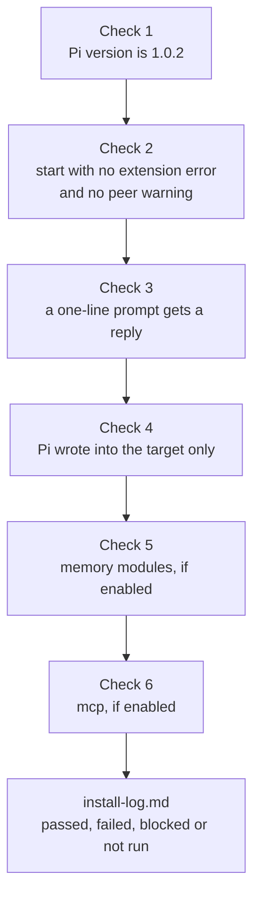

import { Aside, CardGrid, LinkCard, Steps } from '@astrojs/starlight/components';
import Capture from '@/components/Capture.astro';
import DocVersion from '@/components/DocVersion.astro';
import Shot from '@/components/Shot.astro';
import prompt from '../../../../../captures/tenant-pi/stage9-prompt.png';

<DocVersion project="tenant-pi" />

<Aside type="note" title="Verified on a clean client">
	A run on a clean Debian 12 client verified this stage for a core-only profile, after a login with an API key. Each "Not verified:" line names a part that the run did not do.
</Aside>

## Goal

A record of each check of the new profile as passed, failed, blocked or not run.



## Before you start

- [Stage 8](/tenant-pi/install/stage-8-launch/) is passed.
- You work in the shell that launches Pi.

| Label | When you use it |
| --- | --- |
| passed | The check ran, and you saw the result that the step names. |
| failed | The check ran, and you saw another result. |
| blocked | You cannot run the check. For example, you have no credential. |
| not run | You did not run the check. |

A check that did not run is "not run". Never write "passed" for it.

## Steps

<Steps>

1. Print the Pi version with the profile.

   <Capture id="tenant-pi/stage9-pi-version" />

   Result: Pi prints `1.0.2`.

2. Start Pi with the launcher file.

   ```sh
   "$HOME/.config/tenant-pi/launch-main.sh"
   ```

   Result: Pi shows its terminal interface.

3. Read the text that Pi prints at start.

   Result: the text has no extension error and no peer warning.

4. Send a prompt of one line to Pi.

   Result: the model that you selected gives a reply. This check needs a credential.

   <Shot
   	src={prompt}
   	alt="The terminal interface of Pi 1.0.2 after one prompt. It shows the prompt, the thinking text of the model and the reply 5. The status line shows the token numbers, the cost and the name of the model."
   	callouts={[
   		{ n: 1, x: 46.1, y: 29.5, text: 'The prompt of one line.' },
   		{ n: 2, x: 93.3, y: 39.0, text: 'The thinking text of the model, in italic letters. Not each model shows such text.' },
   		{ n: 3, x: 6.6, y: 61.0, text: 'The reply of the model. The check is passed.' },
   		{ n: 4, x: 48.1, y: 94.6, text: 'The status line shows the token numbers and the cost of the session. The name of the model is at the end of the line.' },
   	]}
   />

5. Stop Pi: press `Ctrl+D` when the input line is empty.

   Result: the shell prompt shows again.

6. List the target.

   <Capture id="tenant-pi/stage9-target-files" />

   Result: the list shows the generated files and what Pi wrote: `auth.json`, `models-store.json`, `bin/` and `sessions/`.

7. Look into the live profile `~/.pi/agent`.

   <Capture id="tenant-pi/stage9-live-profile" />

   Result: nothing new is in the live profile. On a clean client, the list has no entry `agent`.

8. Only if the shell had `PI_CODING_AGENT_SESSION_DIR`: look into that directory.

   <Capture id="tenant-pi/stage9-session-dir" />

   Result: nothing new is in that directory.

9. Only with Hermes: look for the directory `pi-hermes-memory/` in the target after the first session.

   Result: the directory exists.

10. Only with the wiki, and with ambient off: look for the directory `~/.llm-wiki`.

    Result: the directory does not exist.

11. Only with `mcp`: type `/mcp-adapter status` inside Pi.

    Result: Pi lists only the servers of the input file.

12. Print the commit of the kit clone.

    ```sh
    git -C "$HOME/tenant-pi" rev-parse HEAD
    ```

    Result: Git prints the full commit hash for the field `Kit commit` of the entry.

13. Open the install log of the private directory in a text editor.

    ```sh
    ${EDITOR:-vi} "$HOME/.config/tenant-pi/install-log.md"
    ```

    Result: the editor shows the template of an entry. Its title is `YYYY-MM-DD: short title`.

14. Write one entry with the result of each check above the template.

    Result: each check has one of the four labels. The newest entry is first, and the template stays below it.

    <Capture id="tenant-pi/stage9-install-log" />

</Steps>

- The model in the screenshot of step 4 is an example from the run.
- The captures of steps 6, 7, 8 and 14 come from a core-only profile after a login and one prompt. Such a profile has no directory `npm/`.
- For the capture of step 8, the shell had the variable, and the launcher file started Pi. The directory stayed empty.
- Step 11 needs a running Pi. Start Pi again with the launcher file for that step.
- For the capture of step 14, a script wrote the entry. A later run wrote an entry with the text editor of step 13.

Not verified: the directory `npm/` in the target. Pi makes it for the packages of optional modules.

Not verified: steps 9, 10 and 11. They need the modules Hermes, wiki and `mcp`.

Warning: do not write a secret value into the install log. Write the name of a credential, never its value.

## The entry in the install log

The template of the install log has these fields:

| Field | What you write |
| --- | --- |
| Kit commit | The full commit hash of the kit clone. |
| Overlay | The overlay file that you used. |
| Target | The absolute path of the generated profile. |
| Commands | The commands that you ran, in order. |
| Result | What you checked and what you saw. |
| Not verified | What you did not check. |

Record the model reply of step 4 separately from the other checks. A profile can start correctly when no credential is available.

## The result

Stage 9 is done when each check has a label in the install log. The profile is tested when the checks that apply to it are passed.

## What can go wrong

| What you see | Cause | What to do |
| --- | --- | --- |
| Step 1 prints another version. | The shell finds another Pi. | Do the runtime check of [Stage 6](/tenant-pi/install/stage-6-install-the-dependencies/) in this shell. |
| Step 3 shows an extension error or a peer warning. | A dependency step of Stage 6 is absent. | Read [What can go wrong in Stage 8](/tenant-pi/install/stage-8-launch/#what-can-go-wrong). |
| Step 4 gives an auth error. | The credential did not reach the Pi process. | Do [Stage 7](/tenant-pi/install/stage-7-authenticate/) in the shell that runs the launcher file. |
| Step 8 finds new session files. | Pi started without the launch line of the kit. | Start the profile only with its launcher file. |

The file `docs/guides/troubleshooting.md` of the kit lists each known error and its correction.

## After the install

<CardGrid>
	<LinkCard title="Command reference" description="Each action of the tenant-pi command line." href="/tenant-pi/use/commands/" />
	<LinkCard title="Candidate update loop" description="Regenerate a profile, compare it, carry your choices and switch." href="/tenant-pi/use/candidate-update/" />
	<LinkCard title="Modules and privacy" description="What each optional module needs, and what the kit keeps separate." href="/tenant-pi/use/modules-and-privacy/" />
</CardGrid>
