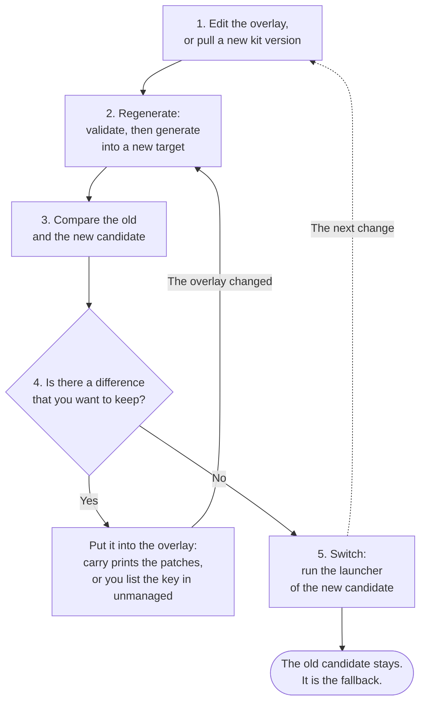
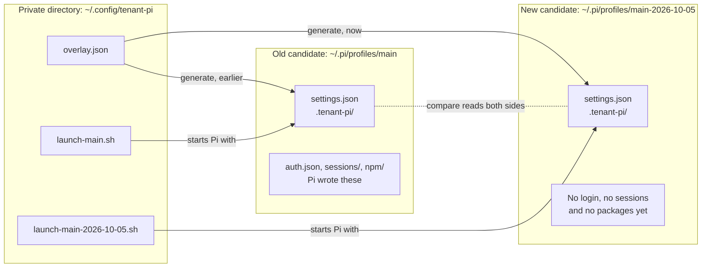

import Capture from '@/components/Capture.astro';
import Cast from '@/components/Cast.astro';
import DocVersion from '@/components/DocVersion.astro';

<DocVersion project="tenant-pi" />

The kit never updates a profile in place. Each change makes a new profile directory, a candidate. You compare the candidate with the old one. Then you switch by hand.

## The loop



1. Edit the overlay, or pull a new kit version.
2. Regenerate into a new target that does not exist.
3. Compare the old and the new candidate.
4. Reconcile your choices: carry a wanted change into the overlay, accept it as drift, or drop it.
5. Switch the launcher.

The old candidate stays as it is. It is the fallback.

## The old and the new directory



- The overlay is the only source of a candidate. `generate` copies nothing from the old candidate.
- `generate` refuses a target that exists. So the old candidate cannot change.
- Pi writes `auth.json`, `sessions/` and `npm/` into a candidate at run time. The kit copies none of them.
- Each candidate has its own launcher file.

## One pass in a recording

<Cast id="tenant-pi/update-pass" />

The recording shows one pass as one command: `validate`, `generate`, `compare` and `carry`. It is a later pass than the steps below. It generates the candidate `main-2026-10-06` and compares it with `main-2026-10-05`.

Before the recording, the session set `target.agentDir` in the overlay to the new name.

The candidate `main-2026-10-05` has the edit by hand of the [last section](#after-pi-changes-a-profile). `carry` reports that edit as `rendered_field`.

## Before you start

You need these three things:

- The kit clone. The examples use `~/tenant-pi`.
- The private directory with the overlay. The examples use `~/.config/tenant-pi/overlay.json`.
- One candidate that exists. The examples use `~/.pi/profiles/main`.

Run each command from the kit clone.

## Step 1: get the new inputs

A pass starts with a new kit version, a new choice in the overlay, or both.

To take a new kit version, run these commands:

```sh
cd "$HOME/tenant-pi" && git pull
PYTHONDONTWRITEBYTECODE=1 python3 -m unittest discover -s tests -q
PYTHONDONTWRITEBYTECODE=1 python3 scripts/publish_check.py
python3 scripts/tenant_pi.py check-runtime
```

The pull changes no profile directory. But a profile reads `packages/` of the clone by path. So a pull can change what a profile loads at its next start.

Not verified: the effect of a pull on a Pi session that runs.

Then give the overlay a new target:

1. Open `overlay.json` in an editor.
2. Change `target.agentDir` to a new name, for example a name with a date.
3. Write the full absolute path, not `~`.

Change nothing else when your choices stay the same.

<Capture id="tenant-pi/update-target" />

## Step 2: regenerate

1. Validate the overlay.

   <Capture id="tenant-pi/cmd-validate" />

2. Generate into the new target, with a new launcher path.

   <Capture id="tenant-pi/cmd-generate" />

3. List the candidates under the parent directory.

   <Capture id="tenant-pi/cmd-list" />

Use the same `--registry`, `--local-dir` and `--require-role` options as for the old candidate.

`list` shows the kit commit and the generation time of each candidate. It marks no candidate as current. The directory `hand-made` in the capture is a profile that the kit did not generate.

The placeholder `<UTC time>` in the capture replaces each generation time.

## Step 3: compare

1. Save the report in the private directory. The command prints nothing.

   <Capture id="tenant-pi/update-compare" />

2. Read the report. The command in the capture stops the output at the list `unchanged`.

   <Capture id="tenant-pi/update-report" />

Read these keys of the report:

| Key | Meaning |
| --- | --- |
| `changes` | The declared fields that differ. A private field shows as a marker, without a value. |
| `unsupported` | The fields that the comparison does not interpret, for example a key that Pi wrote. |
| `accepted` | The differences that the `unmanaged` list of the overlay accepts, with the reason. |
| `markers` | `generatedAt` and `kitCommit`, when they differ. |
| `left.drift`, `right.drift` | The status `owner_edits` lists the `settings.json` keys that changed after generation. |

Two candidates of the same overlay and the same kit differ only in `/overlay/target/agentDir` and in the markers.

A profile that the kit did not generate can be a side too. It compares as `settings_only`. To list the packages, extensions, skills and prompts of one directory by name, use [`inventory`](/tenant-pi/use/commands/inventory/).

## Step 4: reconcile your choices

A candidate comes from the overlay, not from the previous candidate. A change that you make inside Pi does not reach the next candidate by itself. For each difference in the report, choose one of three actions.

### Carry it into the overlay

`carry` prints the overlay patches for the choices that the right side records.

<Capture id="tenant-pi/update-carry" />

In this pass, the two candidates have the same choices. So the list `patches` is empty. [`carry`](/tenant-pi/use/commands/carry/#output) has a capture with a patch.

- `carry` prints only. Apply each patch to the overlay by hand after you read it.
- `--right` must be the exact `right.path` of the report.
- `carry` never prints a patch for `consent`. Set `consent` in the overlay yourself.
- An edit of `settings.json` inside Pi shows as `rendered_field`. `carry` does not carry it.

To carry an edit of `settings.json` by hand, use this table:

| Edited key of `settings.json` | Overlay field |
| --- | --- |
| `defaultProvider`, `defaultModel`, `defaultThinkingLevel` | `provider`, `model` and `thinking` of `roles.interactive`. With `modelRoutes`, also the first `cycle` entry. |
| `enabledModels` | `modelRoutes.cycle` |
| `modelThinkingLevels` | `thinking` of the role or the cycle entry of that model |
| `packages` | A package of the kit: enable or disable the component in `selection`. A package of your own: `ownerPackages`. |
| `skills`, `prompts` | A directory of your own: `ownerResources`. |
| Each other key, for example `npmCommand` | No overlay field. Accept it as drift. |

### Accept it as drift

Some keys have no overlay field, for example `npmCommand`. List the key in `unmanaged` of the overlay, with a reason:

```json
{"unmanaged": [{"key": "/npmCommand", "reason": "Host wrapper for npm; reviewed 2026-10-05."}]}
```

- The next `compare` reports that key under `accepted`.
- The kit writes no accepted value into a new candidate. Apply the value by hand, or let Pi write it again.
- The acceptance covers the key, not one value. A later change of that key stays accepted.

### Drop it

Do nothing. The next candidate does not have the change.

## Step 5: switch

A switch is a launch choice. The kit moves no file.

1. Do stages 6 and 7 of the [install](/tenant-pi/install/) for the new candidate: the packages and the authentication.
2. Run the launcher file of the new candidate.

   ```sh
   "$HOME/.config/tenant-pi/launch-main-2026-10-05.sh"
   ```

3. To go back, run the launcher file of the old candidate.

The launcher file holds the launch line of the plan:

<Capture id="tenant-pi/update-launcher" />

The line sets `PI_CODING_AGENT_DIR` for one `pi` process. It removes `PI_CODING_AGENT_SESSION_DIR` for that process. Without a launcher file, use the line `commands.launchDisplayOnly` of the plan.

Limits of a switch:

- The kit copies no login, sessions, memory or packages between candidates.
- A switch back is not a data rollback. Data that a session wrote into a candidate stays there.
- The live profile `~/.pi/agent` stays untouched. To replace it is your decision, and the kit does not do it.
- Old candidates stay on disk. The kit deletes nothing.

Remove an old candidate by hand only after you check that no launcher file points at it.

Warning: `rm -rf` of the wrong directory deletes `auth.json`, sessions and memory. Run `list` and read the path two times before a removal.

## After Pi changes a profile

Pi can write `settings.json` of a profile on its own. Examples are `pi update --extensions`, `pi install`, `/model` and a settings change in the interface.

After each such operation:

1. Run `compare` again. The previous candidate is the left side, and the changed candidate is the right side.
2. Read `right.drift.fields`. Each listed key changed after generation.
3. Carry, accept or drop each change as in Step 4.

<Capture id="tenant-pi/cmd-compare" />

Before this capture, the session added the key `defaultThinkingLevel` to `settings.json` of the right side by hand. The edit stands in for Pi. Find the key in `changes` and in `right.drift.fields`.

The drift stays visible on purpose. The kit does not hide it and does not revert it. An accepted key still shows in `drift.fields`.

## Reference files

These files are in the project repository:

- `docs/guides/candidate-update.md`: the guide of the loop.
- `docs/candidate-compare.md`: the report, the markers and the drift.
- `docs/carry.md`: the patches and the reasons.
- `docs/accepted-drift.md`: the `unmanaged` list.
- `docs/candidate-list.md`: the candidate list and the provenance fields.
- `docs/profile-lifecycle.md`: the model behind the loop.
