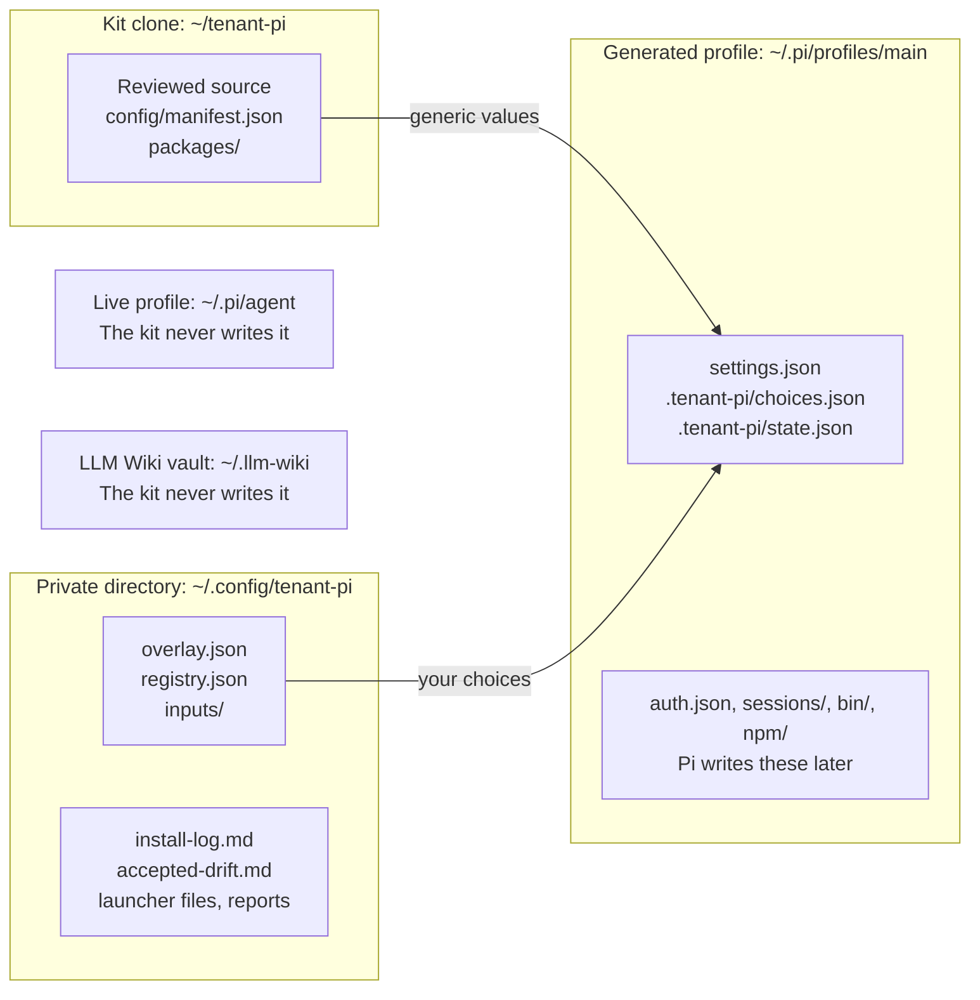

import DocVersion from '@/components/DocVersion.astro';

<DocVersion project="tenant-pi" />

This page has two parts. The first part lists each component of the kit and what it needs. The second part says what the kit keeps separate, what it never does, and what its scanner checks.

The manifest calls each entry a component. This release has 27 components. A memory module is a component that stores text of your sessions.

## What the kit separates

| Location | Holds | Tracked by Git |
| --- | --- | --- |
| The kit clone | The reviewed source, the manifest, the sample overlay and the packages in the tree. No value of yours. | Yes |
| `.local/` in the clone | Optional. It is the default `--local-dir`. It can hold private state. | No |
| The private directory | `overlay.json`, `registry.json`, `install-log.md`, `accepted-drift.md`, `.gitignore`, `inputs/`, launcher files, the runtime report, baseline files, saved `compare` reports, the facts file `results-facts.json` and the results file `INSTALLER_KIT_RESULTS.md`. | Only if you run `git init` there. The kit never runs it. |
| A generated profile | `settings.json`, `.tenant-pi/choices.json`, `.tenant-pi/state.json` and the optional component files. After a launch, Pi adds `auth.json`, `models-store.json`, `sessions/` and `bin/`. It adds `npm/` for a declared npm package. The extensions add their state directories. | No |
| The live profile `~/.pi/agent` | Your Pi setup from before the kit. | The kit never writes it. It reads it only when you name it with `--dir`. |
| An LLM Wiki vault | The pages of the wiki extension. Each profile of your account uses the same personal vault. | The kit never writes it and opens no file of it. |

- Keep the private directory outside the clone. [`init-private`](/tenant-pi/use/commands/init-private/) refuses a path inside the clone, inside `~/.pi/agent`, inside a vault and inside a known overlay target.
- Keep each generated profile outside the clone. `validate`, `plan` and `generate` refuse a target inside the clone, inside `~/.pi/agent` and inside a vault.
- `.tenant-pi/choices.json` holds a copy of the overlay, the registry and the MCP definitions. Treat it as private, like the overlay.
- The kit does not read `PI_CODING_AGENT_DIR`. A live profile that only this variable names is not protected.

Three actions read the live profile when you name it with `--dir`:

- [`baseline`](/tenant-pi/use/commands/baseline/) and [`check-baseline`](/tenant-pi/use/commands/check-baseline/) read the name, the kind, the size and the modification time of each entry. They open no file.
- [`inventory`](/tenant-pi/use/commands/inventory/) reads `settings.json` and lists three directories.

Warning: the Git ignore rule of `.local/` is not a security control. Keep the overlay and the input files in the private directory.

### Separation is not isolation

The kit gives each profile its own directory. `PI_CODING_AGENT_DIR` selects one directory for one Pi process. This is a separation of configuration. It is not an isolation by the operating system.

Warning: a profile directory is not a sandbox. Each process of the same user can read each profile, the private directory and `HOME`.

All profiles of one user share these things:

- `HOME` and each file under it. Examples are the vault `~/.llm-wiki/`, `~/.copilot` and the Claude Code login file `~/.claude/.credentials.json`.
- The keyring of the operating system. The MCP adapter stores tokens there.
- The environment of the shell that starts Pi, for example `TENANTEXT_LITELLM_API_KEY`.
- The working directory and its project files. A trusted project file `.pi/settings.json` can change Pi settings at a launch.
- `$TMPDIR`. The MCP adapter writes large tool output there.
- A remote account. Two profiles with the same login see the same account data.

For a real boundary, run each profile as a separate user, in a container or in a virtual machine. Use separate remote accounts too.

Not verified: a container or a sandbox setup with this kit.

## Status labels

The manifest of the kit can give a component one of three statuses: `tested`, `unverified` or `blocked`. The module guide of the release maps them to four labels.

In this release, 5 components have the status `tested` and 22 have the status `unverified`. No component has the status `blocked`.

| Label | Meaning | From |
| --- | --- | --- |
| `blocked` | The kit refuses the choice. | A refused choice, for example the gateway with `auth: "login"`. Also the manifest status `blocked`, which no component of this release has. |
| `skipped` | You did not enable the component. The kit generates nothing for it. | The component is in `selection.disable`. This is the state of each component except `core` in the sample overlay. |
| `unverified` | The kit validates, plans and generates the component offline. No accepted live trial proves that Pi loads it and that it works. | The manifest status `tested` or `unverified`, when the component is enabled. |
| `ready` | The component passed an accepted live trial on the qualified platform. | No component has this label in this release. |

The manifest status `tested` means that the pin and the structure passed an offline review. It does not mean a trial on a clean client.

The manifest status `unverified` means that the component is in the kit and that you can select it. The plan lists its gaps as readiness gaps.

## The components

`core` is always on. Each other component is optional. You enable a component in `selection.enable` of the overlay, or you leave it in `selection.disable`.

The action [`components`](/tenant-pi/use/commands/components/) prints the 27 components as one numbered checklist. It reads the manifest at each run.

The tables show the state of this release. They do not claim that a component works on a clean client.

Each table uses these columns:

- **Inputs**: the overlay fields and the files that the component needs, apart from `selection.enable`.
- **Source**: the source in the manifest. `tree` is a package directory in the kit clone.
- **Credentials**: how a credential gets to the component. The kit never stores one.
- **State**: where the component or Pi keeps data at run time. "Profile" is the target directory. Each profile of the user shares "HOME".
- **Consent**: an overlay switch that the component needs.
- **Status**: the manifest status, then the label when the component is enabled.

A table has no column for a value that is the same for each component in it. The text above the table then gives that value.

"Source reading" marks a fact that comes from the source code of the package. Nobody saw it at run time.

Not verified: each fact of these tables about a component at run time. The capture session is core only.

### Core and model routing

These two components need no consent switch.

| Component | Inputs | Source | Credentials | State | Status |
| --- | --- | --- | --- | --- | --- |
| `core` | `target.agentDir` | npm `@earendil-works/pi-coding-agent@1.1.0` | The Pi command `/login` after the launch. Pi writes `auth.json`. | Profile: `auth.json`, `models-store.json`, `sessions/` and `bin/`. Also `npm/` with a declared npm package. | `tested`, `unverified` |
| `model-routing` | `roles` and the optional `modelRoutes`. A `--registry` file when `modelRoutes` names a model. | Pi settings (builtin) | The `/login` of the provider | Profile: keys of `settings.json` | `tested`, `unverified` |

### Tenantext components

- Source: each component is in the tree, in `packages/tenantext`.
- Consent: no component of this table needs a consent switch.
- Status: each component of this table is `unverified` in the manifest, and `unverified` when it is enabled.
- The first nine components are extensions. The other six components hold skills.

| Component | Inputs | Credentials | State |
| --- | --- | --- | --- |
| `tenantext` | none | none | Profile. Not verified: other paths. |
| `codex-accounts` | `modelRoutes.gateway` with `{"auth": "env"}`, `endpoints.codex-accounts` (an HTTPS URL that ends in `/v1`), `env.codex-accounts` with `${TENANTEXT_LITELLM_API_KEY}` | `TENANTEXT_LITELLM_API_KEY` in the shell that starts Pi. `TENANTEXT_LITELLM_BASE_URL` on the launch line. `auth: "login"` is `blocked`. | Profile |
| `slopscore` | none | none | Not verified |
| `context-meter` | none | `TENANTEXT_NEXT_MOVE_KEY`, only when you set `nextMoveUrl`. After each agent run, one POST request then goes to that URL. It holds the last 300 characters of your last message, and the key as a Bearer value (source reading). | Profile |
| `ops-footer` | `context-meter` enabled | none. It requests the health URLs that you set. They are in `OPS_FOOTER_OK_HEALTH_URL`, in `OPS_FOOTER_OV_HEALTH_URL` or in its settings file (source reading). | Profile. It reads `~/.copilot` (source reading). |
| `copilot-usage` | none | It reads `COPILOT_GITHUB_TOKEN`, `GH_TOKEN`, `GITHUB_TOKEN` and the Pi `github-copilot` login. It also reads the output of `gh auth token`, the editor files of `github-copilot` and `~/.copilot` (source reading). At each poll, it sends the tokens one after the other to the Copilot usage endpoint of GitHub. Each one goes in a GET request, until the endpoint accepts one. It does this only when Pi has a Copilot provider configured, or with the mode `on`. Not verified live. | HOME, shared |
| `anthropic-usage` | none | It reads the Claude Code login file `~/.claude/.credentials.json`, or the same file under `CLAUDE_CONFIG_DIR`. It also reads the Pi `anthropic` login. It does not refresh or write them (source reading). At each poll, it sends the token of the login in a GET request to `api.anthropic.com`. It does this only with an active login. Not verified live. | HOME, shared |
| `doctor` | none | It reads `TENANTEXT_LITELLM_BASE_URL` for one line. It reads the tokens that `copilot-usage` and `anthropic-usage` read. Its command sends them in read-only GET requests to the Copilot usage endpoint and to the Anthropic usage endpoint. It sends a request only when a login for that service exists (source reading). Not verified live. | Profile. It reads `auth.json` of the profile, `~/.copilot` and `~/.claude/.credentials.json` (source reading). The `fix` command writes settings files of the extensions with a `.bak` copy. From a shell, it can also add the package to `settings.json`. There it can also remove an entry under `node_modules` of the package directory and make a symbolic link in its place. Without `PI_CODING_AGENT_DIR`, the shell form uses `~/.pi/agent`. Not verified: the paths at run time. |
| `resources` | none | none | Profile: toggles in `settings.json` |
| `herdr` | The `herdr` tool on `PATH`. The kit does not install it. [`check-herdr`](/tenant-pi/use/commands/check-herdr/) reports it. | none | Herdr state, outside the profile |
| `herdr-relay` | `herdr` enabled, the `herdr` tool on `PATH`, Python 3 and the installed `herdr` skill | none | Herdr state and the relay job files, outside the profile |
| `coordinator-skills` | On Pi, the question tool of the component `questions`. Without it, a skill asks in plain text. Some skills need the `herdr` skill or a Gitea tracker. | `GITEA_TOKEN` in the shell that starts Pi, for three of the skills. The skills read it and do not write it. | The Gitea issue tracker, outside the profile |
| `knowledge-skills` | An OpenKnowledge MCP server and the `ok` tool. The kit installs neither. | none. You configure the external tools yourself. | The OpenKnowledge project, outside the profile |
| `slopscore-pr` | The host tools of the skill | Not verified | Not verified |
| `tracker-site` | Python 3.11 or later and Git on `PATH`. `PYTHONPATH` set to `packages/tenantext`. | `GITEA_TOKEN`, or the variable or the token file that the configuration names. The tool sends it in a request header to the Gitea API of `issues.api`. On an explicit publish, the tool reads a publish credential file and sends its content to the publish endpoint. With the OpenKnowledge store, the tool reads `~/.claude.json` and `~/.pi/agent/mcp.json` (source reading). | The brief, and a tracker state directory. The defaults of the state and of the publish receipts are below `~/.pi/agent`, the live profile (source reading). |

`coordinator-skills` holds 13 skills, and `knowledge-skills` holds 4 skills. The checklist of [`components`](/tenant-pi/use/commands/components/#the-checklist) names each one.

### Promptr components

- Source: each component is in the tree, in `packages/promptr`.
- Consent: no component of this table needs a consent switch.
- Status: each component of this table is `unverified` in the manifest, and `unverified` when it is enabled.

| Component | Inputs | Credentials | State |
| --- | --- | --- | --- |
| `promptr` | A build step: `npm ci --ignore-scripts` and `npm run build` in `packages/promptr` | `GITEA_TOKEN` or `GITHUB_TOKEN`, as the provider of the repository needs. The extension sends it in a request header to the tracker host. That host comes from the tracker variables, a binding file or the Git remote `origin`. `OPENKNOWLEDGE_USERNAME` and `OPENKNOWLEDGE_PASSWORD`: the extension sends them as Basic authentication to the OpenKnowledge origin. `OPENKNOWLEDGE_ORIGIN` names that origin, or the default of the package applies. The kit stores none of them (source reading). Not verified live. | Profile: `promptr/`. Project: `.promptr/`. |
| `promptr-generate-task-prompt` | `promptr` | The skill reads none. The extension reads the tracker token for the task: see the row `promptr` (source reading). | As `promptr` |
| `promptr-handoff` | `promptr` | The skill reads none. With a connected OpenKnowledge target, the extension sends the handoff there with the credentials of the row `promptr` (source reading). | As `promptr` |
| `promptr-openknowledge-project-pages` | `promptr` and an OpenKnowledge service | `OPENKNOWLEDGE_USERNAME` and `OPENKNOWLEDGE_PASSWORD` in the environment. The skill tells the agent to send them as Basic authentication to the OpenKnowledge origin (source reading). Not verified live. | As `promptr` |
| `promptr-watch-herdr-agents` | `promptr` and the `herdr` tool | none | As `promptr` |

### MCP, questions and memory

The sources of these components are:

- `mcp`: npm `pi-mcp-adapter`, no version. Reviewed at 3.2.0.
- `questions`: npm `@juicesharp/rpiv-ask-user-question@2.11.0`. Only the registry data of that version was read.
- `hermes`: npm `pi-hermes-memory`, no version. Reviewed at 0.9.9.
- `wiki`: npm `@zosmaai/pi-llm-wiki`, no version. Reviewed at 0.12.4. The facts about a vault that exists come from 0.12.5.
- `openviking`: the tree, in `packages/openviking-pi`. It is a copy of one reviewed commit of the OpenViking extension.

| Component | Inputs | Credentials | State | Consent | Status |
| --- | --- | --- | --- | --- | --- |
| `mcp` | `inputs.mcpFile` with `"inputs/mcp-adapter.json"`, and that file under `--local-dir` | `${NAME}` references in headers and in `env`. You export the names. The OAuth and bearer stores use the keyring of the operating system. | Profile: `mcp-adapter.json` and caches. HOME: the keyring. `$TMPDIR`: large tool output. | none | `tested`, `unverified` |
| `questions` | none | none | HOME: the guidance file of the extension, shared. Profile: `npm/`. | none | `unverified`, `unverified` |
| `hermes` | The `memory.hermes` block. `roles.memory` when `backgroundReview` is `true`. | The login of the parent session, or a child `pi -p` process | Profile: `pi-hermes-memory/` and memory files | `consent.memoryCapture: true` | `tested`, `unverified` |
| `wiki` | The `memory.wiki` block | none. The kit writes no chat credential. | HOME: `~/.llm-wiki/`, or `<wikiHome>/.llm-wiki/` | `consent.memoryCapture: true` | `tested`, `unverified` |
| `openviking` | The `memory.openviking` block. `npm ci --ignore-scripts` in `packages/openviking-pi`. An OpenViking server. | `OPENVIKING_*` variables, or the files `ovcli.conf` and `ov.conf` under `~/.openviking`. You make them. The kit writes no endpoint and no key. | HOME: `~/.openviking/`. The server: the sessions and the memories. | `consent.memoryCapture: true` and `consent.remoteMemoryWrites: true` | `unverified`, `unverified` |

`pi install` gets the newest version of a package that has no version in the manifest. A newer version than the reviewed one is not verified.

### Facts for each component

- `validate` and `plan` show each gap of an enabled component under `readinessGaps`. Read the gaps before `generate`.
- A component in the tree points at the package directory of the clone by its absolute path. Keep the clone in its place.
- A component can require another component. `ops-footer` needs `context-meter`. `herdr-relay` needs `herdr`. Each Promptr skill needs `promptr`.
- `validate` stops with `missing_dependency: overlay.selection.enable` when a required component is not enabled.
- A component that you leave disabled adds no file, no key and no assignment on the launch line.

## The recommended set

The checklist of [`components`](/tenant-pi/use/commands/components/#the-recommended-set) marks a recommended set of 16 components:

- `core` and `model-routing`.
- The nine extensions of Tenantext.
- The skill components `coordinator-skills`, `knowledge-skills` and `slopscore-pr`.
- The two local memory modules `hermes` and `wiki`.

The set is a proposal. The action enables nothing. The sample overlay enables only `core`, so a profile from `init-private` with no edit is core only.

`hermes` and `wiki` store text of your sessions on this machine. Hermes stores it below the profile. The wiki stores it in the vault. Remove a mark when you do not want that.

`copilot-usage`, `anthropic-usage` and `doctor` read login files of your account. With a login, each one sends a token to the usage endpoint of the provider. `doctor` does this only when you run its command. Remove a mark when you do not want that (source reading).

## The consent keys

The key `consent` of the overlay has four switches:

| Key | In the sample overlay | Needed for |
| --- | --- | --- |
| `consent.memoryCapture` | `false` | Each memory module: `hermes`, `wiki` and `openviking`. |
| `consent.remoteMemoryWrites` | `false` | `openviking`. Each capture is a write to a server. |
| `consent.embeddingTextTransfer` | Absent | A `memory.wiki.embedding` block. The page text and the search text then go to the embedding endpoint. |
| `consent.telemetry` | `false` | Nothing. The kit refuses the value `true` with `telemetry_activation_unavailable: overlay.consent.telemetry`. |

Three parts together enable a memory module: the ID in `selection.enable`, `consent.memoryCapture: true` and a `memory` block for the module.

`validate` checks the three parts in this order:

| Overlay | `validate` stops with |
| --- | --- |
| A memory module is enabled, and the overlay has no `memory` block | `memory_choices_required: overlay.memory` |
| A memory module is enabled, the overlay has a `memory` block, and `consent.memoryCapture` is `false` | `memory_consent_required: overlay.consent.memoryCapture` |
| A memory module is enabled with its consent, and the `memory` block holds `null` for it | `memory_choices_required: overlay.memory.<module>` |
| `consent.memoryCapture` is `true`, and no memory module is enabled | `memory_disabled: overlay.consent` |
| A `memory` block for a module that is not enabled. This rule shows only when no rule above it stops the overlay. So it shows with no enabled module and `consent.memoryCapture: false`, or with another enabled module and its consent. | `memory_module_disabled: overlay.memory.<module>` |
| `openviking` is enabled, and `consent.remoteMemoryWrites` is `false` | `remote_memory_consent_required: overlay.consent.remoteMemoryWrites` |
| `consent.remoteMemoryWrites` is `true`, a memory module is enabled, and `openviking` is not enabled | `remote_memory_disabled: overlay.consent.remoteMemoryWrites` |
| A `wiki.embedding` block without `consent.embeddingTextTransfer: true` | `embedding_consent_missing: overlay.consent.embeddingTextTransfer` |
| `consent.embeddingTextTransfer` is `true`, and the overlay has no `wiki.embedding` block | `embedding_consent_unused: overlay.consent.embeddingTextTransfer` |

- Consent alone enables nothing.
- A credential name, an endpoint or a service that answers never enables a capture.
- [`carry`](/tenant-pi/use/commands/carry/) never prints a patch for `consent`. You set each consent key yourself.

## Background model calls

A memory module can make model calls on its own. Each such call is off by default.

| Switch of the `memory` block | Value for no background call | With `true` |
| --- | --- | --- |
| `hermes.backgroundReview` | `false` | Hermes reviews, corrects and consolidates its memory with model calls. It needs `roles.memory` and the key `reviewTransport`. |
| `wiki.backgroundTasks` | `false` | The wiki uses the model of `roles.memory` for its background tasks. |
| `wiki.embedding` | Absent or `null` | The wiki sends page text to the embedding endpoint that you name. |

- With `backgroundReview: false`, Hermes does only local capture. It indexes the sessions and runs the memory tools that the agent calls.
- The kit writes each background switch of Hermes into `hermes-memory-config.json`, in both states. So a default of the package cannot switch a path on.
- The plan shows the state in `memory.activation`. With the three switches off, `backgroundModelCalls` is `false` for both modules.
- A command that you run inside Pi can still call a model, for example `/memory-consolidate`.

A second switch of the wiki is not a model call, but it sends text to the model provider:

| Switch | `false` | `true` |
| --- | --- | --- |
| `wiki.ambientPersonalVault` | The extension stays quiet until a project vault exists or the agent calls a wiki tool. | The extension adds text from the vault to each prompt, in each directory. With no vault, the first session start makes one. |

Not verified: the behavior of Hermes and of the wiki at run time. These facts come from `docs/memory-modules.md` of the release.

## The vault of the LLM Wiki

The personal vault of the wiki extension is the directory `.llm-wiki` below a root. The overlay is the one source of the root:

| Overlay | Launch line | Personal vault |
| --- | --- | --- |
| `wiki` enabled, no `memory.wiki.wikiHome` | The line has `-u WIKI_HOME`. It removes a `WIKI_HOME` of the shell for the Pi process. | `~/.llm-wiki/` |
| `wiki` enabled, with `memory.wiki.wikiHome` | The line starts with the assignment `WIKI_HOME=<wikiHome>`. | `<wikiHome>/.llm-wiki/` |
| `wiki` not enabled | The line does not set and does not remove `WIKI_HOME`. | None |

- Each launch line also has `-u PI_CODING_AGENT_SESSION_DIR`. A shell can export that variable, and Pi then writes the sessions of each profile to one directory.
- A new profile of your account uses a vault that exists as it is. The kit makes no second vault.
- `memory.wiki.wikiHome` is permitted only with `ambientPersonalVault: true`. Else `validate` stops with `wiki_home_is_ambient: overlay.memory.wiki.wikiHome`.
- Run [`check-wiki-vault`](/tenant-pi/use/commands/check-wiki-vault/) before you enable `wiki`. It reports the vault and opens no file.
- Record a baseline of the vault before the first launch. [Stage 8](/tenant-pi/install/stage-8-launch/#record-the-baselines) has the step.

Warning: a `pi` command without the launch line does not remove `WIKI_HOME`. In a shell that exports the variable, the extension then makes a second vault at `<WIKI_HOME>/.llm-wiki`.

### The places that the kit refuses

The kit writes nothing into a vault and nothing below one. An action stops with `under_wiki_vault` when one of its paths is a vault or is under one.

| Action | Path | The vaults that the action knows |
| --- | --- | --- |
| `validate`, `plan`, `generate` | `target.agentDir`, and the launcher file | `~/.llm-wiki`, `<WIKI_HOME>/.llm-wiki` and `<wikiHome>/.llm-wiki` of the overlay |
| `results` | `--out-dir` and each `--target` | The same three, with `--overlay` |
| `init-private` | `--dir` and `--target` | `~/.llm-wiki` and `<WIKI_HOME>/.llm-wiki` |
| `baseline` | The `--out` file | `~/.llm-wiki` and `<WIKI_HOME>/.llm-wiki` |
| `compose-plan --write` | `--private-dir` | `~/.llm-wiki` and `<WIKI_HOME>/.llm-wiki` |

- `init-private` and `baseline` read no overlay. So they do not know a vault that only `memory.wiki.wikiHome` names.
- `baseline` can record a vault: `--dir` can name it. Only the `--out` file must be outside.
- Each root counts as you write it, and with its symbolic links resolved.

### What the extension writes

The kit writes no file of a vault. The wiki extension writes into the vault when the agent uses a wiki tool.

Not verified: each fact of this list. The facts come from `docs/memory-modules.md` of the release, for the package version 0.12.5.

- With a vault that exists and `ambientPersonalVault: true`, a session start changes no file of the vault. It makes the directory `meta/qmd/`, and makes and removes a lock file below it.
- With a vault that exists and `ambientPersonalVault: false`, a session start writes nothing.
- With embeddings on and another model label than the label in the store, the next write tool sends each page again. It then writes the store `meta/embeddings.json` again.
- A write tool adds pages and a line in `meta/events.jsonl`, and writes the files below `meta/` again.
- `wiki_bootstrap` on an existing vault writes `config.json` and `WIKI_SCHEMA.md` again.
- `wiki_lint` with `auto_fix=true` repairs pages and keeps backups.
- `/wiki-model` and `/wiki-trajectories` write `.pi/settings.json` of the working directory. That file is outside the vault.

Warning: the write of `meta/embeddings.json` is not atomic.

## The declared npm packages

`mcp`, `questions`, `hermes` and `wiki` come from npm. The kit installs none of them. The plan prints one `pi install` line for each declared package in `commands.setupDisplayOnly`. With a memory module or with `questions`, it also prints one peer correction line.

- Run the lines by hand, in the order of the plan. [Stage 6](/tenant-pi/install/stage-6-install-the-dependencies/#packages-of-optional-modules) has the steps.
- The peer correction line is `node scripts/patch_extension_peers.mjs`, with `PI_CODING_AGENT_DIR` before it. It runs only from the root of the kit clone.
- With `pi-hermes-memory` 0.9.10 and `@zosmaai/pi-llm-wiki` 0.12.5, the peer correction prints nothing, also at its first run. Only the question extension gets a correction.
- Hermes uses the native module `better-sqlite3`. With npm 11.19.0 on Linux x64, no install script ran, and the module loaded from a prebuilt file.
- The install of the `wiki` package prints an audit summary of npm, and an `npm warn install-scripts` line. The kit did not review these findings.
- Pi and the extensions write state directories into the profile, for example `npm/` and `pi-hermes-memory/`.

Warning: do not run `npm audit fix` in the profile. It changes the installed packages of the profile.

Not verified: the install of Hermes on a platform other than Linux x64, and with another npm version.

Not verified: a later version of the two memory packages. `pi install` gets the newest version.

### Notes on some components

- **MCP** (`mcp`): the server list goes into `inputs/mcp-adapter.json` of the private directory. Each `validate`, `plan` and `generate` then needs `--local-dir`. The kit disables the MCP function that Pi has built in.
- **Questions** (`questions`): the extension gives Pi a question tool. It needs an interactive session. Without it, a skill asks in plain text.
- **Herdr** (`herdr`): the component holds only the skill. The Herdr application is a host tool. Pi inside Herdr is not qualified.
- **Your own packages and directories**: `ownerPackages` adds a Pi package that you maintain. `ownerResources` adds a skills or a prompts directory. Each entry adds one gap that stays.
- **Agent fan-out**: the kit has no subagents component. Use the `herdr` component.
- **A remote host or a container**: [`remote-plan`](/tenant-pi/use/commands/remote-plan/) and [`compose-plan`](/tenant-pi/use/commands/compose-plan/) print command lines. The kit runs none of them.

### Change a selection

1. Run [`components`](/tenant-pi/use/commands/components/#the-selection) with `--select` and your component IDs.
2. Copy the printed object `selection` into the overlay.
3. Run [`validate`](/tenant-pi/use/commands/validate/). It shows the first rule that fails.
4. Run [`plan`](/tenant-pi/use/commands/plan/).
5. Read the new gaps in the plan.
6. Generate into a new target. See the [candidate update loop](/tenant-pi/use/candidate-update/).

## What the kit never does

The kit has 17 actions. The [command reference](/tenant-pi/use/commands/) lists them. No action does one of these things:

- It edits a shell startup file such as `~/.bashrc`, `~/.zshrc` or `~/.profile`, or it changes `PATH`.
- It installs a package, or it runs `npm`, `pip`, `git` or a system package manager.
- It starts, stops or configures a service, a timer or a daemon.
- It runs `pi`. The one exception is `pi --version` inside `check-runtime`, with an empty temporary `PI_CODING_AGENT_DIR`.
- It opens a network connection, or it makes a model call.
- It opens `auth.json`, `models.json`, a session or a memory store.
- It writes into the live profile `~/.pi/agent` or into an LLM Wiki vault.
- It copies a login, sessions, memory, queues, keyring state or installed packages between profiles.
- It writes, prints or resolves a secret value.

Two actions start a process, and each process is one fixed command:

| Action | Process |
| --- | --- |
| `check-runtime` | `pi --version`, `node --version` and `python3 --version` |
| `check-herdr` | `herdr --version` |

Two actions print command lines for another machine or for a container: `remote-plan` and `compose-plan`. The kit runs none of these lines. `compose-plan` writes files only with `--write`.

The actions read these environment values:

| Value | Actions | Use |
| --- | --- | --- |
| `HOME` | `init-private`, `baseline`, `validate`, `plan`, `generate`, `check-wiki-vault`, `results` and `compose-plan --write` | To find `~/.pi/agent` and `~/.llm-wiki`. |
| `WIKI_HOME` | The same actions | To find the vault `<WIKI_HOME>/.llm-wiki`. |
| `PATH` | `check-runtime`, `check-herdr` | To find a tool. |
| A fixed list of provider key names | `plan` | A test for presence only. `plan` reads no value. See [the warning](/tenant-pi/use/commands/plan/#the-warning-for-a-provider-key). |

`check-runtime` and `check-herdr` also give the full environment of the caller to their child processes.

The plan prints dependency commands and launch commands as display text. You read them and run them by hand.

The test suite of the kit checks these limits with audit hooks for file opens, processes and sockets. Not verified: a proof that the kit opens no other file. The audit lists forbidden names.

## Credentials

- The overlay has no field for a secret value. An `env` value is a `${NAME}` reference.
- The kit needs no credential store. Export the name in the shell that starts Pi, or read it from a store that you use already. A password manager is one example.
- Pi reads a provider key from the environment of the shell that starts it, also in a profile with no login. `plan` warns when a known key name is set.
- The results file and the facts file of [`results`](/tenant-pi/use/commands/results/) hold no credential value of the overlay. Write no credential value into the facts file.
- The plan of [`compose-plan`](/tenant-pi/use/commands/compose-plan/) holds the name of the key variable. It never holds the value.
- `TENANTEXT_LITELLM_BASE_URL` is public configuration on the launch line.
- `TENANTEXT_LITELLM_API_KEY` is a secret. It never enters a file of the kit.
- The Pi command `/login` writes `<target>/auth.json`. That file belongs to Pi.
- A `compare` report shows a marker, not a value, for a private field.
- A `carry` patch prints overlay values, such as an endpoint URL or a package path. Treat a `carry` output like the overlay.

## What the scanner checks

`scripts/scan.sh` checks the tracked files of the kit repository before they leave the host. It does not check your profile or your private directory.

| Finding | Result |
| --- | --- |
| A secret pattern (the default rules of gitleaks v8.28.0) | The scan always fails. |
| A host value: a pattern of the deny lists, or a private network address | The scan fails on the branch `portable` and on a tag `portable/*`. It warns on other branches. |
| A tracked `.gitleaksignore` file, a tracked file in `.local/`, a tracked archive or a tracked database dump | The scan always fails. |

The scanner has five modes: `tree`, `staged`, `history`, `all` and `selftest`. It runs gitleaks in a pinned container without network access, or a local gitleaks binary.

The scanner does not check these things:

- Files that Git does not track.
- The private directory.
- A generated profile.
- An encoded secret.
- The author names of commits.

`scripts/publish_check.py` also scans each file of the publish set for private-key and token patterns. It also checks the content rules for a public reader. Neither check is a full secret audit.

## Reference files

These files are in the project repository:

- `docs/guides/modules.md`: each component and its status.
- `docs/guides/privacy.md`: the privacy guide.
- `docs/memory-modules.md`, `docs/workflow-modules.md`, `docs/model-routes.md` and `docs/packages.md`: the components in detail.
- `docs/herdr-setup.md`: Herdr, the question extension and the remote plan.
- `docs/host-peer-overrides.md`: the peer correction of the declared npm packages.
- `docs/directory-baseline.md`: the baseline of a directory.
- `POST_INSTALL.md`: one section for each task after an install.
- `docs/owner-packages.md` and `docs/owner-resources.md`: your own packages and directories.
- `docs/secret-handling.md`: the scanner.
