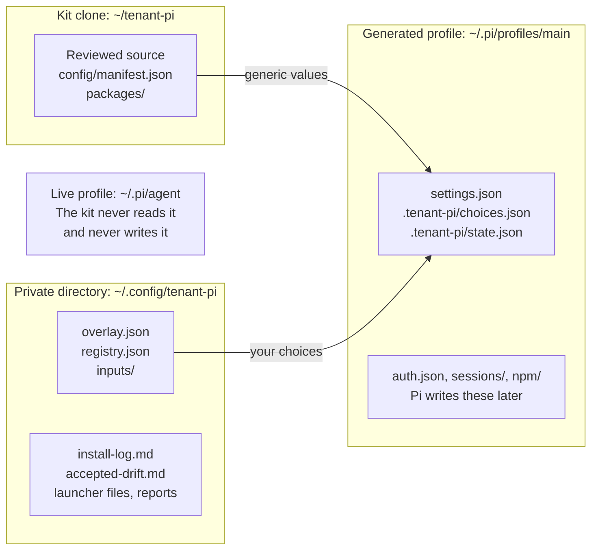

import DocVersion from '@/components/DocVersion.astro';

<DocVersion project="tenant-pi" />

This page has two parts. The first part lists each module of the kit and what it needs. The second part says what the kit keeps separate, what it never does, and what its scanner checks.

## What the kit separates

| Location | Holds | Tracked by Git |
| --- | --- | --- |
| The kit clone | The reviewed source, the manifest, the sample overlay and the packages in the tree. No value of yours. | Yes |
| `.local/` in the clone | Optional. It is the default `--local-dir`. It can hold private state. | No |
| The private directory | `overlay.json`, `registry.json`, `install-log.md`, `accepted-drift.md`, `.gitignore`, `inputs/`, launcher files and saved `compare` reports. | Only if you run `git init` there. The kit never runs it. |
| A generated profile | `settings.json`, `.tenant-pi/choices.json`, `.tenant-pi/state.json` and the optional module files. After a launch, Pi adds `auth.json`, `sessions/`, `npm/` and module state. | No |
| The live profile `~/.pi/agent` | Your Pi setup from before the kit. | The kit never reads it and never writes it. |

- Keep the private directory outside the clone. [`init-private`](/tenant-pi/use/commands/init-private/) refuses a path inside the clone.
- Keep each generated profile outside the clone. `validate`, `plan` and `generate` refuse a target inside the clone.
- `.tenant-pi/choices.json` holds a copy of the overlay. Treat it as private, like the overlay.

Warning: the Git ignore rule of `.local/` is not a security control. Keep the overlay and the input files in the private directory.

### Separation is not isolation

The kit gives each profile its own directory. `PI_CODING_AGENT_DIR` selects one directory for one Pi process. This is a separation of configuration. It is not an isolation by the operating system.

Warning: a profile directory is not a sandbox. Each process of the same user can read each profile, the private directory and `HOME`.

All profiles of one user share these things:

- `HOME` and each file under it, for example `~/.llm-wiki/` of the wiki module.
- The keyring of the operating system. The MCP adapter stores tokens there.
- The environment of the shell that starts Pi, for example `TENANTEXT_LITELLM_API_KEY`.
- The working directory and its project files.
- `$TMPDIR`. The MCP adapter writes large tool output there.
- A remote account. Two profiles with the same login see the same account data.

For a real boundary, run each profile as a separate user, in a container or in a virtual machine. Use separate remote accounts too.

Not verified: a container or a sandbox setup with this kit.

## Status labels

The manifest of the kit gives each module one of three statuses: `tested`, `unverified` or `blocked`. The module guide of the release maps them to four labels.

| Label | Meaning | From |
| --- | --- | --- |
| `blocked` | The kit refuses to enable the module. `validate` stops with `blocked_component: overlay.selection.enable`. | The manifest status `blocked`. Also a refused choice, for example the gateway with `auth: "login"`. |
| `skipped` | You did not enable the module. The kit generates nothing for it. | The module is in `selection.disable`. This is the default of each module except `core`. |
| `unverified` | The kit validates, plans and generates the module offline. No accepted live trial proves that Pi loads it and that it works. | The manifest status `tested` or `unverified`, when the module is enabled. |
| `ready` | The module passed an accepted live trial on the qualified platform. | No module has this label in this release. |

The manifest status `tested` means that the pin and the structure passed an offline review. It does not mean a trial on a clean client.

## The modules

`core` is always on. Each other module is optional. You enable a module in `selection.enable` of the overlay, or you leave it in `selection.disable`.

The tables show the state of this release. They do not claim that a module works on a clean client.

Each table uses these columns:

- **Inputs**: the overlay fields and the files that the module needs, apart from `selection.enable`.
- **Source**: the source in the manifest. `tree` is a package directory in the kit clone.
- **Credentials**: how a credential gets to the module. The kit never stores one.
- **State**: where the module or Pi keeps data at run time. "Profile" is the target directory. Each profile of the user shares "HOME".
- **Consent**: an overlay switch that the module needs.
- **Status**: the manifest status, then the label when the module is enabled.

A table has no column for a value that is the same for each module in it. The text above the table then gives that value.

"Source reading" marks a fact that comes from the source code of the package. Nobody saw it at run time.

### Core and model routing

These two modules need no consent switch.

| Module | Inputs | Source | Credentials | State | Status |
| --- | --- | --- | --- | --- | --- |
| `core` | `target.agentDir` | npm `@earendil-works/pi-coding-agent@1.0.2` | The Pi command `/login` after the launch. Pi writes `auth.json`. | Profile: `auth.json`, `sessions/`, `npm/` | `tested`, `unverified` |
| `model-routing` | `roles` and the optional `modelRoutes`. A `--registry` file when `modelRoutes` names a model. | Pi settings (builtin) | The `/login` of the provider | Profile: keys of `settings.json` | `tested`, `unverified` |

### Tenantext components

- Source: each module is in the tree, in `packages/tenantext`. The package comes from Tenantext commit `8aae751`.
- `herdr`, `herdr-relay` and `slopscore-pr` are skills of that package: `skills/herdr`, `skills/herdr-relay` and `skills/slopscore-pr`.
- Consent: no module of this table needs a consent switch.

| Module | Inputs | Credentials | State | Status |
| --- | --- | --- | --- | --- |
| `tenantext` | none | none | Profile. Not verified: other paths. | `unverified`, `unverified` |
| `codex-accounts` | `modelRoutes.gateway` with `{"auth": "env"}`, `endpoints.codex-accounts` (an HTTPS URL that ends in `/v1`), `env.codex-accounts` with `${TENANTEXT_LITELLM_API_KEY}` | `TENANTEXT_LITELLM_API_KEY` in the shell that starts Pi. `TENANTEXT_LITELLM_BASE_URL` on the launch line. `auth: "login"` is `blocked`. | Profile | `unverified`, `unverified` |
| `slopscore` | none | none | Not verified | `unverified`, `unverified` |
| `context-meter` | none | none | Profile | `unverified`, `unverified` |
| `ops-footer` | `context-meter` enabled | none | Profile. It reads `~/.copilot` (source reading). | `unverified`, `unverified` |
| `copilot-usage` | none | It reads `GITHUB_TOKEN`, `GH_TOKEN`, `gh auth` and `~/.copilot` (source reading). | HOME, shared | `unverified`, `unverified` |
| `anthropic-usage` | none | It reads the Claude Code login file `~/.claude/.credentials.json`, or the same file under `CLAUDE_CONFIG_DIR`. It also reads the Pi `anthropic` login. It does not refresh or write them (source reading). It sends one GET request to `api.anthropic.com` for each poll, only with an active login. Not verified live. | HOME, shared | `unverified`, `unverified` |
| `doctor` | none | It reads `TENANTEXT_LITELLM_BASE_URL` for one line. It sends one read-only GET request to the Copilot usage endpoint, and one to the Anthropic usage endpoint. It sends each request only when a login for that service exists (source reading). Not verified live. | Profile. It reads `~/.copilot` and `~/.claude/.credentials.json` (source reading). | `unverified`, `unverified` |
| `resources` | none | none | Profile: toggles in `settings.json` | `unverified`, `unverified` |
| `herdr` | The `herdr` tool on `PATH` | none | Herdr state, outside the profile | `unverified`, `unverified` |
| `herdr-relay` | The `herdr` tool on `PATH` and the installed `herdr` skill | none | Herdr state and the relay job files, outside the profile | `unverified`, `unverified` |
| `slopscore-pr` | The host tools of the skill | Not verified | Not verified | `unverified`, `unverified` |
| `tracker-site` | The Python needs of `packages/tenantext/tracker` | Not verified | Not verified | `blocked` |

### Promptr components

- Source: each module is in the tree, in `packages/promptr`. The package comes from Promptr commit `070be88`.
- Consent: no module of this table needs a consent switch.
- Each module of this table is `blocked` in this release.

| Module | Inputs | Credentials | State | Status |
| --- | --- | --- | --- | --- |
| `promptr` | A build step | none | Profile: `promptr/`. Project: `.promptr/`. | `blocked` |
| `promptr-generate-task-prompt` | `promptr` | none | As `promptr` | `blocked` |
| `promptr-handoff` | `promptr` | none | As `promptr` | `blocked` |
| `promptr-openknowledge-project-pages` | `promptr` and an OpenKnowledge service | Not verified | As `promptr` | `blocked` |
| `promptr-watch-herdr-agents` | `promptr` and the `herdr` tool | none | As `promptr` | `blocked` |

### MCP and memory

The sources of these modules are:

- `mcp`: npm `pi-mcp-adapter`, no version. Reviewed at 3.2.0.
- `hermes`: npm `pi-hermes-memory`, no version. Reviewed at 0.9.9.
- `wiki`: npm `@zosmaai/pi-llm-wiki`, no version. Reviewed at 0.12.4.
- `openviking`: none.

| Module | Inputs | Credentials | State | Consent | Status |
| --- | --- | --- | --- | --- | --- |
| `mcp` | `inputs.mcpFile` with `"inputs/mcp-adapter.json"`, and that file under `--local-dir` | `${NAME}` references in headers and in `env`. You export the names. The OAuth and bearer stores use the keyring of the operating system. | Profile: `mcp-adapter.json` and caches. HOME: the keyring. `$TMPDIR`: large tool output. | none | `tested`, `unverified` |
| `hermes` | The `memory.hermes` block. `roles.memory` when `backgroundReview` is `true`. | The login of the parent session, or a child `pi -p` process | Profile: `pi-hermes-memory/` and memory files | `consent.memoryCapture: true` | `tested`, `unverified` |
| `wiki` | The `memory.wiki` block | none. The kit writes no key field. | HOME: `~/.llm-wiki/`, or `<wikiHome>/.llm-wiki/` | `consent.memoryCapture: true` | `tested`, `unverified` |
| `openviking` | The kit accepts none. | `OPENVIKING_*` names and files under `~/.openviking` (facts without a pin) | HOME and a remote service | The kit refuses `consent.remoteMemoryWrites`. | `blocked` |

### Facts for each module

- `validate` and `plan` show each gap of an enabled module under `readinessGaps`. Read the gaps before `generate`.
- A module in the tree points at the package directory of the clone by its absolute path. Keep the clone in its place.
- A module can require another module. `ops-footer` needs `context-meter`. Each Promptr skill needs `promptr`.
- A module that you leave disabled adds no file, no key and no assignment on the launch line.

### Notes on some modules

- **Memory** (`hermes`, `wiki`): three parts together enable a memory module. The parts are the ID in `selection.enable`, `consent.memoryCapture: true` and a `memory` block. Consent alone enables nothing.
- **Hermes**: with `backgroundReview: true`, Hermes makes model calls on its own.
- **MCP** (`mcp`): the server list goes into `inputs/mcp-adapter.json` of the private directory. Each `validate`, `plan` and `generate` then needs `--local-dir`. The kit disables the MCP function that Pi has built in.
- **Your own packages and directories**: `ownerPackages` adds a Pi package that you maintain. `ownerResources` adds a skills or a prompts directory. Each entry adds one gap that stays.
- **Agent fan-out**: the kit has no subagents module. Use the `herdr` module. Pi inside Herdr is not qualified.

### Change a selection

1. Edit `selection.enable` and `selection.disable` in the overlay.
2. Run [`validate`](/tenant-pi/use/commands/validate/). It shows the first rule that fails.
3. Run [`plan`](/tenant-pi/use/commands/plan/).
4. Read the new gaps in the plan.
5. Generate into a new target. See the [candidate update loop](/tenant-pi/use/candidate-update/).

## What the kit never does

The kit has nine actions: `validate`, `plan`, `generate`, `compare`, `carry`, `inventory`, `list`, `check-runtime` and `init-private`. No action does one of these things:

- It edits a shell startup file such as `~/.bashrc`, `~/.zshrc` or `~/.profile`, or it changes `PATH`.
- It installs a package, or it runs `npm`, `pip`, `git` or a system package manager.
- It starts, stops or configures a service, a timer or a daemon.
- It runs `pi`. The one exception is `pi --version` inside `check-runtime`, with an empty temporary `PI_CODING_AGENT_DIR`.
- It opens a network connection, or it makes a model call.
- It reads `auth.json`, `models.json`, a session, a memory store or the live `settings.json`.
- It copies a login, sessions, memory, queues, keyring state or installed packages between profiles.
- It writes, prints or resolves a secret value.

The actions read two environment values: `HOME` (`init-private` and `--launcher`) and `PATH` (`check-runtime`). `check-runtime` also gives the full environment of the caller to its three child processes.

The plan prints dependency commands and launch commands as display text. You read them and run them by hand.

The test suite of the kit checks these limits with audit hooks for file opens, processes and sockets. Not verified: a proof that the kit opens no other file. The audit lists forbidden names.

## Credentials

- The overlay has no field for a secret value. An `env` value is a `${NAME}` reference.
- The kit needs no credential store. Export the name in the shell that starts Pi, or read it from a store that you use already.
- `TENANTEXT_LITELLM_BASE_URL` is public configuration on the launch line.
- `TENANTEXT_LITELLM_API_KEY` is a secret. It never enters a file of the kit.
- The Pi command `/login` writes `<target>/auth.json`. That file belongs to Pi.
- A `compare` report shows a marker, not a value, for a private field.
- A `carry` patch prints overlay values, such as an endpoint URL or a package path. Treat a `carry` output like the overlay.

## What the scanner checks

`scripts/scan.sh` checks the tracked files of the kit repository before they leave the host. It does not check your profile or your private directory.

| Finding | Result |
| --- | --- |
| A secret pattern (the default rules of gitleaks v8.28.0) | The scan always fails. |
| A host value: a pattern of the deny lists, or a private network address | The scan fails on the branch `portable` and on a tag `portable/*`. It warns on other branches. |
| A tracked `.gitleaksignore` file, a tracked file in `.local/`, a tracked archive or a tracked database dump | The scan always fails. |

The scanner has five modes: `tree`, `staged`, `history`, `all` and `selftest`. It runs gitleaks in a pinned container without network access, or a local gitleaks binary.

The scanner does not check these things:

- Files that Git does not track.
- The private directory.
- A generated profile.
- An encoded secret.
- The author names of commits.

`scripts/publish_check.py` also scans each file of the publish set for private-key and token patterns. Neither check is a full secret audit.

## Reference files

These files are in the project repository:

- `docs/guides/modules.md`: each module and its status.
- `docs/guides/privacy.md`: the privacy guide.
- `docs/memory-modules.md`, `docs/workflow-modules.md`, `docs/model-routes.md` and `docs/packages.md`: the modules in detail.
- `docs/owner-packages.md` and `docs/owner-resources.md`: your own packages and directories.
- `docs/secret-handling.md`: the scanner.
