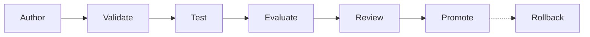

**Status:** an initial repository on 2026-10-05. It has no installer and no promotion command.

tenant-skills is the source, evaluation and release catalog for the Agent Skills of one owner. An Agent Skill is a directory of instructions and scripts that an agent loads for one type of task.

## What it is for

A person can edit an installed copy of a skill in place. Then the source and the copy do not agree. tenant-skills keeps the source apart from the installed copies. The skill directories of an agent are installation targets only.

## Main parts

| Part | What it does |
| --- | --- |
| `owned/` | The source of each skill that the owner writes. |
| `imports/` | The pins of skills that a different repository owns. |
| `catalog.toml` | For each skill: ownership, source, destination, dependencies, activation and risk. |
| Lock file | The digest of each source tree and the revision of each imported skill. |
| Command | The actions `validate`, `lock`, `candidate` and `status`. No action installs a skill. |

## Lifecycle

A candidate skill runs in a new agent session that loads no other skill. An installed skill cannot change the result.

Each skill has one of six risk levels, from `read-only` to `production`. A higher level needs a stricter evaluation, for example a plan-only run and an independent review.

The promote step is not automatic. An installation is a separate operation that the owner approves.

## Connections

- The skills go into the skill directories of an agent profile. [tenant-pi](/tenant-pi/) generates such a profile for Pi.
- The `candidate` action prints a Pi command with only the candidate skill and its declared dependencies.

This site has one overview page for this project.
