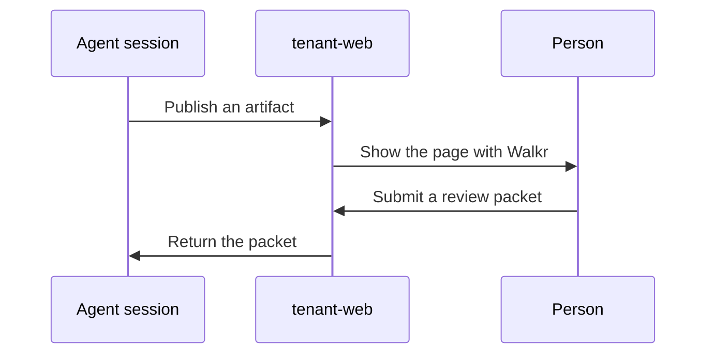

**Status:** the service runs at version 1.2.0 on 2026-10-05. Each module has its own test file.

tenant-web is a small private web service for agent work. It stores HTML and Markdown artifacts and serves them on a private network. It also collects the review packets of Walkr. It needs no cloud account.

## What it is for

An agent makes a page, for example a prototype or a report. A person must see the page and answer. tenant-web gives the page a link, and Walkr adds a review layer to the page.

## Main parts

| Part | What it does |
| --- | --- |
| Artifact service | The HTTP API, the viewer, the browse page and the review store. The metadata is in SQLite. |
| Walkr | The review layer of a prototype page. A person marks items, writes notes and submits a packet. |
| Agent skill | A session waits for a review packet and continues when the packet arrives. |
| Connectors | A live artifact calls a service through tenant-web. tenant-web holds the credential. |
| Bridge | A small process with fixed routes between tenant-web and a terminal multiplexer for agents. |

In a browser tab, Walkr cannot submit a packet. The submit button shows in the desktop app of tenant-artifacts.

An artifact expires 30 days after its creation or its last update. One API token controls the service. A reader needs a browser login and the link of the artifact.

Warning: the service does not separate its readers. Each reader can list each active artifact in the browse page.

## Connections

- [tenant-artifacts](/tenant-artifacts/) shows the artifacts in a desktop app. It also sends the review packets of Walkr to the review store.
- [tenant-pi-durable](/tenant-pi-durable/) publishes its viewer pages here. A connector lets such a page call the research agent.
- An agent session uses the skill to wait for a review.

This site has one overview page for this project.
